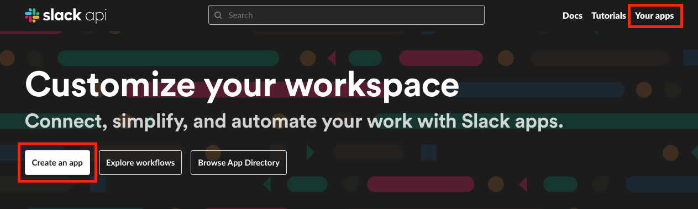
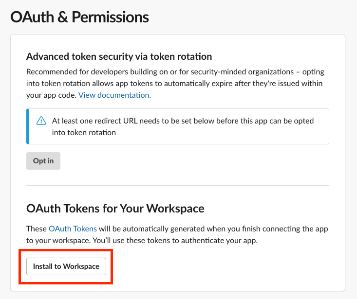

# 슬랙봇 만들기

API에 기능이 많아 이것만 보고 따라할 수 있게끔 정리함.

[https://api.slack.com/](https://api.slack.com/) 접속

# 1. App 생성

App name 입력 + workspace 선택

Scope 지정
- Add an OAuth Scope 누르면 여러가지 옵션이 나오고 원하는걸 지정해주면 됌.

이 예시에서는 슬랙봇으로 메세지를 보내기 위해 chat:write 권한을 첫번째로 줘봄.

그런 뒤 위로 올라가서 Install to Workspace

허용

Bot User OAuth Token 확인

# 2. Compose your message

