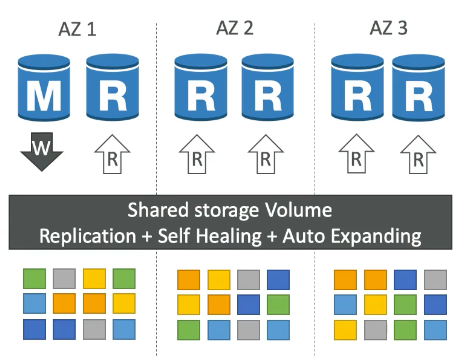
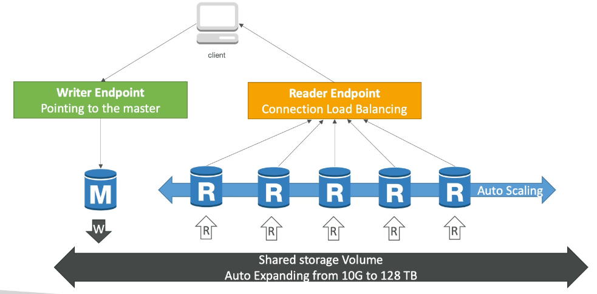

# Aurora

- Aurora는 AWS 자체 서비스 (not open sourced)
- Postgres와 MySQL 지원
- AWS 클라우드 환경에 최적화
- MySQL on RDS 에 비해 5배 향상된 성능과 Postgres on RDS 에 비해 3배 향상된 성능을 자랑
- 자동으로 저장공간을 늘려줌. (10GB 시작해서 10GB씩 늘어남. up to 128TB)
- 15개의 Read Replica를 생성 가능 (MySQL은 5개)
- replication process가 훨씬 빠름
- RDS의 Multi AZ보다 Failover이 훨씬 빠름 (고가용성)
- RDS에 비해 약 20% 이상 비싼 요금 -- 하지만 그만큼 효율적

# Aurora: High Availability and Read Scaling

엄청난 고가용성을 자랑함.

- 3개의 AZ에 걸쳐 6개의 데이터 copy를 만듬.
  - write는 최소 4개 필요
  - read는 최소 3개 필요
  - Self Healing 기능이 있음 (w/ peer-to-peer replication)
  - 몇백개의 볼륨에 걸쳐 데이터가 쪼개져 보관됨.
- 하나의 Master 인스턴스가 write 요청을 담당함. (오직 master만 write)
- Master 인스턴스에 대한 자동화된 failover (30초 이내로 작동)
- Master 인스턴스와 15개까지 확장 가능한 Read Replicas (for reads)
- Cross Region Replication 지원

# Aurora DB Cluster

- 자동으로 확장하는 shared storage volume (10GB ~ 128TB)
- Writer Endpoint: master 인스턴스만이 write를 담당하기 때문에 master instance를 바라보는 Writer Endpoint가 존재하고 client는 Writer Endpoint를 호출
- Reader Endpoint: 15개까지 auto scale 가능한 read replicas에 대한 load balancing (로드밸런싱은 statement level이 아닌 connection level에서 진행)

# 정리: Features of Aurora

- Automatic fail-over
- Backup and Recovery
- Isolation and Security
- Industry Compliance
- Push-button Scaling
- Automated patching with zero downtime
- Advanced Monitoring
- Routine Maintenance
- Backtrack: 백업없이 언제든 원하는 시점으로 restore 가능
