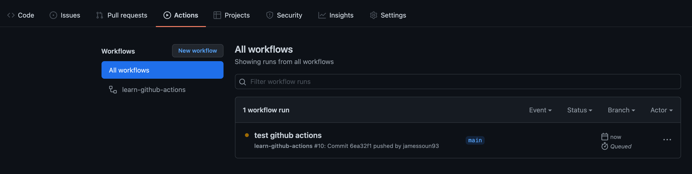
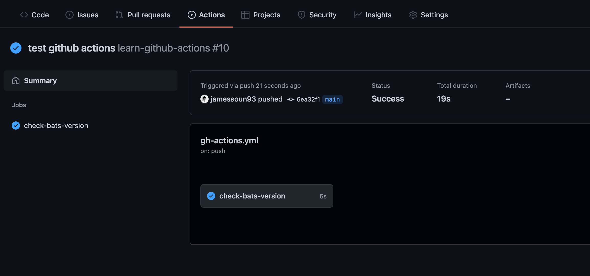
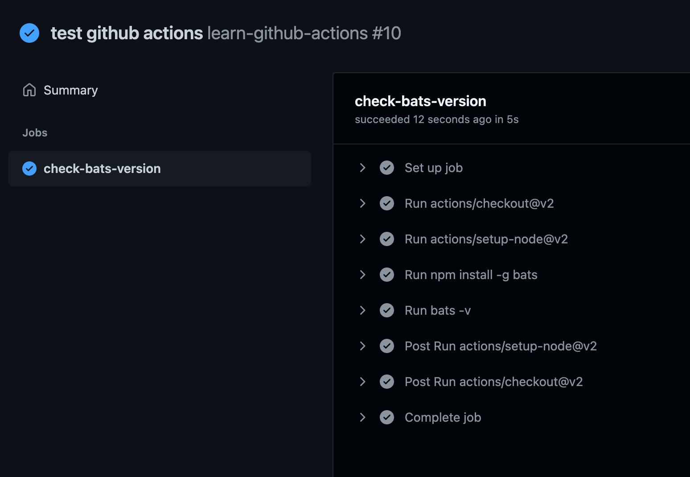

# GitHub Actions란 무엇일까? CI/CD란 무엇일까?

[Tistory 블로그 포스팅 바로가기](https://seunghyunson.tistory.com/14)

GitHub Actions는 우리가 개발한 애플리케이션의 빌드, 테스트, 배포를 자동화할 수 있게 해주는 CI/CD 파이프라인입니다.

GitHub Actions를 활용하면 우리가 GitHub Repo에 코드를 push하거나 새로운 PR을 생성할 때마다 자동으로 진행됐으면 하는 액션들을 직접 정의해서 자동화할 수 있습니다.

대표적인 예로 빌드&테스트가 있습니다.

내가 작성한 코드를 push할때마다 staging 혹은 production 환경으로 올리기 전에 해당 변경사항으로 인해 생기는 문제는 없는지 빌드 후 작성한 유닛테스트를 돌려 확인할 수 있습니다.

CI/CD 파이프라인이 없다면 이런 과정을 매번 직접 진행해야하는데, 굉장히 자주 해야 하는 일 치고 공수가 정말 많이 드는 작업이기 때문에 자동화할 수 있으면 정말 좋은 작업입니다.

우리는 CI/CD 파이프라인을 통해 우리가 원하는 작업을 자동화할 수 있으며 자동화할 수 있는 작업의 범위는 엄청나게 넓습니다.

---

# GitHub Actions 이해하기

지금부터 설명드릴 내용은 [GitHub Actions 공식문서](https://docs.github.com/en/actions/learn-github-actions/understanding-github-actions)에 상세하게 나와있는 내용들입니다.  

하지만 한글로 번역된 버전이 존재하지 않기때문에 최대한 이해하기 쉽게 설명을 해보겠습니다. (한글 번역으로 contribute 해보려 했으나 외부 번역 PR은 받고 있지 않다고 합니다 😭)

GitHub Actions 사용법을 익히기 전 꼭 알아야할 용어들부터 짚고 넘어가겠습니다.

* **Workflows:** 하나 이상의 작업(Job)을 실행하는 자동화된 프로세스입니다. 워크플로우는 YAML 파일에 의해 정의되고 특정 이벤트(Event)에 의해 트리거 되거나 직접 수동으로 트리거 될 수 있습니다.
* **Events:** 위 워크플로우를 실행하게 하는 트리거를 뜻합니다. 새로운 코드를 push하거나, 새로운 PR을 생성하는 행위를 예로 들 수 있습니다.
* **Jobs:** workflow내 정의된 여러 개의 순서 있는 작업(step)들의 묶음을 뜻합니다. 실행하고 싶은 workflow에서 실행할 작업들을 순서에 맞게 정의해놓은 부분이며, 각 작업(step)들은 서로 의존적입니다. 따라서 첫 번째 step에서 내가 작성한 애플리케이션을 빌드한 뒤 다음 스텝에서 첫 번째 스텝에서 빌드된 애플리케이션을 활용해 테스트를 돌릴 수 있습니다.
* **Actions:** 복잡하며 자주 반복되는 작업들을 사용하기 편하게 만들어놓은 어플리케이션입니다. 라이브러리와 비슷한 개념이죠.
* **Runners:** Workflow가 실행되는 서버. Ubuntu, Windows, MacOS를 지원합니다. 각 Runner는 한 번에 하나의 Job만 실행 가능합니다.

[공식문서](https://docs.github.com/en/actions/learn-github-actions/understanding-github-actions)에 이해를 돕기위해 예시로 작성해둔 Workflow를 가지고 설명해보겠습니다.

```yaml
name: learn-github-actions
on: [push]
jobs:
  check-bats-version:
    runs-on: ubuntu-latest
    steps:
      - uses: actions/checkout@v2
      - uses: actions/setup-node@v2
        with:
          node-version: '14'
      - run: npm install -g bats
      - run: bats -v
```

위 YAML파일 내용은 코드가 push 될 때마다 해당 코드를 가지고 Node.js 14 버전을 이용하여 `bats`라는 npm 패키지를 설치한 뒤 버전을 확인하는 워크플로우입니다.

한줄 한줄 의미하는 바를 확인해보겠습니다.

작성한 Workflow의 이름을 지정해주는 부분이며 지정해줄지 말지는 선택하셔도 되는 부분입니다. (Optional)
```yaml
name: learn-github-actions
```

어떤 event에 의해 트리거 될 것인지 정의하는 부분입니다. 여기서는 모든 push 이벤트에 의해 트리거 되게끔 작성되어있습니다.
```yaml
on: [push]
```

해당 workflow에서 실행할 job들을 모아서 정의하는 부분입니다.
```yaml
jobs: 
```

실행할 job 하나의 이름을 지정하는 부분입니다.
```yaml
check-bats-version:
```

가장 최신버전의 Ubuntu 기반 Runner를 사용하겠다는 뜻입니다.
```yaml
runs-on: ubuntu-latest
```

실행할 작업들을 순서대로 나열하기 위해 그룹 지어 놓는 부분입니다.
```yaml
steps:
```

`actions/checkout`이라는 action의 버전2를 사용한다는 뜻이며 해당 workflow를 실행하기 위해 사용하고 있는 runner에 해당 repository의 코드를 가져오기 위한 부분입니다. 해당 워크플로우가 돌고 있는 repository의 코드가 필요한 경우 꼭 필요한 action입니다.
```yaml
- uses: actions/checkout@v2
```

`actions/setup-node`라는 action의 버전2를 사용한다는 뜻이며 Node.js 버전 14를 설치해주기 위한 부분입니다. 해당 action을 통해 `node`와 `npm`을 설치하게 됩니다.
```yaml
- uses: actions/setup-node@v2
  with:
    node-version: '14'
```

`run` 뒤에오는 command를 실행합니다. (여기서는 `bats`라는 npm 패키지를 설치합니다.)
```yaml
- run: npm install -g bats
```

바로 전 step에서 설치한 `bats` 패키지의 version을 확인하는 명령어를 실행합니다.
```yaml
- run: bats -v
```

---

# 작성한 Workflow 테스트해보기

그럼 이 워크플로우가 잘 실행되는지 테스트를 해볼까요?

워크플로우를 작성한 YAML 파일은 `.github/workflows` 디렉토리 내 `.yml` 확장자를 가진 파일로 생성해주셔야 합니다.  
ex) `.github/workflows/gh-actions.yml`

`.github/workflows` 폴더에 위 워크플로우 내용을 담은 `yml` 파일을 잘 생성하셨으면 `add`, `commit` 후 `push`를 하면 됩니다.

워크플로우는 해당 repository의 `Actions` 탭에서 확인할 수 있습니다.

`push` 이벤트에 의해 트리거 되어 실행 중인 워크플로우가 노란색 점으로 확인됩니다.


해당 워크플로우를 클릭하면 어떤 job이 돌고 있는지 확인할 수 있습니다.


job을 선택하면 해당 job 내 정의된 모든 step들이 실행되는 과정과 결과를 확인할 수 있습니다.


파란색 배경의 체크마크는 모든 step이 정상적으로 실행되어 해당 workflow가 잘 실행되었다는 것을 뜻합니다.

---

# 마무리

이렇게 GitHub Actions 공식문서 자료와 예시를 활용하여 GitHub Actions 워크플로우의 실행 과정을 이해해보고 실제로 작성하여 실행까지 해봤습니다.

스스로 응용하여 원하는 workflow를 작성할 수도 있고, GitHub Actions를 통해 자동화하고 싶은 CI/CD 파이프라인을 검색을 통해 참고하여 적용해보는 방법도 있습니다.

위 예시에서는 npm 패키지 버전을 확인하는 단순 워크플로우였지만, 실제로 push 할 때마다 원하는 환경에 애플리케이션을 자동으로 배포해주는 workflow를 작성해보시면 훨씬 더 재미있고 다양한 작업들을 자동화할 수 있게 됩니다.

GitHub Actions와 조금이라도 친해지셨기를 바라며.. 화이팅 💪