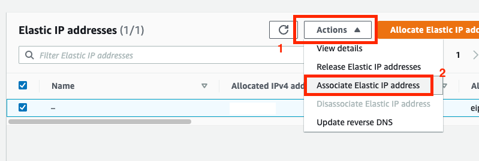

# [Jenkins, Docker를 이용한 CI/CD 구축하기 #1] Jenkins용 EC2 서버 셋업

## 1. EC2 인스턴스 생성

#### 1. AMI 선택


#### 2. 인스턴스 타입 선택


#### 3. 스토리지 옵션 설정


#### 4. 보안그룹 설정


#### 5. Key Pair 생성


#### 6. 확인


---

## 2. Elastic IP 추가 (고정 IP)

#### 1. Elastic IP 할당


#### 2. 할당된 Elastic IP 인스턴스에 연결




---

## 3. SSH 연결

#### 1. pem key 자동 적용 설정 (매번 pem 키를 입력할 필요없이 연결하기 위해)

pem 키 .ssh 폴더로 이동

```
cp pem [pem키 위치] ~/.ssh
```

pem 키 권한 변경 (읽기 권한)

```
chmod 600 ~/.ssh/[pem키 파일명]
```

SSH config에 Host 등록

```
vim ~/.ssh/config
```

Host 정보 입력

```
Host [서비스명]
    HostName [EC2 인스턴스 퍼블릭 IP(연결한 Elastic IP)]
    User ec2-user
    IdentityFile ~/.ssh/[pem키 파일명]
```

저장

```
:wq
```

config 파일 권한 변경 (실행 권한)

```
chmod 700 ~/.ssh/config
```

#### 2. 서버 접속

```
ssh [config 파일에 입력한 Host 서비스명]
```

최초 연결 시 authenticity 관련 문구가 뜨면서 이어서 연결을 진행할지 묻는데, `yes` 입력 후 엔터


접속 성공!


---

## 4. 몇 가지 추가 설정

#### 1. 타임존 변경 (UTC -> KST)

```
timedatectl
```


```
sudo timedatectl set-timezone Asia/Seoul
```


#### 2. 호스트네임 변경

```
sudo vim /etc/hostname
```

기존에 있는 HOSTNAME을 원하는 HOSTNAME으로 변경 (서비스명)

1. `dd`: 한줄 지우기
2. `i`: 입력 모드
3. 원하는 HOSTNAME 입력 후 ESC (명령 모드)
4. `:wq`: 저장 후 나가기

재부팅

```
sudo reboot
```

재접속 후 확인


#### 3. `/etc/hosts` 에 HOSTNAME 등록

`/etc/hosts` 는 호스트 주소를 찾을 때 가장 먼저 검색해 보는 파일

```
sudo vim /etc/hosts
```

아래에 추가

```
127.0.0.1 [등록할 HOSTNAME]
```


---

서버 초기 세팅 끝
