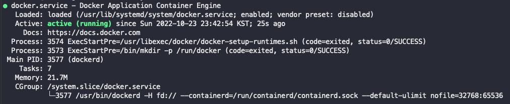

# [Jenkins, Docker를 이용한 CI/CD 구축하기 #2] Docker 설치

## 1. Docker 설치

```
sudo yum update
```

```
sudo yum install docker
```

```
docker version
```


아래 메시지는 도커를 설치만 하고 도커 데몬을 아직 실행하지 않았기 때문에 뜨는 메시지

```
Cannot connect to the Docker daemon at unix:///var/run/docker.sock. Is the docker daemon running?
```

부팅 시 docker 시작

```
sudo systemctl enable docker.service
```

docker 시작

```
sudo systemctl start docker.service
```

확인

```
sudo systemctl status docker.service
```



## 2. sudo 없이 실행할 수 있게 설정

```
sudo usermod -a -G docker ec2-user
```

```
id ec2-user
```

```
newgrp docker
```

이제 sudo 없이 docker 명령어를 사용 가능
