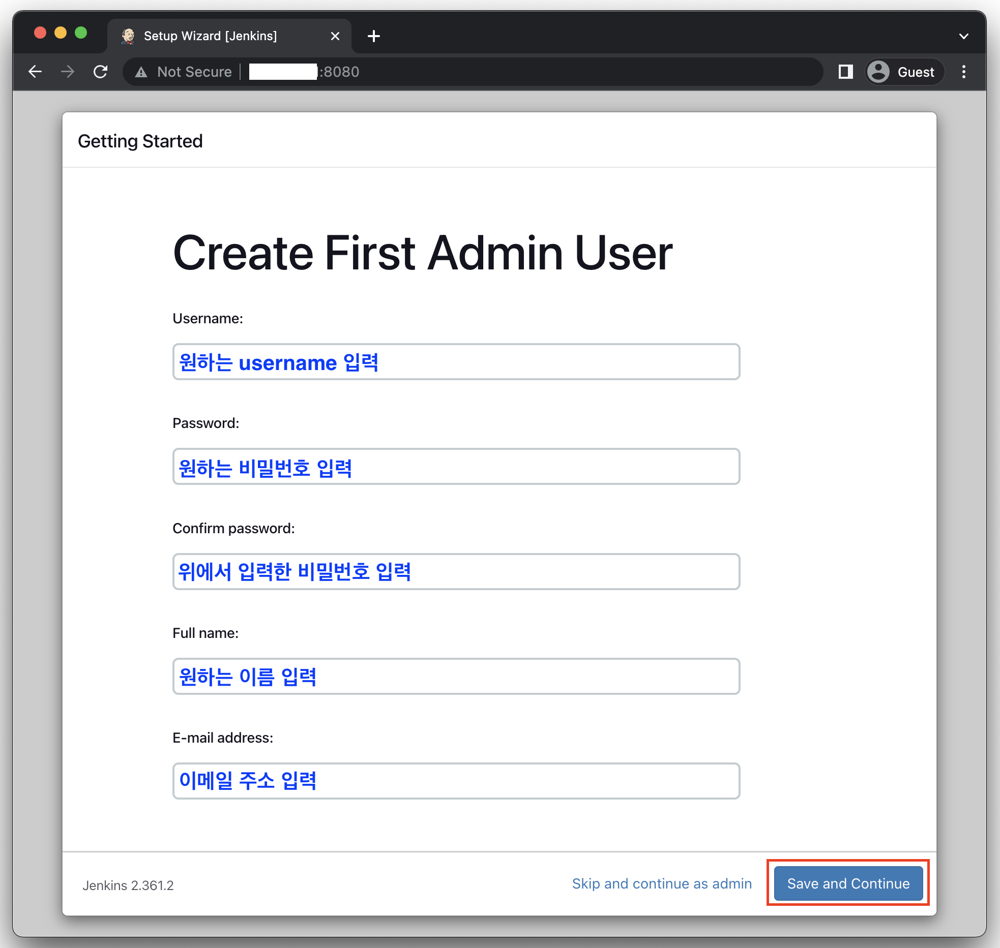
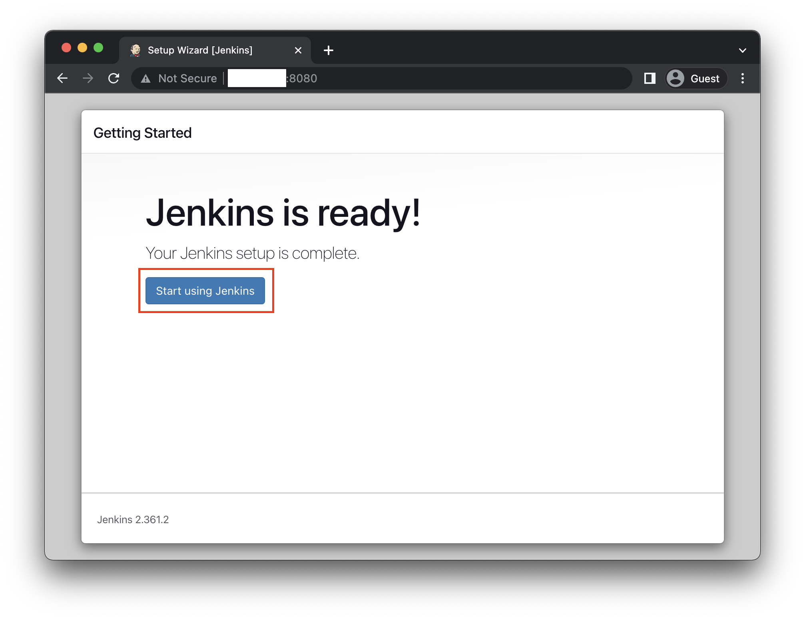

# [Jenkins, Docker를 이용한 CI/CD 구축하기 #3] Jenkins 설치

## 1. Jenkins 이미지 pull 받기 (작성 시점 lts 버전)

```
docker pull jenkins/jenkins:lts-jdk11
```

확인

```
docker images
```


---

## 2. 컨테이너 실행 및 Jenkins 설정

#### 1. 컨테이너 생성 및 실행

```
docker run --name jenkins -p 8080:8080 -p 50000:50000 -v /jenkins:/var/jenkins_home -v /usr/bin/docker:/usr/bin/docker -v /var/run/docker.sock:/var/run/docker.sock -v /home/ec2-user/.ssh:/root/.ssh -u root -d jenkins/jenkins:lts-jdk11
```

#### 2. 컨테이너 실행 결과 확인

```
docker container logs jenkins
```


빨간 부분에 Jenkins 셋업에 필요한 비밀번호가 있으니 복사

#### 3. 포트 8080에 대한 보안 그룹 설정 추가

브라우저에서 EC2 IP에 포트 8080으로 연결 시도

하면 연결이 안됨.. -> SG 8080 추가


브라우저에서 EC2 IP에 포트 8080으로 연결

#### 4. Jenkins 셋업

컨테이너 로그에서 복사해두었던 비밀번호 입력 후 진행


권장 플러그인 설치


다 설치될 때까지 기다린 후 진행 (시간이 좀 걸릴 수 있음)


Admin 계정 생성






#### 5. 필요한 플러그인 설치

---
