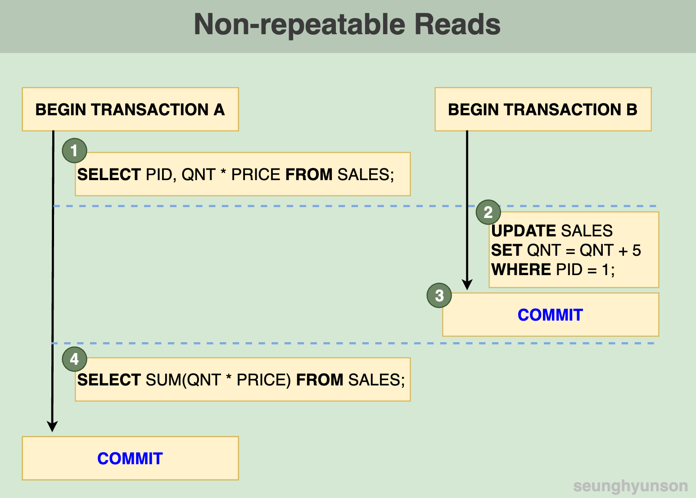
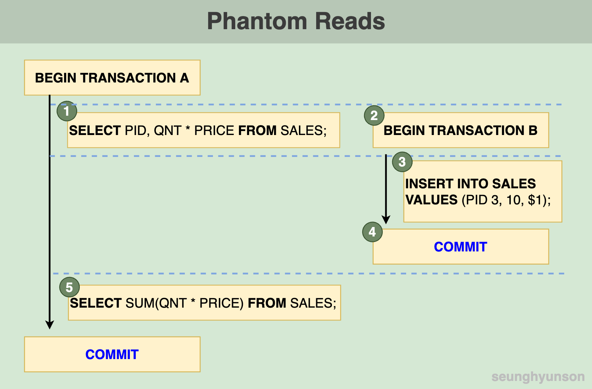
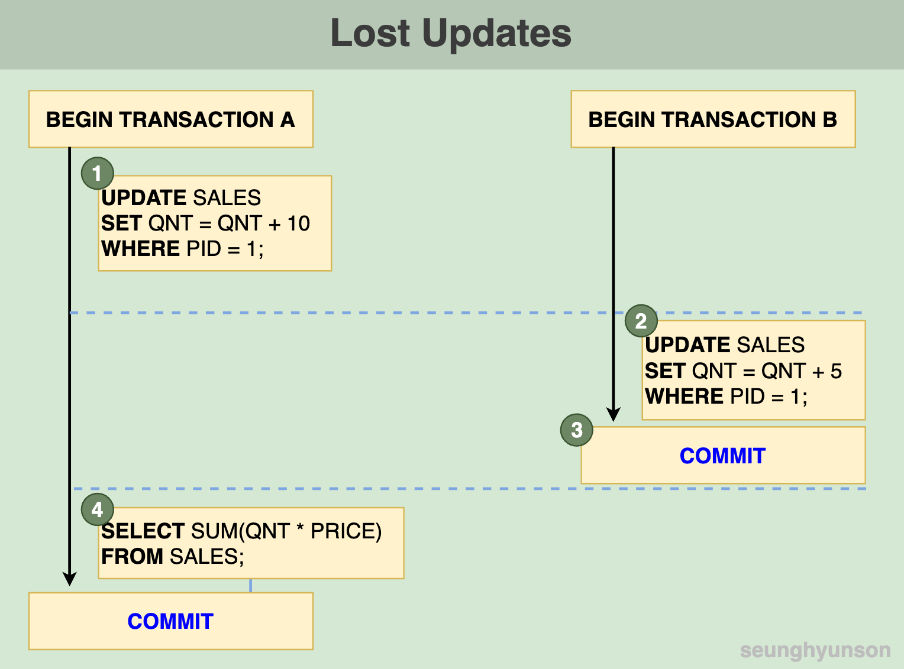
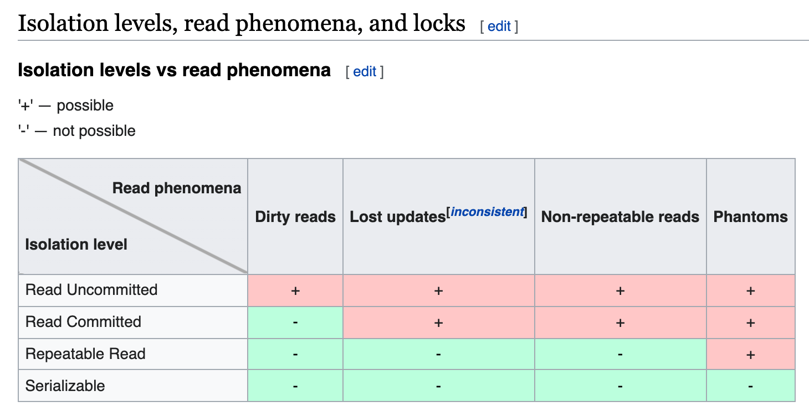

# Isolation이란? 트랜잭션의 격리 수준(isolation level)이란?

[Tistory 블로그 포스팅 바로가기](https://seunghyunson.tistory.com/12)

**Isolation**은 RDBMS를 정의하는 **ACID 트랜잭션** 특성 중 `I`에 해당하는 특성입니다.

이번 포스팅에서 **Isolation**에 대해 설명하면서 다룰 내용들은 아래와 같습니다.

1. Read Phenomena
2. Isolation Levels (격리 수준)

Isolation 개념은 아래 질문과 관련이 있습니다.

💡 진행 중인 트랜잭션은 동시에 진행 중인 다른 트랜잭션들로 인해 생긴 데이터의 변화에 영향을 받을까요?

한 번쯤 이런 생각을 해보셨을까요? 그럼 시작해볼까요?

---

## Read Phenomena
여러 개의 **Read Phenomena**에 대해서 알아보겠습니다.

트랜잭션이라는 개념을 처음 접했을 때 항상 궁금해했던 부분이었습니다.

(아래 예시들은 전부 Read Phenoma에 대한 설명을 위해 꾸며낸 상황이고 실제 결과들이 아니니 참고 바랍니다.)

### 1. Dirty Reads
더티 리드란, 동시에 진행되고 있는 다른 트랜잭션(아직 커밋하지 않은 상태)에서 변경한 데이터를 현재 진행 중인 트랜잭션에서 읽어 들이는 것을 뜻합니다.

간단한 예를 들어 설명해보겠습니다.

아래는 판매 기록을 관리하는 `SALES` 테이블입니다.

| PID | QNT | PRICE |
|-----|-----|-------|
| 1   | 10  | $5    |
| 2   | 20  | $4    |

아래는 더티 리드를 설명하기 위해 그린 다이어그램입니다.

트랜잭션 A와 트랜잭션 B가 동시에 진행되고 있는 상태라고 가정합니다.

[1] 트랜잭션 A에서 먼저 제품별 판매금액을 읽어 들입니다.

| PID | (QNT * PRICE) |
|-----|---------------|
| 1   | $50           |
| 2   | $80           |

[2] 제품 1이 5개가 더 판매되어 트랜잭션 B를 활용해 PID 1 로우의 QNT에 5를 더해줍니다. (트랜잭션 B의 [1]번 UPDATE문은 시간상 트랜잭션 A의 [1]번 SELECT문보다 뒤에 실행되게 됩니다.)

| PID | QNT | PRICE |
|-----|-----|-------|
| 1   | 15  | $5    |
| 2   | 20  | $4    |

[3] 트랜잭션 B의 2번 업데이트문이 실행되고 난 뒤 트랜잭션 A에서 총판매금액을 조회합니다.

| SUM |
|-----|
| 155 |

$5짜리 10개와 $4짜리 20개를 총 합해서 $130이 아닌 $155이라뇨? 뭔가 이상하지 않나요?

이후 트랜잭션 A는 정상적으로 커밋을 하고, 트랜잭션 B는 실제로 5개가 더 판매된 게 아님이 확인되어 롤백합니다.

트랜잭션 B에서 트랜잭션 중 기존 `10`에서 `5`를 더한 `15`로 업데이트한 `1`번 제품의 `QNT`를 읽어 들여 계산하여 `155`가 나오게 된 것입니다.

아직 완료되지 않은 트랜잭션에서 작업한 내용을 볼 수 있는 이 현상을 바로 **Dirty Read**라고 합니다.

### 2. Non-repeatable Reads
**Non-repeatable Read**란 하나의 트랜잭션 중 읽어 들였던 특정 row의 값을 같은 트랜잭션 내에서 다시 읽어 들이는데 중간에 변경사항이 생겨 (실제로 COMMIT이 된 변경사항) 결과값이 다르게 나오는 현상을 뜻합니다.

**Non-repeatable Read**도 위와 같은 `SALES` 테이블로 예를 들어 설명해보겠습니다.

| PID | QNT | PRICE |
|-----|-----|-------|
| 1   | 10  | $5    |
| 2   | 20  | $4    |

아래는 **Non-repeatable read**를 설명하기 위해 그린 다이어그램입니다.

여기서도 마찬가지로 트랜잭션 A와 트랜잭션 B가 동시에 진행되고 있는 상태라고 가정합니다.

[1] 트랜잭션 A에서 먼저 제품별 판매금액을 읽어 들입니다.

| PID | (QNT * PRICE) |
|-----|---------------|
| 1   | $50           |
| 2   | $80           |

[2] 제품 1이 5개가 더 판매되어 트랜잭션 B를 활용해 PID 1 로우의 QNT에 5를 더해줍니다. (트랜잭션 B의 [2]번 UPDATE문은 시간상 트랜잭션 A의 [1]번 SELECT문보다 뒤에 실행되게 됩니다.)

| PID | QNT | PRICE |
|-----|-----|-------|
| 1   | 15  | $5    |
| 2   | 20  | $4    |

[3] 이번에는 트랜잭션 B가 정상적으로 `COMMIT`을 완료합니다. 

[4] 트랜잭션 B가 정상적으로 완료된 시점에 트랜잭션 A에서 총판매금액을 조회합니다.

| SUM |
|-----|
| 155 |

여기서도 $130이 아닌 $155가 나오게 됩니다.

PID 1의 QNT를 15로 `UPDATE` 하는 트랜잭션이 정상적으로 `COMMIT`이 완료된 시점에 트랜잭션 A에서 전체 `SUM` 계산을 위해 PID 1의 QNT를 읽어 들였기 때문입니다.

**Dirty read**와 결과도 같고 비슷해 보이겠지만 **Non-repeatable read**에서는 다른 트랜잭션이 진행 중에 변경한 값을 읽어드리는 것이 아닌 정상적으로 COMMIT이 된 후의 값을 읽어드린다는 점에서 차이가 있습니다. 

### 3. Phantom Reads
Phantom read란 트랜잭션 시작 시점 데이터를 읽었을 때 존재하지 않았던 데이터가 다시 같은 조건으로 데이터를 읽어 들였을 때 존재해 (유령처럼) INCONSISTENT 한 결과값을 반환하는 현상을 뜻합니다.

트랜잭션을 시작한 후 두 날짜 사이에 진행되는 모든 이벤트를 불러오는 쿼리를 실행하여 불러들여온 뒤, 다시 한번 같은 날짜 range로 모든 이벤트를 불러오는 쿼리를 실행했을 때 이전 쿼리에는 없던 유령 이벤트가 생겨 결과값에 나타나게 되는 케이스를 예로 들어볼 수 있습니다.

상세한 설명을 위해 다시 한번 위와 같은 `SALES` 예시로 설명해보겠습니다.

| PID | QNT | PRICE |
|-----|-----|-------|
| 1   | 10  | $5    |
| 2   | 20  | $4    |

아래는 **Phantom read**를 설명하기 위해 그린 다이어그램입니다.

여기서는 트랜잭션 B가 트랜잭션 A보다 늦게 시작한다고 가정해봅니다.

[1] 먼저 트랜잭션 A에서 먼저 제품별 판매금액을 읽어 들입니다.

| PID | (QNT * PRICE) |
|-----|---------------|
| 1   | $50           |
| 2   | $80           |

[2], [3], [4] 동시에 트랜잭션 B가 시작되고 트랜잭션 B에서 `SALES` 테이블에 새로운 데이터를 `INSERT` 한 뒤 `COMMIT` 합니다.

| PID | QNT | PRICE |
|-----|-----|-------|
| 1   | 10  | $5    |
| 2   | 20  | $4    |
| 3   | 10  | $1    |

[5] 트랜잭션 B가 정상적으로 완료된 시점에 트랜잭션 A에서 총판매금액을 조회합니다.

| SUM |
|-----|
| 140 |

여기서는 $130이 아닌 $140가 나오게 됩니다.

1번 쿼리를 실행할 때는 존재하지 않았던 PID 3에 대한 데이터가 5번 쿼리를 실행할 때는 COMMIT이 된 상태로 존재하여 함께 계산되어 반환된 것입니다.

COMMIT이 된 데이터를 읽어 들였으므로 Dirty read는 아닙니다.

COMMIT이 된 상태이지만 5번 쿼리를 실행하기 전 읽어 들인 적이 없는 데이터이기 때문에 Non-repeatable read와도 차이가 있습니다.

기존에 읽어 들인 적이 없던 데이터가 갑자기 유령처럼 나타나 (COMMIT이 된 상태로) 함께 읽히는 현상을 바로 Phantom read라고 합니다.

### 4. Lost Updates
마지막 **Read Phenoma**인 **Lost Update**는 한 트랜잭션에서 데이터를 변경한 뒤 아직 커밋을 하지 않은 상태에서 읽어 들일 때, 다른 트랜잭션으로 인해 내가 작성한 변경사항이 덮어씌워지는 현상을 뜻합니다.

**Lost Updates**도 위와 같은 `SALES` 테이블로 예를 들어 설명해보겠습니다.

| PID | QNT | PRICE |
|-----|-----|-------|
| 1   | 10  | $5    |
| 2   | 20  | $4    |

아래는 **Lost Updates**를 설명하기 위해 그린 다이어그램입니다.

트랜잭션 A와 트랜잭션 B가 동시에 진행되고 있는 상태라고 가정합니다.

[1] 트랜잭션 A에서 PID 1의 QNT를 10만큼 더합니다.

| PID | QNT | PRICE |
|-----|-----|-------|
| 1   | 20  | $5    |
| 2   | 20  | $4    |

[2], [3] 트랜잭션 B에서 PID 1의 QNT를 **기존 10**에서 5만큼 더한 뒤 `COMMIT` 합니다.

| PID | QNT | PRICE |
|-----|-----|-------|
| 1   | 15  | $5    |
| 2   | 20  | $4    |

[4] 트랜잭션 B가 정상적으로 완료된 시점에 트랜잭션 A에서 총판매금액을 조회합니다.

| SUM |
|-----|
| 155 |

$180이 아닌 $155가 나오게 됩니다.

[2]번 UPDATE문에서 트랜잭션 B가 시작됐을 시점의 PID 1의 QNT(10)을 기준으로 잡아 5만큼 더해줘 15가 되어 (15 * $5) + (20 * $4) = $155가 결과값으로 반환된 것이죠.

트랜잭션 A에서 먼저 실행했던 [1]번 작업에서 PID 1의 QNT를 10만큼 더해 20으로 업데이트해줬던 내역은 트랜잭션 B의 [2]번 작업으로 인해 덮어씌워진 것입니다.

이 현상을 바로 Lost Update라고 합니다.

---

## Isolation Levels
트랜잭션을 사용할 때 생길 수 있는 문제점들에 대해 이해가 잘 되셨나요?

Isolation Level은 이러한 Read Phenomena를 상황에 맞게 예방하기 위해 개발되었으며, DBMS에 default로 지정되어 있고 트랜잭션을 시작할 때 SQL문으로 직접 Isolation Level을 지정해줄 수도 있습니다.

그렇다면 이제 이런 **Read Phenomena**를 해결할 수 있는 방법인 여러 개의 **Isolation Levels(격리 수준)**에 대해 알아보겠습니다.

### 1. Read Uncommitted

트랜잭션이 아예 격리가 되지 않는 Isolation Level입니다. 

동시에 일어나는 트랜잭션 간 COMMIT 여부와 상관없이 모든 변경사항을 확인할 수 있습니다.

굉장히 좋지 못한 방법이겠죠? 하지만 그만큼 신경 써야 하는 부분이 없다는 뜻이니 속도는 빠를 수 있습니다.

### 2. Read Committed

트랜잭션 내 모든 쿼리는 다른 트랜잭션을 통해 정상적으로 COMMIT 된 데이터만 볼 수 있습니다.

### 3. Repeatable Read

트랜잭션 중 특정 row를 읽어 들이는 쿼리를 실행한다면 해당 트랜잭션이 끝날 때까지 읽어 들인 row의 데이터는 변하지 않습니다.

### 4. Serializable

가장 엄격한 Isolation Level입니다.

트랜잭션이 진행되는 동안 특정 테이블을 읽으면 동시에 진행되는 다른 트랜잭션은 해당 테이블에 데이터를 추가, 변경, 삭제할 수 없습니다.

이 방법 위에서 설명한 모든 Read Phenomena를 해결할 수 있는 방법입니다.
 

> 출처: https://en.wikipedia.org/wiki/Isolation_(database_systems)

위 이미지에서 보이는 것과 같이 격리 수준이 높을수록 Read Phenomena로 인한 문제들을 더 많이 해결할 수 있습니다.

하지만 동시 처리 성능이 가장 떨어지는 격리 수준입니다.

어떤 방법을 사용하던 모든 결정에는 trade-off가 존재합니다.

이런 차이점을 잘 인지하고 상황에 맞는 선택을 할 수 있어야 합니다.