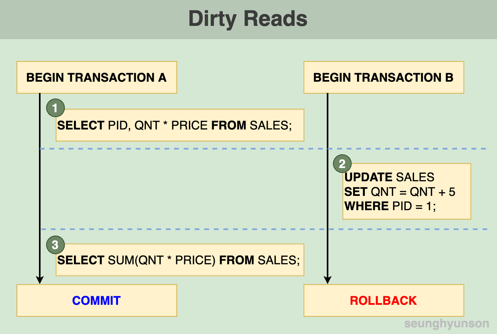

# Isolation

**Isolation(격리성)**은 RDBMS를 정의하는 **ACID 트랜잭션** 특성 중 `I`에 해당하는 특성입니다.

이번 포스팅에서 Isolation에 대해 설명하면서 다룰 내용들은 아래와 같습니다.

1. Read Phenomena
2. Isolation Levels (격리수준)
3. Database Implementation of Isolation

Isolation 개념은 아래 질문과 연관이 있습니다.

> Q) 과연 진행중인 트랜잭션 A는 동시에 진행중인 다른 트랜잭션들로 인해 생긴 데이터의 변화를 감지할 수 있을까요?

그럼 시작해볼까요?

## Read Phenomena
여러개의 **Read Phenomena**에 대해서 알아보겠습니다.

트랜잭션이라는 개념을 처음 접했을 때 항상 궁금해했던 부분이었습니다.

### 1. Dirty Reads
더티 리드란, 동시에 진행되고 있는 다른 트랜잭션(아직 커밋하지 않은 상태)에서 변경한 데이터를 현재 진행중인 트랜잭션에서 읽어들이는 것을 뜻합니다.

간단한 예를 들어 설명해보겠습니다.

아래는 판매기록을 관리하는 `SALES` 테이블입니다.

아래는 더티 리드를 설명하기 위해 그린 다이어그램입니다.

트랜잭션 A와 트랜잭션 B가 동시에 진행되고 있는 상태라고 가정합니다.

[1] 트랜잭션 A에서 먼저 제품별 판매금액을 읽어들입니다.

| PID | (QNT * PRICE) |
|-----|---------------|
| 1   | $50           |
| 2   | $80           |

[2] 제품 1이 5개가 더 판매되어 트랜잭션 B를 활용해 PID 1 로우의 QNT에 5를 더해줍니다. (트랜잭션 B의 2번 업데이트문은 시간상 트랜잭션 A의 1번 SELECT문보다 뒤에 실행되게 됩니다.)

| PID | QNT | PRICE |
|-----|-----|-------|
| 1   | 15  | $5    |
| 2   | 20  | $4    |

[3] 트랜잭션 B의 2번 업데이트문이 실행되고 난 뒤 트랜잭션 A에서 총 판매금액을 조회합니다.

| SUM |
|-----|
| 155 |

$5짜리 10개와 $4짜리 20개를 총 합해서 $130이 아닌 $155이라뇨? 뭔가 이상하지 않나요?

이후 트랜잭션 A는 정상적으로 커밋을 하고, 트랜잭션 B는 실제로 5개가 더 판매된게 아님이 확인되어 롤백합니다.

트랜잭션 B에서 트랜잭션 중 기존 `10`에서 `5`를 더한 `15`로 업데이트한 `1`번 제품의 `QNT`를 읽어들여 계산하여 `155`가 나오게 된 것입니다.

아직 `COMMIT`되지 않은 정보를 볼 수 있는 이 현상을 바로 **Dirty Read**라고 합니다.