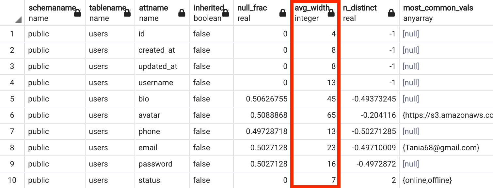
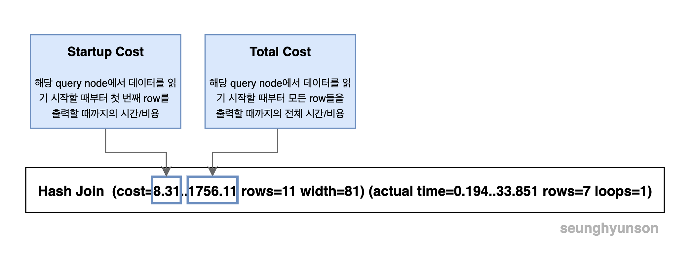

# 쿼리 성능 분석하기 (PostgreSQL)

[Tistory 블로그 포스팅 바로가기](https://seunghyunson.tistory.com/20)

## Table of Contents
- [1. Query Processing Pipeline](#1-query-processing-pipeline)
- [2. 쿼리 성능 파악하기](#2-쿼리-성능-파악하기)
  - [EXPLAIN](#explain)
  - [EXPLAIN ANALYZE](#explain-analyze)
  - [EXPLAIN ANALYZE 결과 분석하기](#explain-analyze-결과-분석하기)
- [3. Cost 계산하기](#3-cost-계산하기)
  - [Sequential Scan 비용 어림잡아 계산해보기](#sequential-scan-비용-어림잡아-계산해보기)
  - [Planner Cost Constants](#planner-cost-constants)
  - [Equation](#equation)

# 1. Query Processing Pipeline
**Query Processing Pipeline**이란 우리가 작성한 SQL 쿼리문을 실행한 뒤 결과를 볼 때까지 Postgres 내부에서 거치는 과정들입니다.

쿼리 성능을 분석하기 전에 내부 동작 과정을 간단하게라도 파악하고 넘어가면 분석 단계에서 더 많은 도움이 되겠죠?

## Parser (Stage)
Parser Stage는 제공된 SQL문의 단어 하나하나를 확인하여 올바른 문법으로 작성되었는지 확인하는 단계이고 제공된 SQL문을 tree 형태로 만듭니다.

위에서 작성한 SQL문을 읽어들여 컴퓨터 프로그램이 이해할 수 있는 논리적 단계 형태로 만드는 작업입니다.

```sql
SELECT *
FROM users
WHERE username = 'jamessoun93';
```

위 SQL 쿼리를 가지고 예를 들면,
* 가장 먼저 보이는 `SELECT`문은 트리 상단에 `"SelectStmt"` 그리고 `*` 즉 모든 컬럼을 뜻하는 `"ColumnRef"`, `"A_Star"`의 형태로 변환됩니다.
* `FROM`은 `"fromClause"`, 테이블명인 `users`는 **Postgres**에서 테이블명(relation명)을 뜻하는 `relname`을 이용하여 `"relname"=>"users"`의 형태로 변환됩니다.
* `WHERE`도 마찬가지로 `"whereClause"`, `"str" => "="`, `"columnRef"`, `"str" => "username"`, `"str" => "Jamessoun93"`의 형태로 변환됩니다.

(실제 Parser Stage의 결과 전체가 아닌 이해할 수 있는 부분들만 가져온 것이니 참고해주세요.)

## Rewriter
View 부분

## Planner
Planner는 앞 스테이지에서 넘겨받은 쿼리 트리를 통해 어떤 데이터를 가져와야 하는지 확인한 뒤, 해당 데이터를 가져오기 위한 여러가지 방법 중 가장 빠르고 효율적인 방법을 파악합니다.

**index**를 활용하여 포인터가 가리키는 `user` 데이터를 `users` Heap File에서 가져오거나, 모든 `users` 테이블 데이터를 불러와 하나하나 확인하여 찾는 방법 두 가지 중 더 빠른 방법을 택해 다음 단계인 **Executer**로 넘긴다는 뜻입니다.

## Executer
전체 과정의 마지막인 실행 단계로, 플래너로부터 넘겨받은 방법으로 쿼리를 실행한 뒤 데이터를 받아오는 단계입니다.

---

# 2. 쿼리 성능 파악하기

위의 Query Processing Pipeline 중 우리가 집중해야할 부분은 Planner 단계이고, 이 단계를 분석하여 슬로우 쿼리를 파악하고 튜닝할 수 있습니다.

여기서 예시로 쓸 SQL 쿼리문은 아래와 같습니다.

```sql
SELECT username, contents
FROM users
JOIN comments ON comments.user_id = users.id
WHERE username = 'Jamessoun93';
```

`users`와 `comments`를 `INNER JOIN` 하여 `username`이 `Jamessoun93`인 유저가 작성한 댓글의 내용을 `username`과 함께 가져오는 쿼리입니다.

먼저, 쿼리 성능 분석의 기초인 키워드 두개를 소개드리겠습니다.

1. `EXPLAIN`
2. `EXPLAIN ANALYZE`

## EXPLAIN
`EXPLAIN`은 query plan을 생성해 여러가지 정보를 제공합니다.  
하지만 실제로 EXPLAIN 뒤에 오는 쿼리를 **실행하지는 않습니다.**

```sql
EXPLAIN SELECT username, contents
FROM users
JOIN comments ON comments.user_id = users.id
WHERE username = 'Jamessoun93';
```


## EXPLAIN ANALYZE
`EXPLAIN ANALYZE`도 마찬가지로 query plan을 생성하여 여러가지 정보를 제공합니다.  
하지만 `EXPLAIN`과는 다르게 **실제 쿼리를 호출한 뒤 쿼리를 실행하는데 걸린 시간 등을 포함한 통계를 제공합니다.**

```sql
EXPLAIN ANALYZE SELECT username, contents
FROM users
JOIN comments ON comments.user_id = users.id
WHERE username = 'Jamessoun93';
```


## EXPLAIN ANALYZE 결과 분석하기

`EXPLAIN`과 `EXPLAIN ANALYZE`의 결과화면을 보면 몇몇 부분에 `->` 처럼 화살표가 보이는 부분이 있습니다.  
이 부분들이 바로 쿼리 노드(Query Nodes)입니다.

쿼리 노드는 실제 데이터를 가져오기 위해 접근하거나 여러가지 작업을 처리하는 부분입니다.

`->` 표시는 붙어있지 않지만, 가장 위 `Hash Join`문 또한 쿼리 노드입니다.

지금부터 각 쿼리 노드에서 수행하는 작업이 어떤 순서로 진행되는지 알아보겠습니다.

이해를 돕기 위해 [pgAdmin 4](https://www.pgadmin.org/)의 Explain Analyze 툴을 실행하여 나온 결과 이미지를 활용했습니다.


각 쿼리 노드의 스텝을 알기 쉽게 표시해뒀습니다.


단순히 결과만 보고는 파악하기 어려운 순서를 이렇게 다이어그램으로 확인하여 이해를 할 수 있습니다.

1. **Index Scan**이 가장 먼저 실행된 후 해당 결과가 **Hash**로 넘어갑니다.  
2. **Hash** 스텝이 실행됨과 동시에 **Seq Scan** 스텝이 실행됩니다.
3. **Hash** 스텝과 **Seq Scan** 스텝의 결과가 함께 **Hash Join** 스텝으로 넘겨지게 됩니다.
4. **Hash Join** 스텝에서 최종 결과를 반환합니다.

첫번째 쿼리 노드인 **Hash Join(Explain Analyze)** 의 결과값을 살펴보겠습니다.


해당 노드에서 어떤 방식으로 데이터를 처리하는지 방법이 명시되어있으며 해당 처리 과정 중 필요한 처리 능력이 어느정도 되는지와 예상되는 결과 row수와 row당 평균 byte수도 포함하고 있습니다.

여기서 잠시 **EXPLAIN**의 **Hash Join** 쿼리 노드 결과값도 살펴보겠습니다.


이상하지 않나요?

**EXPLAIN**은 **EXPLAIN ANALYZE**와 달리 쿼리를 실행하지 않아서 실제 데이터에 접근을 하지 않았을 텐데 예상 rows와 width를 어떻게 포함하고 있는 걸까요?

**Postgres**가 테이블 내부에 존재하는 데이터에 대한 정보가 없는 상황에서 각 스텝을 실행하는 데 걸리는 시간을 어떻게 예측할 수 있을까요?

그 이유는 바로 **Postgres**가 실제로 각 테이블 대한 상세한 통계를 보관하고 있기 때문입니다.

아래 쿼리를 실행해서 한번 확인해보겠습니다.

```sql
SELECT *
FROM pg_stats
WHERE tablename = 'users';
```



`pg-stats`라는 테이블에서 `users` 테이블에 대한 데이터만 가져온 결과입니다.

이 테이블에는 각 컬럼 별로 여러가지 데이터를 종합하고 있습니다.

- 컬럼별 평균 byte 수(`avg_width`)
- 가장 자주 등장하는 값(`most_common_vals`)
- 가장 자주 등장하는 값의 빈도(`most_common_freqs`)

등등 많은 데이터를 저장하고 있습니다.

**Postgres**는 이 테이블 내 데이터를 통해서 **쿼리 계획(Query Plan)** 의 각 단계에서 필요한 예상 값을 계산할 수 있기 때문에 실제 쿼리 호출을 하지 않더라도 예상 값을 반환할 수 있었던 것입니다.

위에서 봤던 **Hash Join**의 평균 width 값은 `users` 테이블의 `username` 컬럼의 평균 width 값인 `13`과 `comments` 테이블의 `contents` 컬럼의 평균값인 `68`을 더해 `81`이 반환된 것이죠.

이렇게 **EXPLAIN**과 **EXPLAIN ANALYZE**를 활용해 실행 계획을 분석하여 더 효율적인 방법을 찾아 전체적인 성능을 개선할 수 있습니다.

---

# 3. Cost 계산하기

그렇다면 위의 Planner 단계에서 생성한 query plan을 활용하여 구체적으로 어떻게 효율을 계산해서 비교할 수 있을까요?

그리고 여기서 더 효율적인 방법을 택하는 기준은 무엇일까요?  
실행 속도일까요? 아니면 메모리 사용량일까요? 

정말 다양한 기준을 세워 효율성을 따질 수 있겠지만 지금은 query plan의 일부가 실행되는데 걸리는 시간을 기준으로 잡아보겠습니다.

아래 쿼리문을 다시 한번 가져왔습니다.

```sql
SELECT username, contents
FROM users
JOIN comments ON comments.user_id = users.id
WHERE username = 'Jamessoun93';
```

위에서 **Query Processing Pipeline**에 대해 설명하면서, **Planner** 단계에서는 해당 쿼리에 대한 결과 데이터를 가져오기 위한 여러가지 방법 중 가장 빠르고 효율적인 방법을 파악해 선택한다고 설명했습니다.

여기서는 `username`을 기준으로 찾아야하니 `username` 컬럼을 기준으로 생성한 index가 존재한다면 해당 **Index를 사용하는 방법**과 users 테이블 데이터를 담고 있는 heap file에서 page(block)마다 담고 있는 데이터를 하나하나 확인하여 **Sequential Scan(Full Table Scan)을 하는 방법**이 있습니다.

(데이터베이스 인덱스에 대해 잘 모른다면 [Database Index란?](https://seunghyunson.tistory.com/19)을 읽어보는걸 추천합니다.)

Planner는 둘 중 어떤 옵션이 더 효율적인지 두 가지 옵션을 실제로 실행하지 않고 어떻게 판단할까요?

지금부터 planner 단계에서 어떤 방식으로 두 가지 방법에 대한 cost를 비교하는지 알아보겠습니다.

## Sequential Scan 비용 어림잡아 계산해보기

`comments` 테이블에 대한 **Sequential Scan**을 진행하는 쿼리 노드를 살펴보겠습니다.


위 SQL 쿼리문에 대한 `EXPLAIN ANALYZE` 결과물(쿼리 플랜)의 3번 노드에 해당하는 부분입니다.


`comments` 테이블에 존재하는 모든 데이터를 확인해야하니 스텝은 아래와 같습니다.

1. comments 테이블 데이터를 담고 있는 heap file을 연다.
2. 첫 번째 page(block)부터 읽어들이기 위해 순서대로 load 한다.
3. 첫 번째 page(block)부터 순서대로 존재하는 모든 row data를 하나하나 확인하여 필요한 작업을 진행한다.
4. 다음에 오는 page(block)마다 2번 스텝을 반복한다.

이 모든 작업을 처리하는데 드는 비용을 계산하기 위해 `comments` 테이블에 존재하는 **rows** 수와 **page(block)** 수를 확인합니다.

```sql
SELECT relpages FROM pg_class WHERE relname = 'comments';
```


```sql
SELECT COUNT(*) FROM comments;
```


`comments` 테이블에는 총 **985개**의 page와 **60410개**의 row가 존재하는 것을 확인할 수 있습니다.

우리가 계산하려고 하는 전체 비용은 **985개의 page를 load 하는 비용**과 **60410개의 row를 처리하는 비용**을 합한 값입니다.  

```
(# of pages) * (1개의 page를 load 하는 cost) + (# of rows) * (1개의 row를 처리하는 cost)
```

하나의 page를 load 하는 비용과 하나의 row를 처리하는 비용을 추정치로 잡은 뒤 갯수만큼 곱한 뒤 합산해야 한다는 뜻이죠.

그런데 page를 load 하는 비용과 row를 처리하는 비용을 어떻게 알 수 있을까요?

정확하게 계산하기는 어렵지만 어림잡아 계산할 수는 있습니다.

page는 한 테이블에 대한 heap file안에 저장되고 이 뜻은 우리 컴퓨터에 존재하는 물리적인 공간 안에 데이터의 형태로 자리를 잡고 있다는 뜻이죠.

그렇다면 page를 load 하는 과정은 실제 컴퓨터의 저장장치로부터 읽어 들이는 작업이 필요합니다.

반면에 이미 load 한 뒤 정렬된 row data를 처리하는 과정은 page를 load 하는 과정보다는 훨씬 빠르고 가볍습니다.

그래서 page를 load 하는 과정의 비용이 `1`이라 가정하고 row를 처리하는 비용이 약 100배 작은 `0.01`이라고 가정해봅시다.

위 계산식을 적용해보면 `1589.1` 라는 값이 나옵니다.

```
(985) * (1.0) + (60410) * (0.01) = 1589.1
```

자, 이 `1589.1` 이라는 값으로 우리가 무엇을 할 수 있을까요?

여기서 잠시 `EXPLAIN ANALYZE`가 보여준 Query Plan을 살펴보겠습니다.


3번 **Sequential Scan** 노드의 **cost** 부분에 `1589.1` 이라는 값이 보이시나요?!

어떻게 이게 가능할 수 있을까요? 위에서 분명 정확한 값을 알 수 없어 어림잡아 계산을 했었는데 말이죠.

그 이유는 Query Plan에서 보여주는 각 노드의 cost는 실제 cost가 아닌 다른 작업들을 수행하는데 드는 cost에 대한 상대값이기 때문입니다.

CPU를 얼마나 잡아먹는지 메모리를 얼마나 잡아먹는지 수치로 계산한 게 아닌 특정 작업이 다른 작업들에 비해 몇 배의 비용이 드는가를 기준으로 계산한 비용이라는 뜻입니다.

## Planner Cost Constants

이런 값들을 Planner Cost Constants (직역하면 플래너 비용 상수)라고 부르고 각 constant의 default 값은 [PostgreSQL 공식문서](https://www.postgresql.org/docs/current/runtime-config-query.html#RUNTIME-CONFIG-QUERY-CONSTANTS)에 정리되어 있습니다.

예시로 몇 가지만 살펴보겠습니다.


`seq_page_cost` 상수는 heap file로부터 page들을 순차적으로 가져오는 작업을 할 때 한 개의 page를 가져올 때의 비용을 뜻하고 기본값이 `1.0`으로 설정되어 있습니다.


`random_page_cost` 상수는 heap file로부터 page들을 순차적으로가 아닌 랜덤하게 가져올 때 한 개의 page를 가져올 때의 비용을 뜻하고 기본값이 `4.0`으로 설정되어 있습니다.

여기서 이 `4.0`이라는 상수값은 바로 위에서 봤던 `seq_page_cost`와 비교한 상대값입니다. (랜덤 page를 가져오는 작업이 page를 순서대로 읽어 들이는 작업의 4배 정도 비용이 든다는 뜻이겠죠.)

이 두 가지 외 모든 상수값들도 값이 `1.0`인 `seq_page_cost`를 기준으로 비교한 값입니다.

## Equation

이 constant들을 사용하여 특정 쿼리 노드의 cost를 계산하기 위해서는 아래 식을 이용하면 됩니다.

```
COST = (# pages read sequentially) * seq_page_cost 
       + (# pages read at random) * random_page_cost 
       + (# rows scanned) * cpu_tuple_cost 
       + (# index entries scanned) * cpu_index_tuple_cost 
       + (# times function/operator evaluated) * cpu_operator_cost
```

`(특정 작업을 진행하는 대상의 숫자) * (해당 작업에 대한 cost constant)`를 전부 더한 값이 됩니다.

(물론 위 공식에 나와있는 부분만 가지고 실제 전체 cost를 계산할 수 있는 것은 아니지만 query plan을 계산하는 단계에서는 이 정도로 충분합니다.)

조금 위에서 직접 계산해봤던 `comments` 테이블에 대한 sequential scan을 제공된 cost constant들을 위 식에 대입하여 계산해본다면,

랜덤 페이지를 가져오는 작업, 인덱스를 scan 하는 작업, 연산 작업이 없기 때문에 `0`으로 계산되어 아래와 같이 순차적으로 page를 읽어 들이는 비용과 row들을 scan 하는 비용을 더한 값이 해당 쿼리 노드의 cost가 됩니다.

```
COST = (# pages read sequentially) * seq_page_cost
       + (# rows scanned) * cpu_tuple_cost
```

그래서 실제로 비용 계산 공식을 찾아보면 위 두 가지만 가지고 계산하는 예시가 많습니다.

## Startup Cost vs Total Cost

지금까지 `EXPLAIN`의 결과에서 특정 query node의 cost에 나와있는 숫자 두 개 중 두 번째 숫자인 전체 cost를 함께 계산해봤습니다.

그렇다면 첫 번째 숫자는 어떤 의미를 갖고 있을까요?



첫 번째 cost 값은 **Startup Cost**입니다.

**Startup Cost**는 query node에서 데이터를 읽기 시작한 시점부터 **첫 번째 row를 출력할 때까지의 시간/비용**을 뜻합니다.

우리가 함께 계산해본 두 번째 cost 값은 **Total Cost**로, query node에서 데이터를 읽기 시작할 때부터 모든 row들을 출력할 때까지의 **전체 시간/비용**을 뜻합니다.

**부모 node**의 **startup cost**는 **자식 node**의 **total cost**를 포함하게 됩니다. (물론 예외 케이스는 존재합니다.)

```sql
SELECT username, contents
FROM users
JOIN comments ON comments.user_id = users.id
WHERE username = 'Jamessoun93';
```


(여기서도 이해를 돕기 위해 [pgAdmin 4](https://www.pgadmin.org/)의 Explain Analyze 툴을 사용했습니다.)

참고로 여기서는 `users` 테이블에서 `username` 컬럼에 대한 index를 지우고 Sequential Scan을 진행하게끔 했습니다.

첫 번째로 `users` 테이블에 대한 sequential scan은 총 `176.81`의 total cost를 가지게 되고, 이 결과는 해당 쿼리 노드의 부모인 Hash 노드의 startup cost에 더해집니다.

그리고 Hash 노드의 total cost는 부모 노드인 Hash Join 노드의 startup cost에 더해지는 것을 확인할 수 있습니다.

자세히 보면 `comments` 테이블에 대한 sequential scan의 total cost는 부모 노드인 hash join의 startup cost에 더해지지 않는 것을 확인할 수 있습니다.

이건 오류가 아니고 실제로 hash join 노드에서 `comments` 테이블에 대한 sequential scan의 결과를 전부 준비시켜놓고 처리하는 게 아니고 row 한줄한줄 읽을 때마다 hash join 노드로 넘어와 이미 준비가 되어있는 상태이기 때문입니다.

반대로 hash node에서는 작업을 시작하기 전에 `users` 테이블에 대한 sequential scan 노드로부터 모든 row를 넘겨받아야 하고, hash join 노드에서 사용할 hash table을 생성한 뒤 통째로 넘겨야하기 때문에 `users` 테이블에 대한 sequential scan 노드의 total cost가 hash node의 startup cost로 더해지고 결과적으로 hash join 노드의 startup cost로 더해지게 되는 것입니다.

---

이렇게 Postgres에서 `EXPLAIN`과 `EXPLAIN ANALYZE`를 활용하여 쿼리 성능을 분석하는 방법에 대해 알아봤습니다.

다음에는 이런 내용을 적용하여 문제를 찾아낸 뒤 효율적으로 바꾸는 예시를 들어볼 계획입니다.