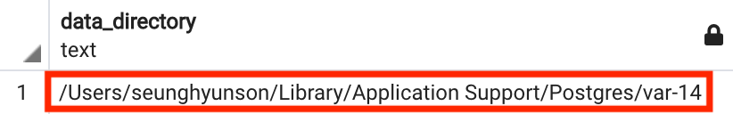

# Postgres는 데이터를 어떻게 저장할까?

## Postgres는 데이터를 어디에 저장할까?

**Postgres**는 하드 디스크 내부에 개별 데이터베이스에 대한 모든 정보를 폴더와 수많은 파일의 형태로 저장합니다.

각각의 다른 파일들은 해당 데이터베이스의 여러가지 정보를 담고 있습니다.  
ex) 테이블 정보, 인덱스, 고유 키

그렇다면 실제로 이런 폴더와 파일들이 어디에 어떤 형태로 존재하는지 알아보겠습니다.

---

우선 Postgres가 어떤 디렉토리에 데이터를 저장하고 있는지 아래 명령어를 통해 확인해본 후 자세히 살펴보겠습니다.

```sql
SHOW data_directory;
```



위 명령어를 통해 어떤 디렉토리에 데이터가 저장되고 있는지 확인했으니 해당 디렉토리로 이동해보겠습니다.


위에 보이는 여러개의 폴더들 중 우리가 원하는 데이터가 존재하는 `base` 폴더로 이동해보겠습니다.


로컬 환경에 존재하는 데이터베이스 별 데이터가 폴더의 형태로 존재합니다.

하지만 이렇게만 봐서는 어떤 폴더가 어떤 데이터베이스의 데이터를 담고 있는지 구분하기가 어렵습니다.

아래 명령어를 통해 각 폴더가 어떤 데이터베이스의 데이터를 담고 있는지 확인을 해보겠습니다.

```sql
SELECT oid, datname
FROM pg_database;
```


위의 base 폴더에 존재했던 숫자로 네이밍 되어있는 폴더들이 각각 어떤 데이터베이스의 폴더인지를 확인할 수 있습니다.

현재 데모용으로 작업중인 데이터베이스는 `instagram` 이므로 `16408` 폴더로 이동해보겠습니다.


해당 폴더에는 파일명만 봐서는 아무 정보도 알 수 없는 파일들이 수많이 존재합니다.

이 모든 파일들은 데이터베이스 내부의 raw data입니다.

그럼 각 파일들은 어떤 데이터를 담고 있을까요?

대충 봤을때 파일 하나하나가 개별 테이블을 나타내기에는 파일 수가 너무 많고, 개별 row를 나타내기에는 파일 수가 너무 적은 것처럼 보입니다.

다른 명령어를 통해 각 파일이 어떤 데이터를 담고 있는지 확인해보겠습니다.

```sql
SELECT * FROM pg_class;
```


많은 데이터가 반환되는 것을 볼 수 있습니다.

몇몇 row들은 테이블 하나에 대한 데이터를 담고 있는 것 처럼 보이지만 모든 row가 그렇지는 않아 보이죠?  
`pkey`, `id_seq`, `index` 등 여러가지가 존재하는 것을 확인할 수 있습니다.

여기서의 각 row는 조금 전 위에서 봤던 파일 하나하나에 담긴 데이터 객체에 담긴 데이터를 보여주고 있습니다.

데이터 객체는 테이블뿐만 아니라 `index`, `sequence`, `primary key` 등에 대한 정보를 담고 있습니다.

그렇다면 `users` 테이블에 대한 정보가 어디에 담겨 있는지 확인해보겠습니다.


`relname` 컬럼에 값이 `users`인 row를 찾아가면 `16410` 이라는 값의 `oid`를 가지고 있는 것을 확인할 수 있습니다.


다시 한번 `16480` 폴더를 찾아가서 `16410` 이라는 파일을 찾았습니다.  
해당 파일은 `users` 테이블에 대한 모든 정보를 담고 있는 파일이라는 뜻이죠.

---