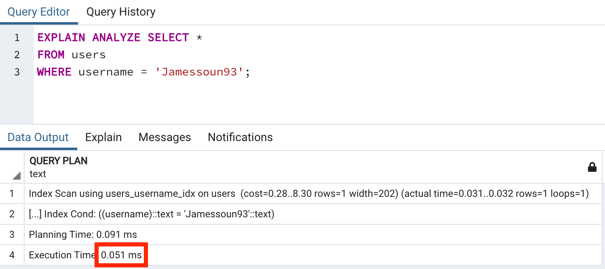
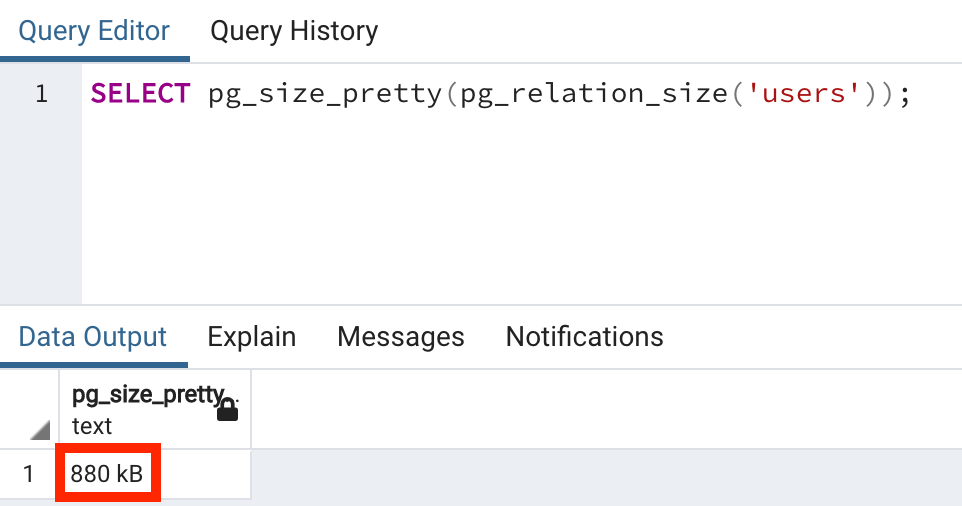
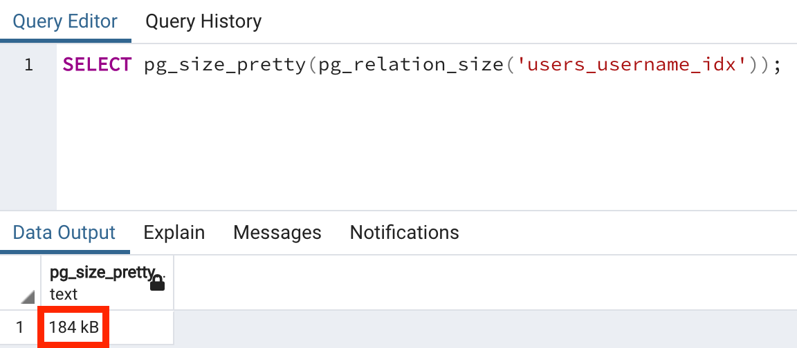

# Database Index란?

[Tistory 블로그 포스팅 바로가기](https://seunghyunson.tistory.com/19)

이번에는 데이터베이스를 다룰 때 정말 중요한 역할을 하는 Index에 대해 다뤄보겠습니다.

실제로 실무에서 서비스를 운영하면서 생기는 장애들을 Index를 적용하여 해결하는 경우가 많습니다.

그렇다면 Index가 무엇인지, 장/단점은 무엇인지 등에 대해 알아보겠습니다.

1. Full Table Scan
2. Index 동작 원리
3. Index 생성 및 벤치마킹
4. Index 단점
5. 자동 생성 Indexes

---

# Full Table Scan

Index가 뭔지 알아보기 전에 **Full Table Scan**에 대해서 알아보겠습니다.

```sql
SELECT *
FROM users
WHERE username = 'jamessoun93';
```

위 쿼리는 `users` 테이블 내 존재하는 모든 데이터 중 `username` 컬럼 값이 `jamessoun93`인 데이터를 반환하는 쿼리입니다.

이런 쿼리를 실행할 때 Postgres 내부에서는 어떤 일이 일어날까요?

제가 이전에 작성한 [Postgres는 데이터를 어디에 어떤 형태로 저장할까?](https://seunghyunson.tistory.com/16) 하단의 **Postgres는 데이터를 어떤 형태로 저장할까?** 파트를 보면, 테이블 하나에 대한 데이터는 하나의 **Heap File**로 저장된다는 것을 알 수 있습니다.

하지만 해당 테이블의 전체 데이터는 여러 개의 **Block**으로 그룹 지어져 저장되어 있는 형태이기 때문에 Postgres가 바로 **Heap File**에 접근해서 스캔을 시작할 수 없습니다.

그래서 스캔할 대상이 되는 모든 데이터를 메모리에 모아놓고 메모리에서 순차적으로 하나하나 확인을 하면서 원하는 데이터를 찾습니다. (아래 다이어그램 확인)


Heap 파일로부터 모든 데이터를 메모리로 옮겨 데이터 하나하나 원하는 조건에 맞는지 확인하는 작업이 바로 **Full Table Scan**입니다.

메모리로 옮겨야 할 데이터가 많으면 많을수록 전체적인 비용이 커지고 성능에 영향을 주는 작업입니다.

그러므로 꼭 **Full Table Scan**이 필요한지에 대한 고민이 필요하고 더 성능 효율적인 방법이 존재한다면 다른 방법을 선택할 수 있어야 합니다.

---

# Index 동작 원리

```sql
SELECT *
FROM users
WHERE username = 'jamessoun93';
```

그렇다면 위와 같은 쿼리를 날릴 때 매번 메모리에 데이터를 로드한 뒤 Full Table Scan을 하는것이 아니라, 내가 원하는 데이터가 정확하게 어떤 Block의 몇 번째 인덱스에 존재하는지 알려줄 수 있는 방법은 없을까요?

**Index**를 활용하면 가능합니다.


데이터베이스 Index는 요청한 데이터가 어떤 Block의 몇 번째 인덱스에 존재하는지를 알려주는 자료구조입니다.

인덱스는 내가 찾고자 하는 데이터를 담고 있는 **컬럼**을 기준으로 생성합니다.  
해당 컬럼 값을 찾을 때 속도 효율을 높여주기 위해서죠.

그래서 인덱스 사용을 고려할 때 가장 첫 번째로 해야 할 것이 어떤 컬럼을 기준으로 인덱스를 생성할 건지 정하는 것입니다.

그렇다면 인덱스가 내부적으로 어떻게 생성되고 어떻게 사용되는지 보겠습니다.

## Index 생성 과정

1. 기준이 될 컬럼의 데이터를 수집합니다.
2. 수집한 데이터를 정렬합니다.
3. 정렬된 데이터를 Tree 구조로 만들어 정리합니다.

### 1. 수집

여기서는 `username` 컬럼을 기준으로 정하겠습니다.

Heap File에서 Block 마다 존재하는 데이터(row)마다 확인하면서 `username`에 대한 데이터를 수집합니다.  
(username 외 다른 정보는 수집하지 않습니다.)


위의 다이어그램과 같은 형태로 각 `username` 데이터마다 해당 데이터가 어떤 block의 몇 번째 index에 존재하는지를 수집합니다.

### 2. 정렬

그런 뒤 이렇게 수집한 데이터를 정렬합니다.

정렬 방식은 수집한 데이터에 따라 다릅니다.

지금과 같은 string인 경우 알파벳순으로 정렬하고, 숫자/날짜 같은 값은 오름차순/내림차순으로 정렬할 수 있습니다.


### 3. Tree 구조로 정리

위에서 특정 기준으로 정렬된 데이터를 이제 Tree 구조로 정리합니다.


여기서 데이터를 가장 왼쪽 **leaf node**부터 순서대로 오른쪽으로 추가합니다.

**leaf node**들만 확인해도 왼쪽에서 오른쪽으로 기존의 정렬 상태를 그대로 유지하는 것을 확인할 수 있습니다. (여기서는 알파벳순)

그런 뒤 **root node**에는 조건에 따라 방향을 말해주는 **helper를** 추가합니다.

**Root node**의 **helper는** 어떤 **leaf node**를 확인해야 하는지 알려줘서, 조건에 맞는 데이터를 담고 있는 **leaf node**만 확인하면 되게 해줍니다. (다른 **leaf node**를 확인할 필요가 없게 해준다는 뜻이죠.)

## Index 동작 과정

그렇다면 이제 위의 작업을 걸쳐 생성된 인덱스가 사용되는 과정을 살펴보겠습니다.


제가 찾고자 하는 데이터는 `username` 값이 `jamessoun93`과 일치하는 row입니다.

1. Root node에서 좌측 조건에 맞지 않으니 우측 조건을 살펴본 뒤 해당 조건에 맞는지 확인합니다.
2. 우측 leaf node에서 미리 수집해놓은 `jamessoun93`이란 `username`을 가진 데이터의 위치(Block, Index)를 파악합니다.
3. Heap file에서 곧장 해당 위치에 있는 데이터를 찾습니다.

인덱스를 사용하면 어떤 이점이 있는지 이제 좀 보이시나요?

내가 원하는 데이터가 어디에 있는지 말해주는 **root node**의 **helper를** 이용하여 **좌측 leaf node**는 확인할 필요도 없이 **우측 leaf node**만 확인하면 됩니다.

그리고 해당 **leaf node**에서 찾는 데이터가 **heap file**의 **Block 1**에 있다는 사실을 알고 **Block 0**는 확인할 필요도 없이 원하는 데이터를 찾을 수 있는 것이죠.

**Full Table Scan**처럼 원하는 데이터를 찾을 때까지 모든 데이터를 메모리에 로드한 뒤 하나하나 확인하는 방식보다 훨씬 빠를 수밖에 없겠죠?

---

# Index 생성 및 벤치마킹

지금까지 인덱스가 어떻게 생성되는지 그리고 생성된 인덱스가 어떻게 사용되는지를 알아봤으니 실제로 인덱스를 생성해보겠습니다.

인덱스를 생성하는 문법은 아래와 같습니다.
```sql
CREATE INDEX ON 테이블명 (컬럼명);
```

생성된 인덱스명은 default로 `테이블명_컬럼명_idx`의 형태로 생성됩니다.

아래 명령어를 입력하면 `users_username_idx`라는 이름으로 인덱스가 생성됩니다.

```sql
CREATE INDEX ON users (username);
```

인덱스 삭제하는 문법은 아래와 같습니다.
```sql
DROP INDEX users_username_idx;
```

`username` 컬럼에 대한 인덱스를 생성했으니 실제로 인덱스를 사용하면 속도가 빨라지는지 테스트해보겠습니다.

현재 5340개의 데이터가 있는 `users` 테이블을 기준으로 아래 쿼리를 실행해 테스트를 진행합니다.

```sql
EXPLAIN ANALYZE SELECT *
FROM users
WHERE username = 'Jamessoun93';
```

`username` 컬럼 인덱스 없이 실행한 결과


`username` 컬럼 인덱스를 생성한 뒤 실행한 결과



이렇게 간략히 진행한 테스트에서 약 29배 정도의 속도 차이가 나는 것을 확인할 수 있습니다.

---

# Index 단점

인덱스를 사용하면 이렇게 빨라지는데 모든 컬럼에 생성해서 사용하면 되지 않을까? 하는 생각을 할 수도 있습니다.

하지만 인덱스는 크게 도움이 되지 않거나 오히려 비효율적인 경우도 존재하기 때문에 항상 사용하는 것은 비효율적일 수 있습니다.

언제 인덱스 사용이 도움이 되지 않거나 비효율적일까요?

## 1. 저장공간

인덱스도 마찬가지로 컴퓨터의 저장 공간을 사용합니다.

실제로 얼마나 사용하는지 확인할 수도 있습니다.

우선 `users` 테이블이 얼마만큼의 공간을 사용하고 있는지 확인해보겠습니다.

```sql
SELECT pg_size_pretty(pg_relation_size('users'));
```



그렇다면 `users` 테이블에 생성한 `username` 인덱스는 얼마만큼의 공간을 사용하고 있을까요?

```sql
SELECT pg_size_pretty(pg_relation_size('users_username_idx'));
```



**880kb** 와 **184kb** 정도면 크기도 작고 괜찮겠네!...

할 수 있지만 엄청나게 많은 데이터를 핸들링하는 서비스라서 테이블 데이터가 **880kb**가 아니라 **80gb**라면 인덱스의 크기도 **18gb** 정도가 될 텐데, 요즘처럼 데이터베이스도 호스팅 해서 비용을 지불하고 사용하는 시대에 과연 저 정도 storage에 대한 금액을 매번 내는 게 부담스럽지 않을지도 생각해봐야 하는 문제입니다.

선택의 문제겠지만 결국 인덱스도 저장공간을 잡아먹는다는 점이 포인트입니다.

## 2. 업데이트

인덱스란 생성시점에 해당 테이블에 존재하는 데이터를 기준으로 생성되기 때문에 테이블에 데이터가 추가, 업데이트, 삭제될 때마다 인덱스도 업데이트해줘야 합니다.

20개의 데이터를 따로따로 INSERT 한다고 가정한다면 인덱스도 20번 업데이트해줘야한다는 뜻이겠죠. 

performance cost가 있을 수밖에 없는 작업입니다.

## 3. 사용하지 않는 경우

인덱스가 존재한다고 해서 Postgres가 꼭 사용하는 건 아닙니다.

인덱스를 생성했지만 사용하지 않아 아무 영향이 없는 경우도 있습니다.

### 이러이러한 이유들 때문에 빨라 보인다고 모든 컬럼에 인덱스를 적용하는 건 좋지 않은 방법입니다.

---

# 자동 생성 Indexes

DBMS마다 조금씩 차이는 있겠지만, 직접 인덱스를 생성하지 않아도 자동으로 생성되는 경우가 있습니다.

**Postgres**는 **primary key**와 **unique constraint**가 걸려있는 컬럼에 대한 인덱스를 자동으로 생성해주기 때문에 따로 인덱스를 생성해줄 필요가 없습니다.

아래 명령어를 통해 현재 사용하고 있는 DB에 존재하는 모든 인덱스를 확인해보겠습니다.

```sql
SELECT relname, relkind
FROM pg_class
WHERE relkind = 'i';
```

위 SQL문에서 `pg_class` 테이블은 해당 데이터베이스의 객체들에 대한 정보를 담고 있습니다.  
테이블, 인덱스, 시퀀스 등등 다양한 (column을 제외한 거의 모든) 데이터를 담고 있습니다.

`relkind = 'i'`의 `i`는 index를 뜻합니다.  
많은 정보들 중 인덱스만 필터 하겠다는 뜻입니다.


`_pkey`로 끝나면 primary key, `_key`로 끝나면 unique constraint에 대한 인덱스라는 뜻입니다.

---

이렇게 Index에 대해 알아봤습니다.

다음에는 인덱스를 활용하여 복잡한 쿼리를 튜닝하는 예시를 들어볼 예정입니다.