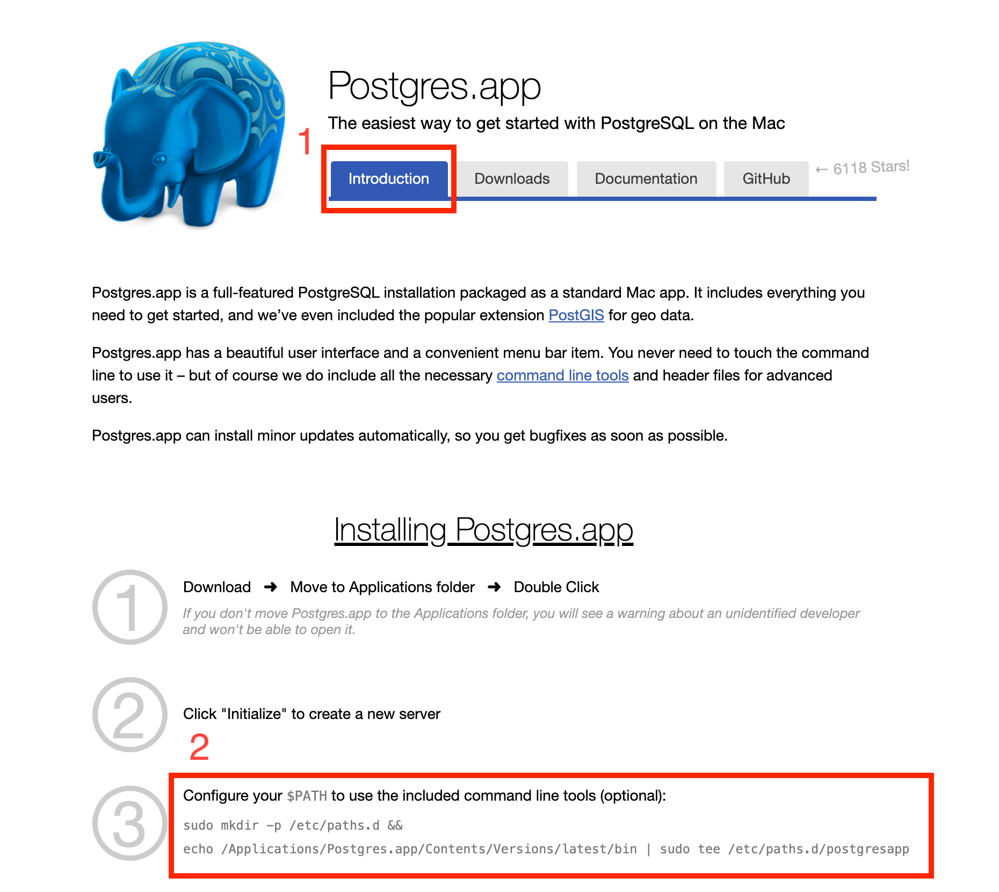
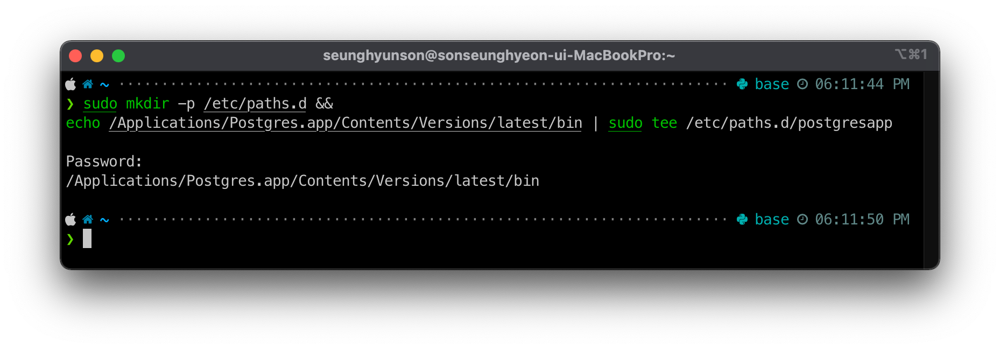
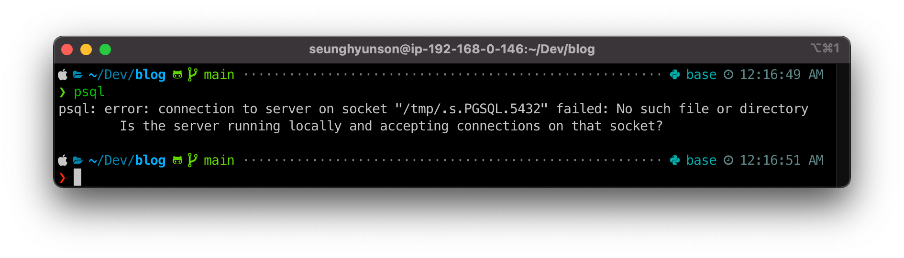
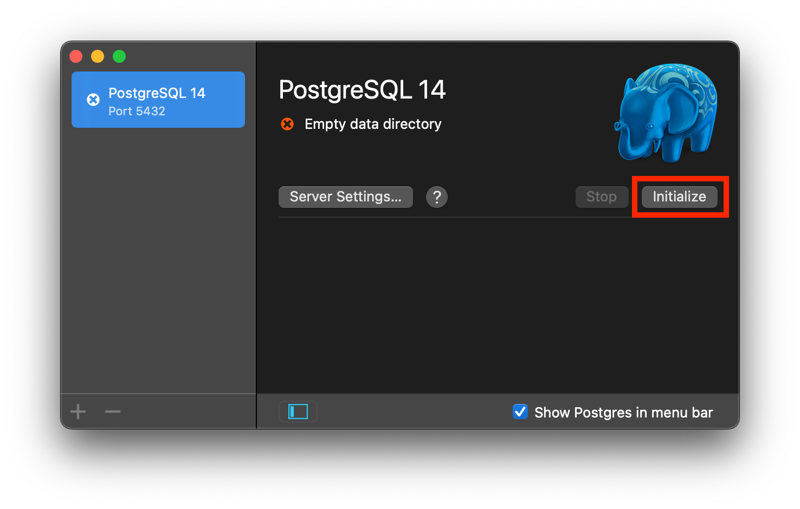
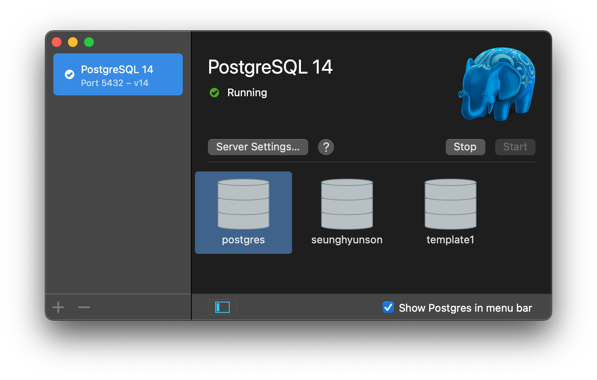
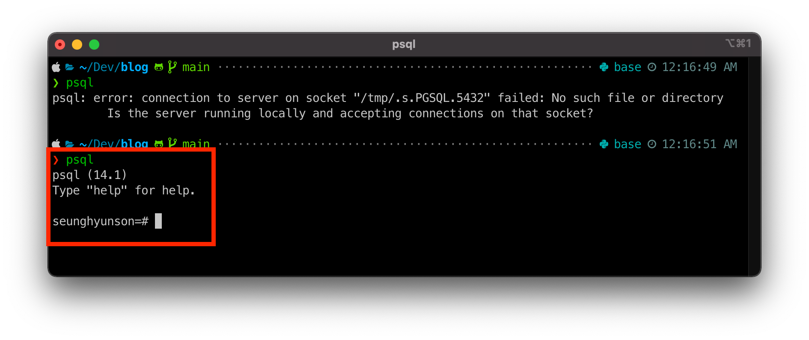

# PostgreSQL 설치하기 (MacOS)
MacOS에서 PostgreSQL을 설치하는 방법에 대해서 알아봅시다.

## 설치 Options
1. Postgres.app을 설치해서 사용하는 방법
2. Homebrew로 설치하는 방법

이번 포스팅에서는 두 가지 방법 중 1번 Postgres.app을 설치하는 방법을 선택하겠습니다.

---

## Download & Setup
Step 1. https://postgresapp.com/downloads.html 접속 후 Latest Release 다운로드

Step 2. Applications 폴더로 복사

Step 3. $PATH 설정

1. Introduction 탭으로 이동
2. `$PATH` 설정코드 복사 후 terminal에서 실행

Step 4. Terminal을 새로 켠 후 `psql` 커맨드 입력

PostgreSQL 서버가 켜져있지 않아서 생기는 문제

해결방법
1. Postgres.app을 실행한 후 Initialize

2. 성공적으로 initialize가 되면 아래와 같은 화면이 보이게 된다.

3. 다시 terminal로 돌아와 `psql` 커맨드 입력하면 이번에는 명령어를 입력할 수 있는 Postgres 서버에 접속하게 된다.

4. 나가려면 `quit` 명령어 입력

이렇게 PostgreSQL 설치를 마쳤다 🎉