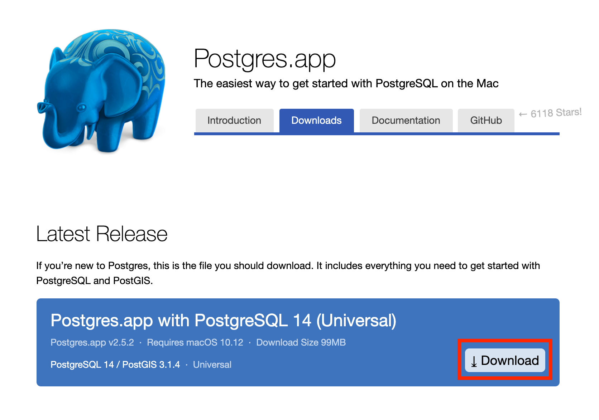
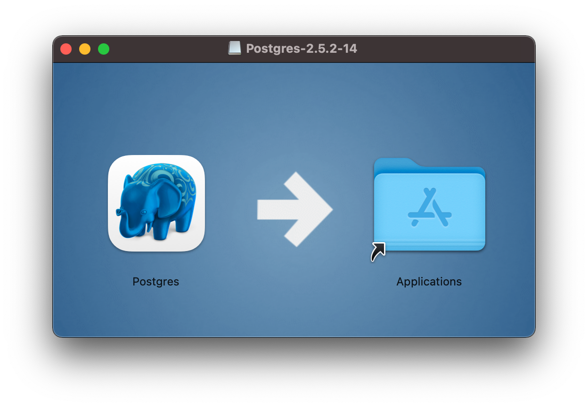

# PostgreSQL 설치하기 (MacOS)
MacOS에서 PostgreSQL을 설치하는 방법에 대해서 알아봅시다.

## 설치 Options
1. Postgres.app을 설치해서 사용하는 방법
2. Homebrew로 설치하는 방법

이번 포스팅에서는 두 가지 방법 중 1번 Postgres.app을 설치하는 방법을 선택하겠습니다.

---

## 1. Download
Step 1. https://postgresapp.com/downloads.html 접속 후 Latest Release 다운로드

Step 2. Applications 폴더로 복사

ㄴㄴ