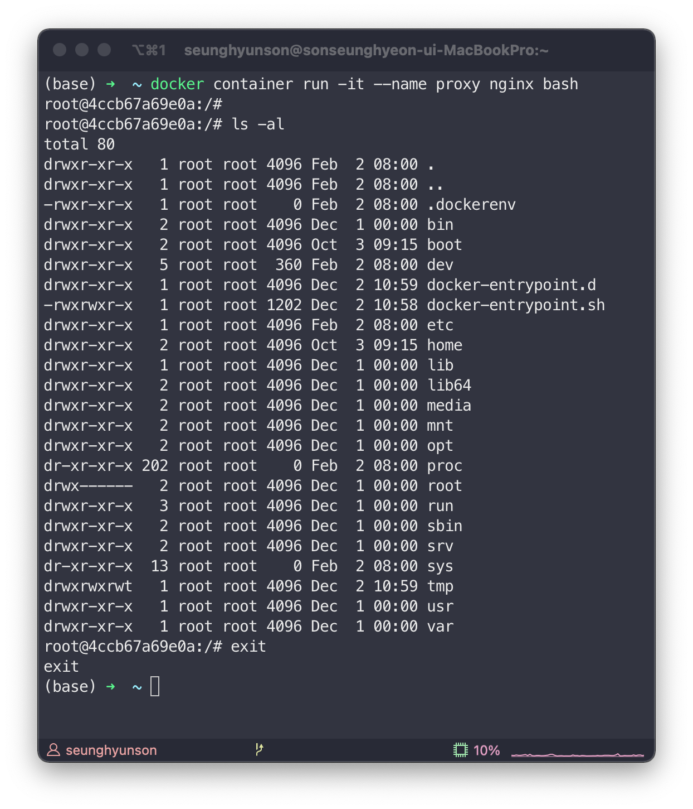
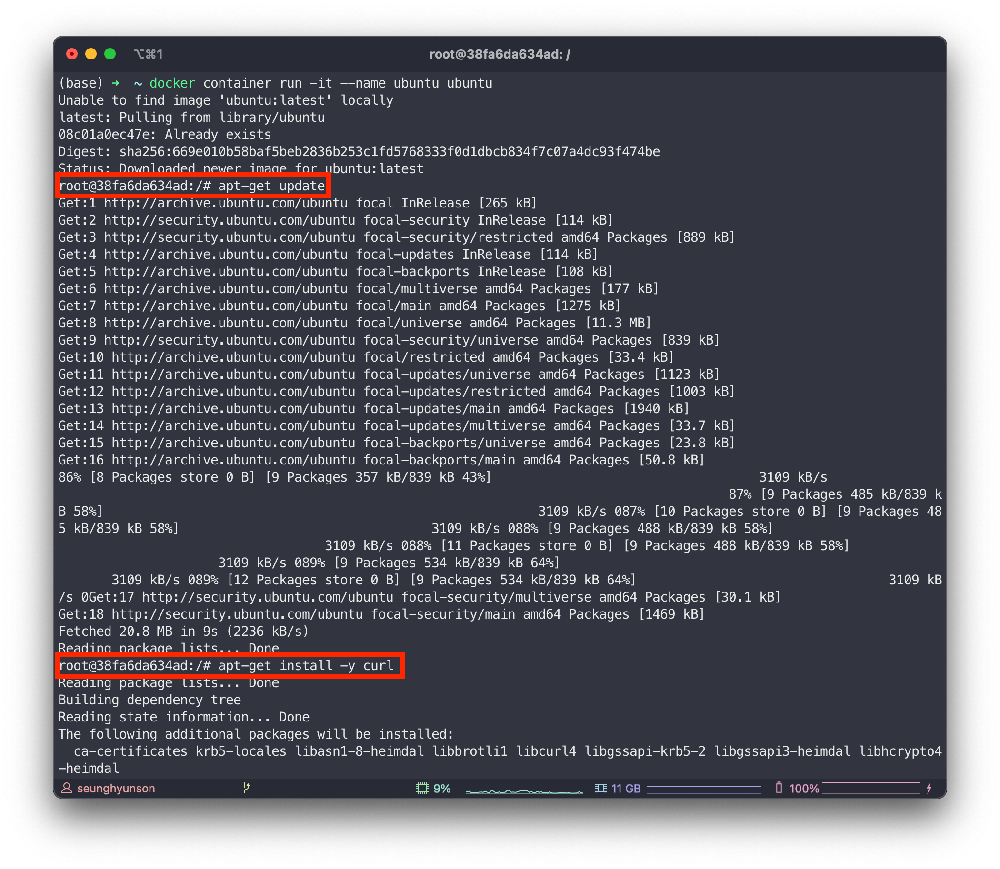
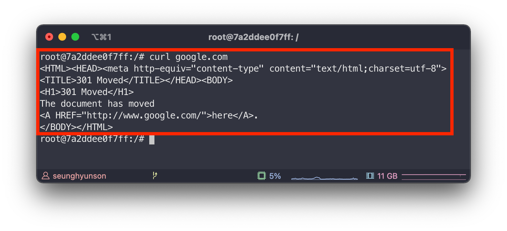
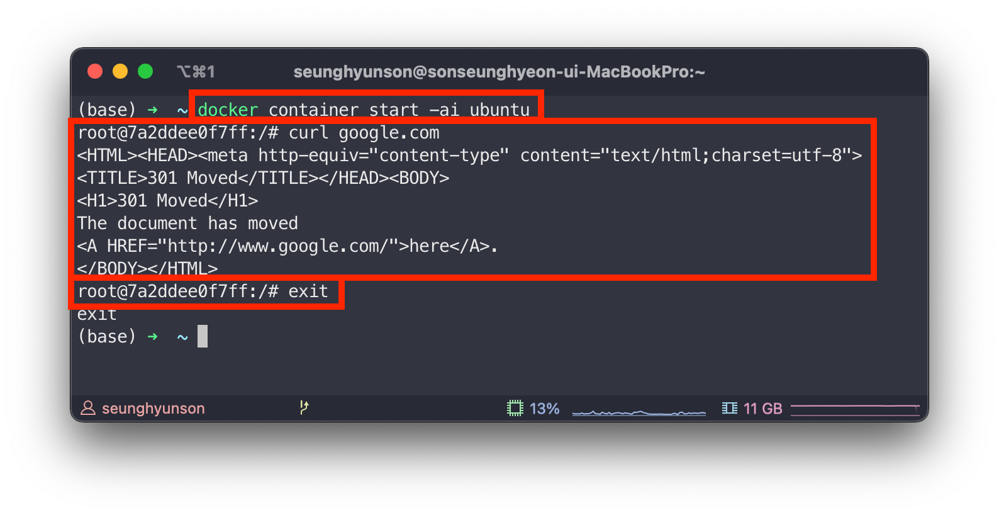
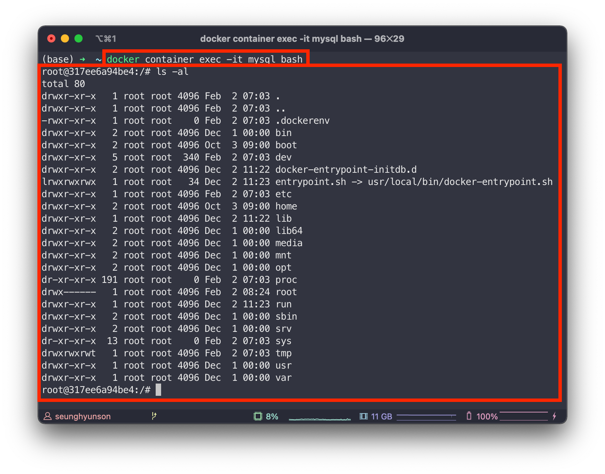
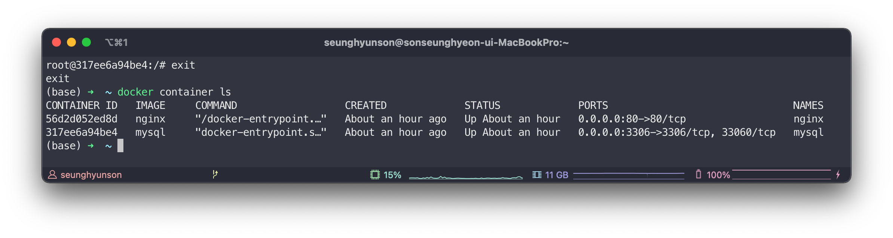

# [Docker #2] Docker 컨테이너 활용하기

[Tistory 블로그 포스팅 바로가기](https://seunghyunson.tistory.com/18)

이제 컨테이너를 생성하는 방법을 알고 있으니 컨테이너를 사용해볼 차례입니다.

## interactive하게 컨테이너 사용
```sh
docker container run -it
```
`-i`: interactive라는 뜻으로 명령어를 입력받을 수 있게 세션을 열어둔다는 뜻입니다.  
`-t`: tty(pseudo-TTY) 터미널과 비슷한 환경을 제공한다는 뜻입니다.

`-it`는 `-i`와 `-t`가 합쳐져 있는 형태의 옵션입니다.

### 예시
nginx 기반 컨테이너에 -it 옵션을 주고 bash를 실행시켜보겠습니다.

```sh
docker container run -it --name proxy nginx bash
```


명령어를 실행하면 실제로 nginx 서버 내부에 SSH 접속을 한 것처럼 터미널 환경이 제공되는 것을 확인할 수 있습니다.

명령어 맨 뒤에 bash는 CMD입니다.  
그냥 nginx를 실행하면 nginx 서버가 실행되고 말기 때문에 bash CMD를 추가하여 bash를 사용할 수 있게끔 한 것입니다.

이번에는 ubuntu 이미지 기반 컨테이너를 `-it` 옵션과 함께 생성해보겠습니다.
```sh
docker container run -it --name ubuntu ubuntu
```


ubuntu 이미지는 default CMD가 bash라서 nginx처럼 추가 CMD를 제공하지 않아도 bash가 제공됩니다.

이제 해당 컨테이너 내부에서 apt 패키지 매니저를 활용하여 curl를 설치해보겠습니다.

```sh
apt-get update
apt-get install -y curl
```


정상적으로 설치를 마쳤으니 이제 활용해서 요청을 날려보겠습니다.

(중간에 동일한 환경의 컨테이너를 새로 생성해서 root@ 옆에 보이는 container id가 달라졌습니다.)

```sh
curl google.com
```


제대로 응답이 오는것을 확인할 수 있죠.

ubuntu 이미지를 활용하여 생성한 컨테이너에 apt 패키니 매니저를 통해서 curl 설치 후 호출까지 해봤습니다.

하지만 같은 ubuntu 이미지를 활용하여 새로운 컨테이너를 생성했을때는 curl 설치가 되어있지 않다는 점을 이해해야합니다.

같은 이미지 기반 컨테이너라도 서로 다른 프로세스이기 때문입니다.

## 종료된 컨테이너 다시 사용하기

작업을 마친 후 컨테이너가 종료되었을때 매번 새로운 컨테이너를 생성할 필요없이 이전에 만들어놓은 컨테이너를 다시 시작할 수 있습니다.

```sh
docker container start -ai <container name>
```


## 현재 실행중인 컨테이너 사용하기

현재 실행중인 컨테이너에 추가로 process를 실행하는 `exec` 커맨드를 활용하여 실행중인 컨테이너를 사용할 수 있습니다.

현재 `mysql` 컨테이너가 실행중이니 해당 컨테이너를 활용해보겠습니다.

```sh
docker container exec -it mysql bash
```

mysql 컨테이너에서 bash를 띄워 위와 마찬가지로 컨테이너 내부에서 원하는 작업을 실행할 수 있습니다.



`exec` 같은경우 새로운 추가 process를 사용하기 때문에 mysql 데몬의 root process에 영향을 주지 않아 `exit`해서 컨테이너에서 나가도 컨테이너는 이전과 같이 계속 실행되고 있는 것을 확인할 수 있습니다.

