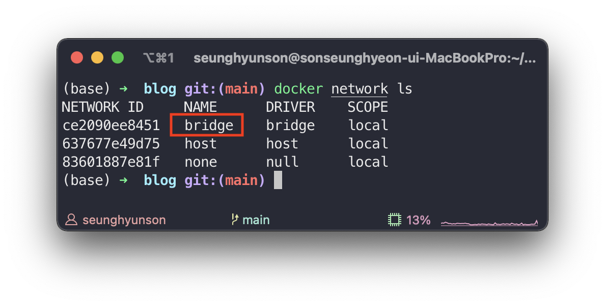
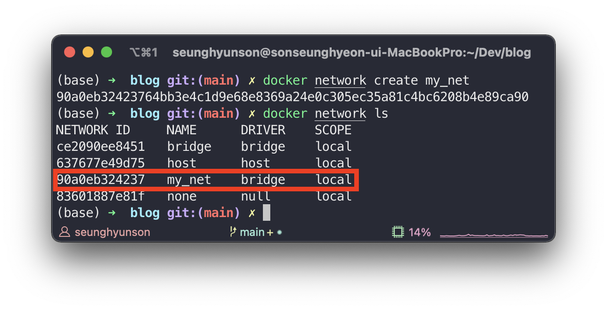
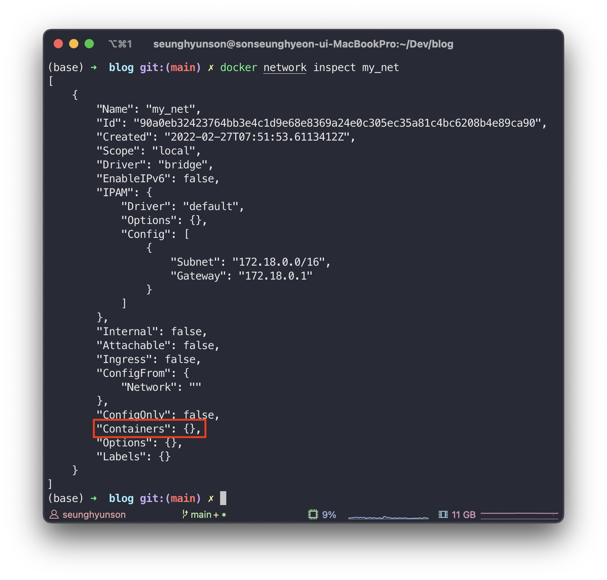
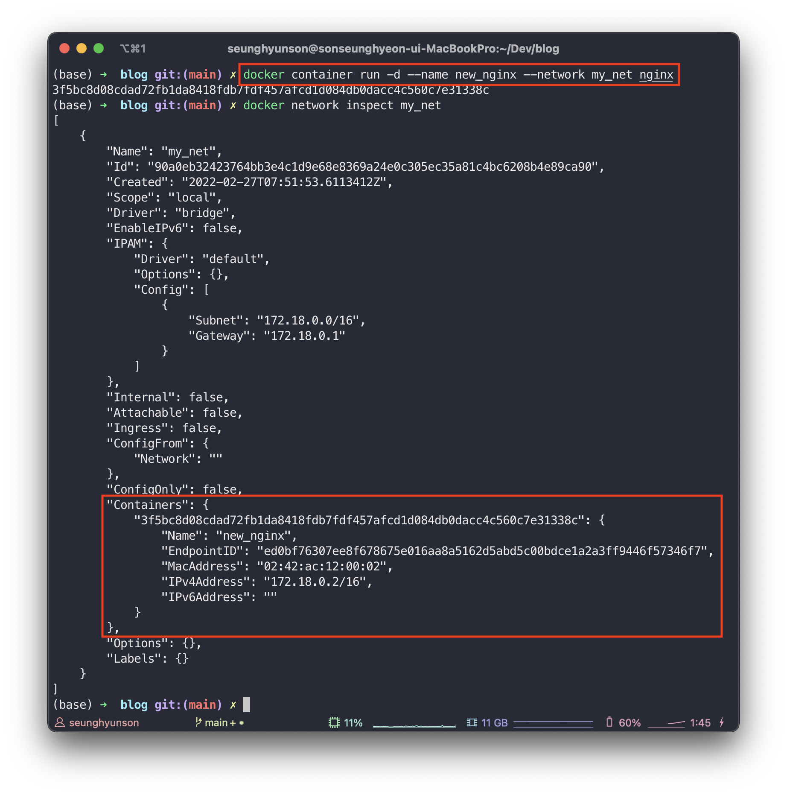
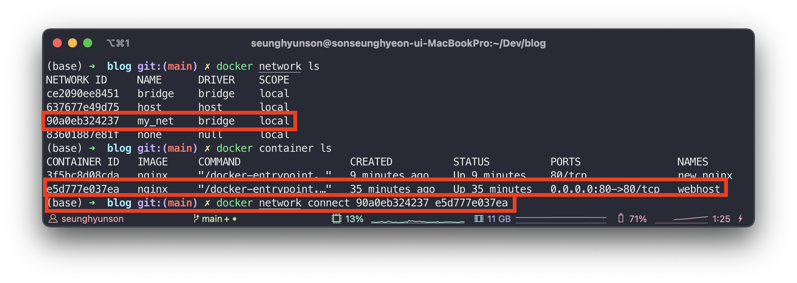
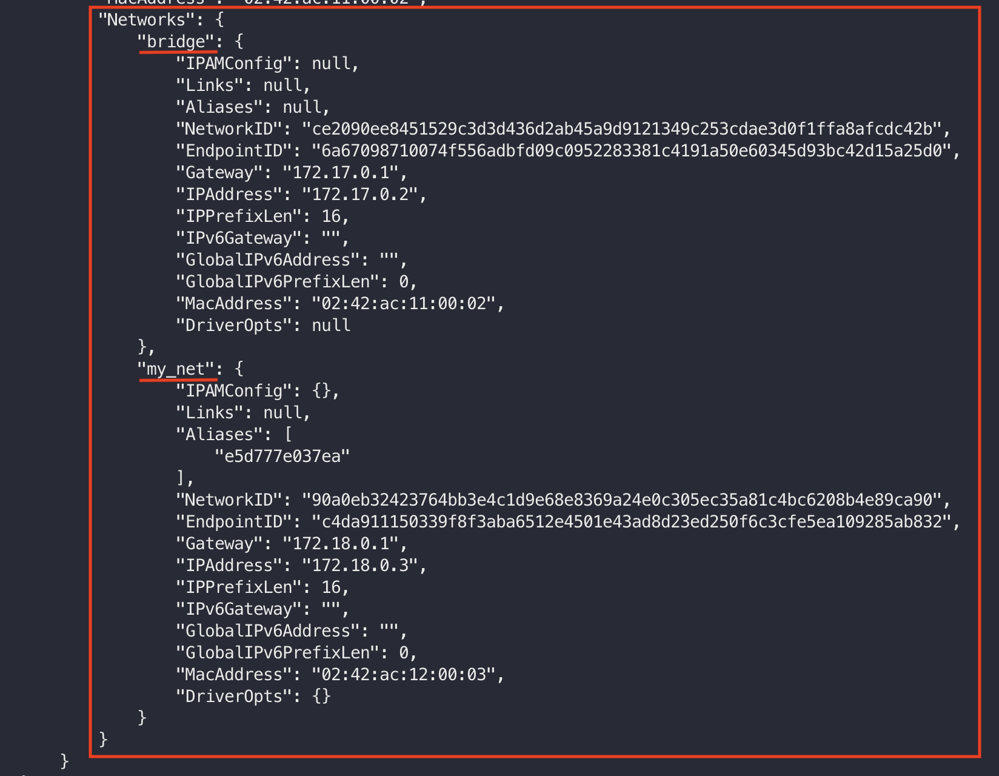

# [Docker #3] Docker Networks

지금까지는 도커를 활용하여 간단하게 컨테이너를 만들어보고 만든 컨테이너를 활용해봤습니다.

그렇다면 서로 다른 이미지를 활용하여 만든 컨테이너끼리 연결하는 방법은 없을까요?

내가 만든 **Node.js** 애플리케이션을 컨테이너로 띄우고, 해당 **Node.js** 애플리케이션에서 연결할 **MySQL** 컨테이너를 띄웠을 때 서로 연결이 가능해야하겠죠?

**Docker Network**를 사용하면 가능합니다.

도커를 사용하여 컨테이너를 시작하면 도커 내 **bridge**라 불리는 가상 네트워크에 연결됩니다.

같은 가상 네트워크에 존재하는 컨테이너들 끼리는 `-p` or `--publish` 옵션을 줘서 **port**를 열지 않아도 서로 연결이 가능합니다.

`my_web_app` 이라는 네트워크 내에 **Node.js** 애플리케이션 컨테이너와 **MySQL** 컨테이너를 함께 두는 것이죠.

이렇게 되면 해당 **Node.js** 컨테이너와 **MySQL** 컨테이너는 포트를 열지 않아도 서로 연결이 가능합니다.

하나의 컨테이너는 하나 혹은 여러개의 가상 네트워크에 포함시킬 수 있고 필요에 따라 아무 가상 네트워크에 포함시키지 않고 host 네트워크를 직접 사용할 수도 있습니다.

---

# Commands

```sh
docker network ls
```



여기서 bridge 네트워크란, host의 네트워크로의 연결다리를 놓아주는 도커의 기본 가상 네트워크입니다.

host 네트워크는 도커의 가상 네트워크를 사용하지 않고 컨테이너를 호스트 인터페이스에 직접 연결하는 특수 네트워크입니다. (host 네트워크를 사용하는데에는 장단점이 있습니다.)

## Network inspect 하기

```sh
docker network inspect {NETWORK_NAME}
```

해당 네트워크의 subnet, gateway와 네트워크에 연결되어있는 컨테이너 정보를 보여줍니다.

## 새로운 Network 생성

```sh
docker network create {NETWORK_NAME}
```



## 새로운 컨테이너 생성 시 Network 지정

```sh
docker container run -d --name {CONTAINER_NAME} --network {NETWORK_NAME} {IMAGE_NAME}
```



위에서 생성한 my_net 네트워크를 inspect 해보면 아무 container도 연결되어 있지 않은 것을 확인할 수 있습니다.



새로운 컨테이너를 생성할 때 my_net 네트워크를 지정해준뒤 다시 my_net을 inspect해보니 컨테이너가 추가된 것을 확인할 수 있습니다.

## 존재하는 컨테이너에 네트워크 연결

```sh
docker network connect {NETWORK_ID} {CONTAINER_ID}
```



이미 존재하는 webhost 컨테이너를 새로 생성한 my_net 네트워크에 연결했습니다.



그런 뒤 webhost 컨테이너를 inspect 해보니 해당 컨테이너가 bridge와 방금 추가한 my_net 네트워크에 연결되어 있는 것을 확인할 수 있습니다.

## 컨테이너에 네트워크 연결 끊기

```sh
docker network disconnect {NETWORK_ID} {CONTAINER_ID}
```

---

!!!!!!(DNS 부분 추가해야함)