# 우리 회사에서 사용하는 Git Flow 소개 (2022.02)

사내 개발팀 인수인계 자료용으로 작성

# Flow Diagram

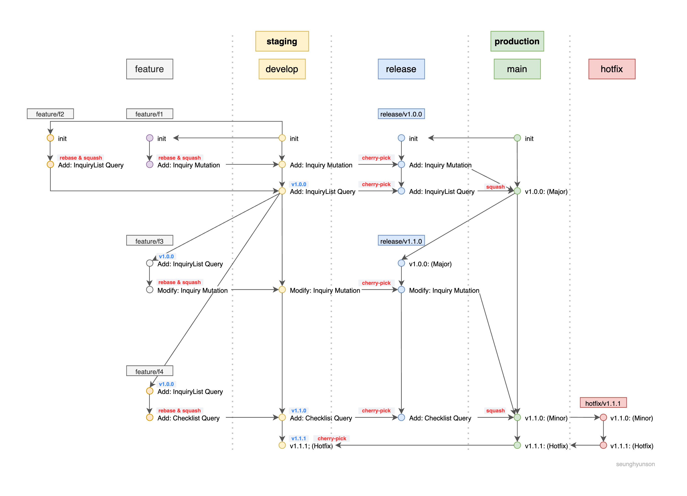

---

# Branches

## master (production)

`master` 브랜치는 `production` 환경에 배포될 코드를 담은 브랜치입니다.

`production` 환경이란 실제 사용자들이 사용하는 버전의 코드를 담고 있는 환경입니다.

굉장히 중요한 브랜치인만큼 쉽게 **ROLLBACK**이 가능하도록 이력관리가 명확하게 되어야 합니다.

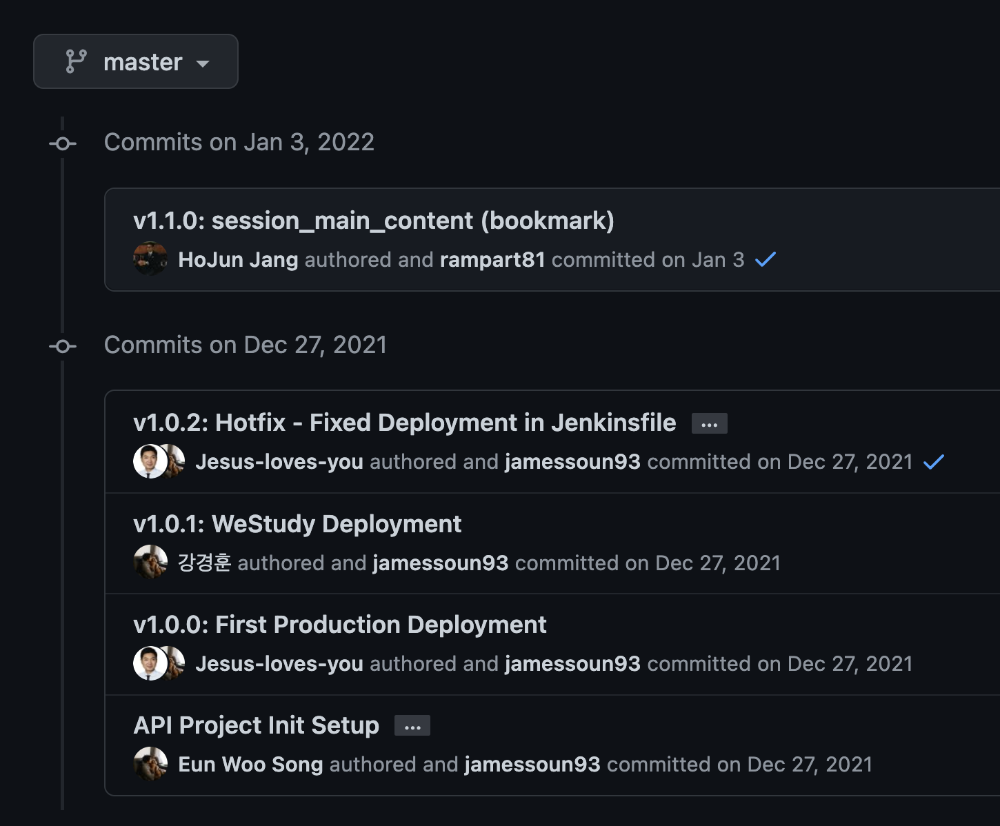

## release

`develop` 브랜치에서 새로운 버전으로 배포할 준비가 완료되면 `release` 브랜치를 생성하여 `master`에 push할 준비를 합니다.

이 브랜치에서는 해당 `release`에 담겨야할 커밋들을 `develop` 브랜치에서 `cherry-pick` 해온 뒤 상세하게 확인 후 **Pre-Deployment Test**를 진행합니다.

**Pre-Deployment Test**는 배포 전 해당 `release`에 올라가야할 기능들을 체크리스트화시켜 하나하나 상세하게 확인하는 테스트입니다.

## hotfix

`production`환경에 배포 후 버그가 발견될 시 바로 수정해서 배포할 목적으로 생성하는 브랜치입니다.

`master` 브랜치를 기준으로 바로 생성하여 문제 해결 확인 후 merge 합니다.

`hotfix`가 merge되면 `develop`에서는 해당 `hotfix` 내역을 담은 `commit`을 `cherry-pick` 해와야 합니다.

## develop (staging)

`develop` 브랜치는 `staging` 환경에 배포될 코드를 담은 브랜치입니다.

`staging` 환경이란 `production` 환경과 동일한 환경으로 내부 확인 및 테스트용 환경입니다.

개발팀원들이 각자의 `feature` 브랜치에서 작업한 내용을 Peer Review, Leader Review를 거쳐 merge되어 최종적으로 합쳐지는 브랜치입니다.

## dev (feature)

개발팀원들이 각각 작업한 기능을 담은 개별 브랜치입니다.

Commit 메세지와 PR Template에는 해당 브랜치에 담긴 코드가 어떤 기능을 담고 있는지 명확하게 설명이 되어야 합니다.

`develop` 브랜치를 기준으로 Pull Request 하여 Peer Review와 Leader Review를 거쳐 최종적으로 merge 됩니다.

---

# Development Process

매 스프린트 티켓을 할당받아 `develop` 브랜치 기준으로 `feature` 브랜치를 생성합니다.

feature 브랜치명은 `feature/JIRA-TICKET-ID`의 형태로 지어줍니다.

해당 feature 브랜치에서 작성한 코드는 항상 업데이트된 `develop` 브랜치를 기준으로 squash & rebase를 해서 push 한 뒤 Pull Request를 생성합니다.

PR을 생성하면 GitHub Action이 해당 팀 팀원들을 reviewer로 등록해줍니다.

Reviewer로 등록된 동료들로부터 리뷰(Peer Review)를 받고 리뷰 내용을 반영합니다.

Peer Review를 진행하는 동료들은 해당 변경사항을 꼭 Approve 혹은 Request Changes를 해주셔야 합니다.

Peer Review가 전부 마무리되면 Leader Review를 거친 뒤 최종적으로 `develop`으로 merge 됩니다.

---

# Deployment Process

### 1. tag 생성 및 push

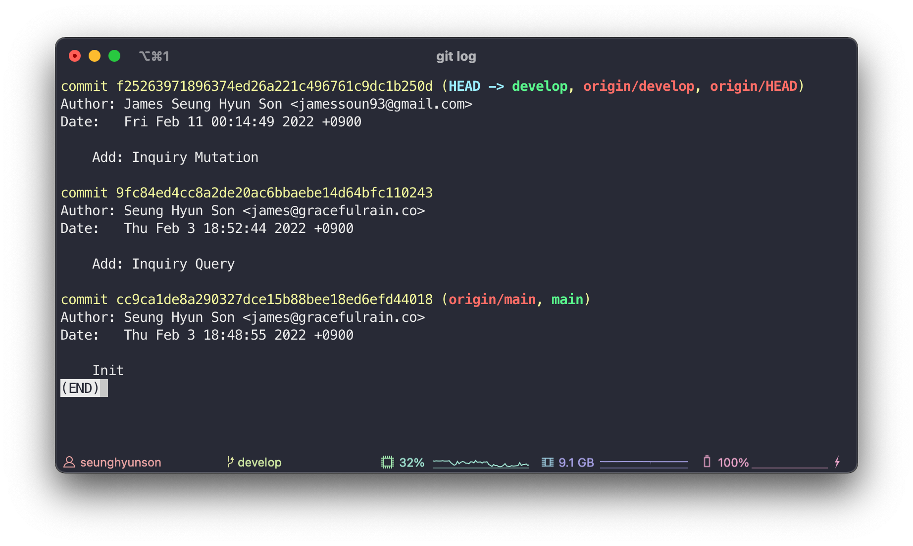

`develop` 브랜치에서 새로운 `release`를 만들 준비가 되면 `develop` 브랜치의 가장 최신 커밋에 해당하는 버전 `tag`를 추가한 뒤 push 합니다.

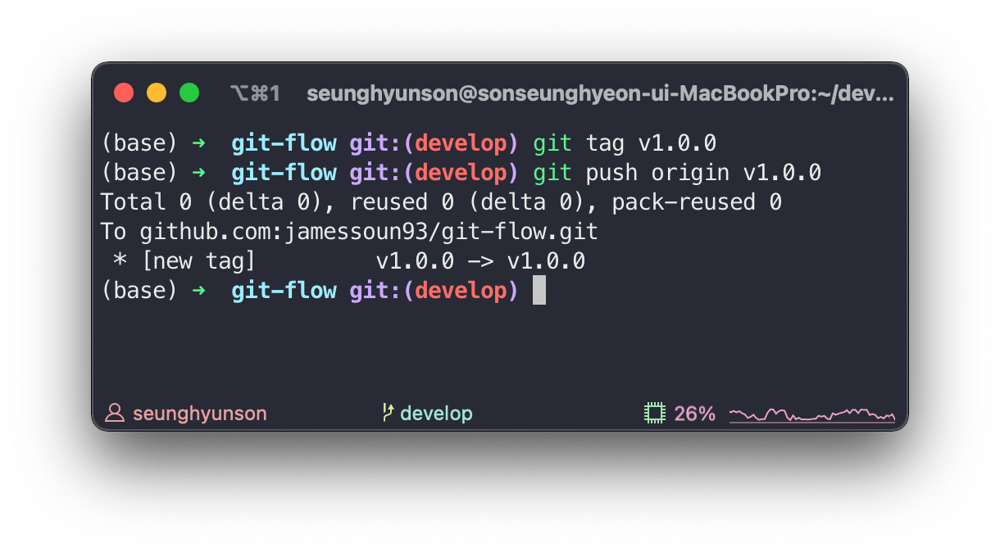

```sh
git tag v1.0.0
git push origin v1.0.0
```

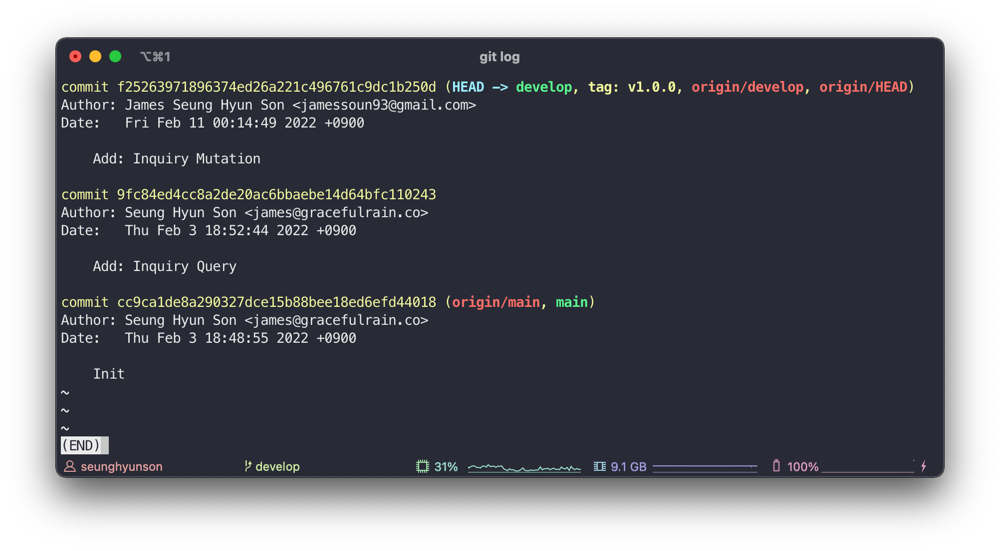

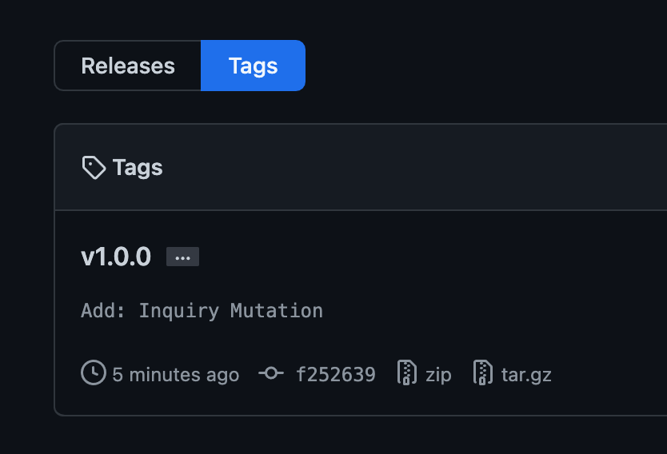

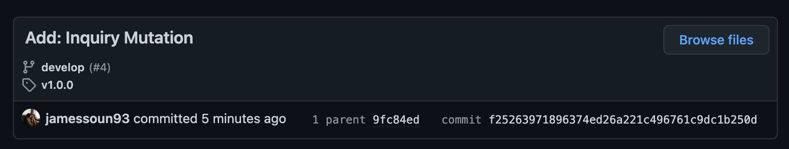

### 2. release 브랜치 생성

tag를 추가했으면 release 브랜치를 생성할 차례입니다.

`master` 브랜치를 기준으로 `release/VERSION-NUMBER`의 형태로 브랜치를 생성합니다. (주의! `develop` 브랜치 기준이 아닙니다.)

### 3. tag 사이 커밋 가져오기 (cherry-pick)

생성한 `release` 브랜치로 이동하여 이전 tag가 달린 commit hash (A) 바로 다음 commit부터 방금 생성한 tag가 달린 commit hash 까지의 commit들을 전부 cherry-pick 해서 가져옵니다.

```sh
git cherry-pick A..B
```

commit hash A 다음 commit부터 commit hash B를 포함한 모든 커밋을 한번에 cherry-pick 하는 명령어입니다.

커밋을 제대로 잘 가져왔는지 확인 후 push 하여 PR을 생성합니다.

### 4. Pre-Deployment Checklist

`release` 브랜치의 PR Template에 해당 버전 기능정의서를 토대로 Pre-Deployment Checklist를 작성합니다.

`release` 브랜치에서 checklist 항목을 하나하나 확인하여 테스트를 진행합니다.

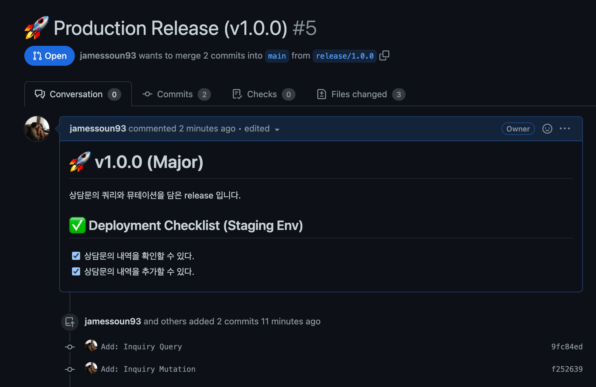

### 5. 🚀 Deploy

체크리스트 항목을 전부 확인했다면 최종 Leader Review를 거친 뒤 squash & merge 해서 `master` 브랜치로 merge 합니다. (production 환경으로 배포)

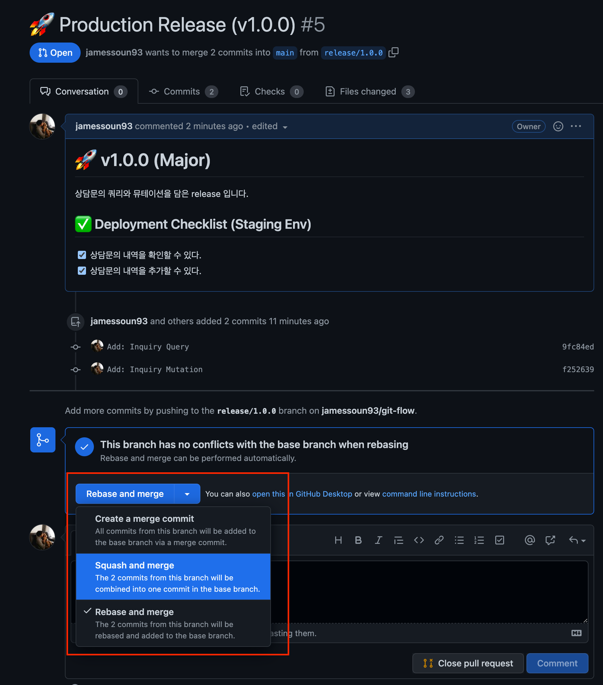

여기서 커밋메세지는 꼭 아래와 같은 형태로 만들어야 합니다.

`VERSION: SUMMARY`

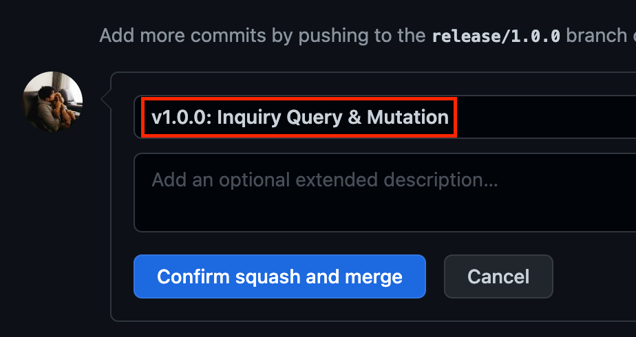

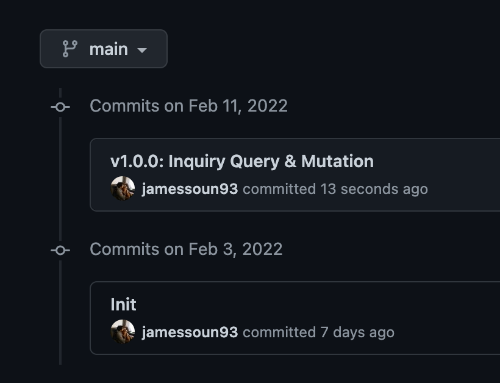

### 6. Production 확인

정상적으로 배포가 되었는데 production 환경에서 확인합니다.
