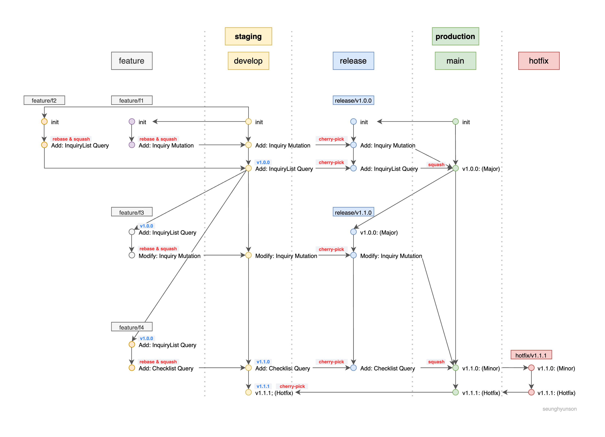

# 사내 Git Flow 소개 (2022.02)

사내 개발팀 인수인계 자료용으로 작성

(이거 만드느라 힘들어 죽을뻔했음..)

* 개발은 각자 로컬 환경에서 feature 브랜치 생성해서 작업.
* feature 브랜치 PR은 최소 2-3명의 Peer Review가 있어야 Leader Review로 넘어감.
* 최종 머지된 feature 브랜치의 output은 squash & rebase 된 형태로 develop 브랜치에 push 된다. (develop 브랜치는 staging 환경)
* main 브랜치는 production 환경
* 프로젝트마다 해당 환경에 맞게 구축되어 있는 CI/CD 파이프라인에 따른 빌드&테스트 자동화

## 배포
* develop 브랜치에 tag 달고 push
* main 브랜치에서 release 생성 후 원하는 commit range cherry-pick
* release PR 생성 후 pre-deployment checklist 추가 후 check thoroughly
* 준비되면 squash & merge
* main 브랜치에는 각 release의 squash된 커밋만 버전 순으로 존재해야함.