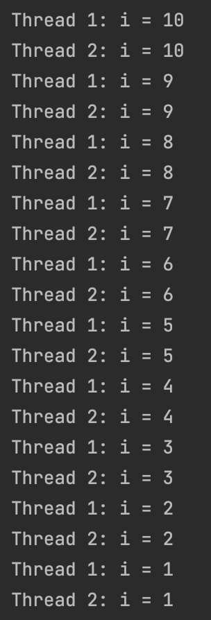
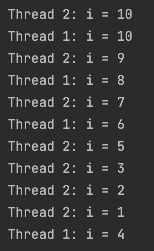
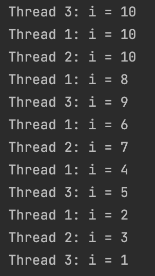
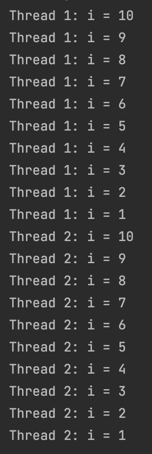

# [Java의 동시성 #2] 동기화(Synchronization)

- 동일한 인스턴스를 여러개의 쓰레드로 다룰 때

# 멀티쓰레딩 예시

- countdown 인스턴스를 두개의 쓰레드에서 받아 활용해보자

```java
public class Main {

    public static void main(String[] args) {
        Countdown countdown = new Countdown();

        CountdownThread t1 = new CountdownThread(countdown);
        t1.setName("Thread 1");
        CountdownThread t2 = new CountdownThread(countdown);
        t2.setName("Thread 2");

        t1.start();
        t2.start();
    }
}

class Countdown {
    public void doCountdown() {
        for (int i = 10; i > 0; i--) {
            System.out.println(Thread.currentThread().getName() + ": i = " + i);
        }
    }
}

class CountdownThread extends Thread {
    private Countdown threadCountdown;

    public CountdownThread(Countdown countdown) {
        threadCountdown = countdown;
    }

    public void run() {
        threadCountdown.doCountdown();
    }
}
```

- 각 쓰레드가 돌아가면서 프린트하는 걸 확인할 있고 이 순서는 실행할때마다 다름



- 근데 여기서는 같은 인스턴스를 사용하는데도 특별할게 없이 각자 i를 10부터 1까지 내림

- 그럼 Countdown 클래스를 아래와 같이 바꿔보자

```java
class Countdown {
    private int i;

    public void doCountdown() {
        for (i = 10; i > 0; i--) {
            System.out.println(Thread.currentThread().getName() + ": i = " + i);
        }
    }
}
```

- for loop의 i를 로컬 변수가 아닌 인스턴스 변수로 변경



- 머여 이게? 각자 하는것 같기도 하고 아닌것 같기도 하고.. 뒤죽박죽임..
- 자세히보면 10은 각 쓰레드가 동일하게 출력하고 그 다음부터 1씩 줄어드는데 이 또한 마지막에는 순서가 맞지 않음.. 그래서 어쨋든 한번씩만 출력됌..
- 그럼 쓰레드가 3개일때는?

```java
public class Main {

    public static void main(String[] args) {
        Countdown countdown = new Countdown();

        CountdownThread t1 = new CountdownThread(countdown);
        t1.setName("Thread 1");
        CountdownThread t2 = new CountdownThread(countdown);
        t2.setName("Thread 2");
        CountdownThread t3 = new CountdownThread(countdown);
        t3.setName("Thread 3");

        t1.start();
        t2.start();
        t3.start();
    }
}
```



- 쓰레드가 3개일때도 마찬가지임

- 무슨일이 일어나는걸까?
- for loop을 돌때 선언하는 경우 로컬 변수이기 때문에 각 쓰레드의 스택 영역에 해당 변수가 저장되는데 이건 다른 쓰레드에서는 접근이 불가능함.
- 하지만 i를 인스턴스 변수로 만들면 해당 변수는 모든 쓰레드가 공유하는 heap 영역에 할당됌.
- 스택과 다르게 세개의 쓰레드가 전부 같은 변수를 공유하는 것
- 그렇기 때문에 Thread 1이 i값을 수정하면 다른 쓰레드에서 변경된 값을 읽게되고 거기서 1을 빼서 저장하는것
- 위에 결과에서 숫자 순서가 다르게 출력되는건 멀티쓰레드를 다룰때 쓰레드 상태 제어로 인해 쓰레드가 번갈아가면서 실행을 멈췄다가 다시 실행됐다 하면서 생기는 불일치임. 그래서 실행할때마다 다르게 나옴.

- 여러개의 쓰레드가 같은 인스턴스를 공유할 때 이런 부분들을 신경써줘야함.

# 동기화(synchronization)

동기화란 여러 개의 쓰레드가 heap 영역 내의 공유자원에 접근하는 것을 제어할 수 있게 해주는 기능을 말합니다.

`synchronized` 라는 키워드를 사용하여 동기화할 수 있으며 크게 두 가지 방법이 있습니다.

- 메서드에 `synchronized` 키워드를 걸어주는 방법
- `synchronized` 블록을 활용하여 동기화하고 싶은 코드만 감싸주는 방법

## 메서드에 `synchronized` 키워드를 걸어주는 방법

동기화하려는 메서드에 `synchronized` 키워드를 추가하면 해당 메서드는 한번에 하나의 쓰레드만 실행이 가능합니다.

해당 메서드를 실행하는 쓰레드가 실행을 종료할 때까지 다른 쓰레드들은 같은 메서드를 호출할 수 없으며 클래스의 다른 `synchronized` 메소드를 호출하지 못하고 일시 중단됩니다.

```java
class Countdown {
    private int i;

    public synchronized void doCountdown() {
        for (i = 10; i > 0; i--) {
            System.out.println(Thread.currentThread().getName() + ": i = " + i);
        }
    }
}
```

- `doCountdown()` 메서드에 `synchronized` 키워드 추가



Thread 1이 `doCountdown()` 실행을 완전히 종료할 때까지 Thread 2가 시작하지 않는 것을 확인할 수 있습니다.
