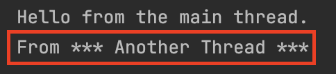
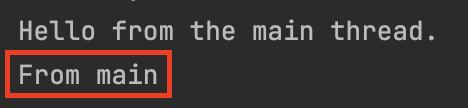
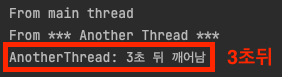
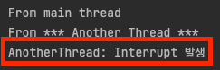
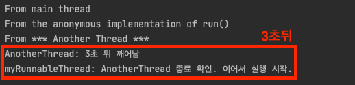
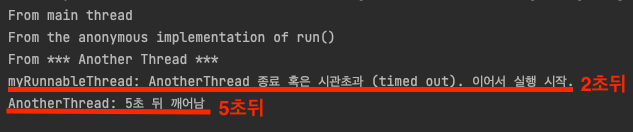

# [Java의 동시성 #1] Threads (생성, 사용, sleep, interrupt, join)

[Tistory 블로그 포스팅 바로가기](https://seunghyunson.tistory.com/27)

Java의 동시성 시리즈의 첫 번째 주제로 Thread 생성 및 시작 방법과 sleep, interrupt, join에 대해 알아보겠습니다.

# Thread 생성 방법과 사용

Java에서 thread를 생성하는 방법은 여러 가지가 있습니다.

1. `Thread` 클래스를 상속한 서브클래스를 생성해서 `run()` 메소드를 오버라이드 하는 방법
2. Anonymous `Thread` 클래스를 생성해서 `run()` 메소드를 오버라이드 하는 방법 (딱 한 번만 실행하고 싶은 경우 좋다.)
3. `Runnable` 인터페이스를 구현하는 방법

### 1. Thread 클래스를 상속한 서브클래스를 생성해서 run() 메소드를 오버라이드 하는 방법

```java
// Main.java

public class Main {
    public static void main(String[] args) {
        System.out.println("From main thread");

        Thread anotherThread = new AnotherThread();
        anotherThread.start();
    }
}
```

```java
// AnotherThread.java

public class AnotherThread extends Thread {
    @Override
    public void run() {
        System.out.println("From another thread");
    }
}
```

여기서 같은 `AnotherThread` 인스턴스를 재사용해서 `start()`를 여러번 호출하는 것은 불가능합니다.

```java
// Main.java

public class Main {
    public static void main(String[] args) {
        System.out.println("From main thread");

        Thread anotherThread = new AnotherThread();
        anotherThread.start();
        anotherThread.start();
    }
}
```

이렇게 실행시 `IllegalThreadStateException`이 발생합니다.

### 2. Anonymous Thread 클래스를 생성해서 run() 메소드를 오버라이드 하는 방법 (딱 한 번만 실행하고 싶은 경우 좋다.)

```java
// Main.java

public class Main {
    public static void main(String[] args) {
        System.out.println("From main thread");

        new Thread() {
            public void run() {
                System.out.println("From the anonymous class thread");
            }
        }.start();
    }
}
```

### 3. Runnable 인터페이스를 구현하는 방법

`Runnable` 인터페이스를 구현할 경우 꼭 `Thread` 클래스가 아니더라도 어떤 클래스던 해당 인터페이스를 구현한 다음 `run()` 메소드만 오버라이드 해서 사용할 수 있습니다.

그리고 해당 thread에서 실행하고 싶은 코드를 `run()` 메소드에 작성해주면 됩니다.

```java
// MyRunnable.java

public class MyRunnable implements Runnable {
    @Override
    public void run() {
        System.out.println("From MyRunnable");
    }
}
```

위와 같이 `Runnable` 인터페이스를 구현한 클래스를 생성하고 `run()` 메소드를 오버라이드 해줍니다.

`MyRunnable`을 새로운 `thread`에서 실행하려면 `Thread` 클래스에 `MyRunnable` 인스턴스를 넘겨주면 됩니다.

```java
// Main.java

public class Main {
    public static void main(String[] args) {
        System.out.println("From main thread");

        Thread myRunnableThread = new Thread(new MyRunnable());
        myRunnableThread.start();
    }
}
```

`Runnable` 인터페이스를 구현하는 경우도 Anonymous Thread 클래스를 생성하는 방법을 활용할 수 있습니다.

```java
// Main.java

public class Main {
    public static void main(String[] args) {
        System.out.println("From main thread");

        Thread myRunnableThread = new Thread(new MyRunnable() {
            @Override
            public void run() {
                System.out.println("From the anonymous implementation of run()");
            }
        });

        myRunnableThread.start();
    }
}
```

## Thread 클래스 vs Runnable 인터페이스

`Thread` 클래스를 활용하는 방법과 `Runnable` 인터페이스를 활용하는 방법 중 무엇을 사용해야 하는 게 좋을까요?

정답은 없지만 보통 `Runnable` 인터페이스를 구현하는 방식이 더 유연하고 편하기 때문에 더 많이 활용합니다.

Java API에도 `Runnable` 인스턴스를 넘겨야하는 부분이 많고, Lambda Expression이 추가된 후로 Anonymous Runnable 인스턴스를 활용하는 게 많이 편해졌기 때문입니다.

## 생성한 thread 종료 시점?

그렇다면 사용한 쓰레드는 언제 종료될까요?

사용한 thread는 `run()` 메소드가 실행을 마쳤을 때 종료되게 됩니다.

## Thread 사용 시 주의사항 (run() vs start())

여기서 잠깐, Thread를 사용할 때 주의사항이 하나 있습니다.

Thread 클래스의 `run()` 메소드를 직접 호출하는 게 아닌 `start()` 메소드를 호출해야 한다는 점입니다.

`run()` 메소드는 JVM이 내부적으로 호출하는 메소드이며, `run()` 메소드를 직접 호출할 시 새로 생성한 thread에서 실행하는 게 아닌 `run()` 메소드를 호출하는 thread에서 실행하게 되기 때문입니다.

```java
// Main.java

public class Main {
    public static void main(String[] args) {
        System.out.println("From main thread");

        Thread anotherThread = new AnotherThread();
        anotherThread.setName("*** Another Thread ***")
        anotherThread.start();
    }
}
```

```java
// AnotherThread.java

public class AnotherThread extends Thread {
    @Override
    public void run() {
        System.out.println("From " + currentThread().getName());
    }
}
```



`start()`를 호출하면 위와 같이 정상적으로 새로 생성한 쓰레드에서 `run()` 메소드가 실행되는 것을 확인할 수 있습니다.

```java
// Main.java

public class Main {
    public static void main(String[] args) {
        System.out.println("From main thread");

        Thread anotherThread = new AnotherThread();
        anotherThread.setName("*** Another Thread ***")
        // anotherThread.start();
        anotherThread.run();
    }
}
```



하지만 위와 같이 `run()` 메소드를 호출하면 새로 생성한 `anotherThread`에서 `run()` 메소드가 실행되는 것이 아닌 `main` 쓰레드에서 실행되게 됩니다.

이런 이유로 쓰레드를 사용할 때는 `run()` 메소드를 직접 호출하지 않고 `start()` 메소드를 호출해야 합니다.

---

# Sleep, Interrupts, Join

Thread를 활용해서 할 수 있는 작업은 여러 가지가 있습니다.

sleep 메소드를 사용해서 thread의 실행을 중지할 수 있고, 특정 인터벌을 두고 시간마다 무언가를 실행하게 할 수도 있습니다.

예를 들면, 15초에 한 번씩 파일에 무언가를 쓸 수도 있고, 2초마다 요청한 데이터를 확인할 수도 있습니다.

그리고 여러 개의 쓰레드를 다룰 때 쓰레드 간 서로 의존시켜 활용하면서 자원을 효율적으로 활용할 수 있게끔 할 수도 있습니다.

예를 들면, 다른 쓰레드가 10초 동안 실행한 결과를 현재 쓰레드가 필요로 할 때, 현재 쓰레드를 계속 실행시키는 것이 아니라, 다른 쓰레드가 작업하는 10초 동안 현재 쓰레드를 중지해놓고 다른 쓰레드의 결과를 기다리게 할 수 있습니다.

위 작업들 외에도 할 수 있는 것은 많겠지만, 이런 작업들을 가능하게 해주는 **sleep**, **interrupt**, **join** 개념에 대해 알아보겠습니다.

## Sleep

`Thread.sleep()` 메소드를 호출해서 쓰레드를 3초 동안 멈췄다 실행시키는 예시를 확인해보겠습니다.

```java
// AnotherThread.java

public class AnotherThread extends Thread {
    @Override
    public void run() {
        System.out.println("From " + currentThread().getName());

        try {
            Thread.sleep(3000);
        } catch (InterruptedException ie) {
            System.out.println("AnotherThread: Interrupt 발생");
            return;
        }

        System.out.println("AnotherThread: 3초 뒤 깨어남");
    }
}
```

```java
// Main.java

public class Main {
    public static void main(String[] args) {
        System.out.println("From main thread");

        Thread anotherThread = new AnotherThread();
        anotherThread.setName("*** Another Thread ***");
        anotherThread.start();
    }
}
```



## Interrupts

인터럽트란 다른 작업을 하기 위해 하던 작업을 방해하는 명령입니다.

다른 쓰레드가 가져오는 데이터 버퍼를 모니터링하는 쓰레드가 실행중이라고 가정해봅시다.

데이터를 가져오는 쓰레드가 더 이상 가져올 데이터가 없다면 모니터링 중인 쓰레드는 실행을 멈춰도 되겠죠?

쓰레드에 인터럽트가 발생했는지 알 수 있는 방법은 두 가지가 있습니다.

`InterruptedException`을 `catch` 하는 방법이 있고,

만약 `run()` 메소드가 `InterruptedException`을 발생시키는 메소드를 실행하지 않는 경우, `interrupt()` 메소드를 주기적으로 실행해서 인터럽트가 발생했는지 확인하는 방법이 있습니다.

쓰레드 간 서로 어떻게 인터럽트를 발생시킬까요?

멈추고자 하는 쓰레드 인스턴스의 `interrupt()` 메소드를 호출합니다.

물론 이럴 경우 멈추고자 하는 쓰레드 인스턴스에 대한 레퍼런스가 존재해야 합니다.

```java
// AnotherThread.java

public class AnotherThread extends Thread {
    @Override
    public void run() {
        System.out.println("From " + currentThread().getName());

        try {
            Thread.sleep(3000);
        } catch (InterruptedException ie) {
            System.out.println("AnotherThread: Interrupt 발생");
            return;
        }

        System.out.println("AnotherThread: 3초 뒤 깨어남");
    }
}
```

```java
// Main.java

public class Main {
    public static void main(String[] args) {
        System.out.println("From main thread");

        Thread anotherThread = new AnotherThread();
        anotherThread.setName("*** Another Thread ***");
        anotherThread.start();
    }
}
```


위와 같이 실행하면 `AnotherThread`의 `Thread.sleep(3000)`이 방해받지 않고 실행되어 3초 뒤에 `"AnotherThread: 3초 뒤 깨어남"`를 확인할 수 있습니다.

여기서 `anotherThread`에 `interrupt()` 메소드를 호출해서 인터럽트를 발생시켜보겠습니다.

```java
// Main.java

public class Main {
    public static void main(String[] args) {
        System.out.println("From main thread");

        Thread anotherThread = new AnotherThread();
        anotherThread.setName("*** Another Thread ***");
        anotherThread.start();

        Thread myRunnableThread = new Thread(new MyRunnable() {
            @Override
            public void run() {
                System.out.println("From the anonymous implementation of run()");
            }
        });
        myRunnableThread.start();
        anotherThread.interrupt();
    }
}
```



`Thread.sleep()` 실행 중 interrupt가 발생해서 `InterruptedException`이 throw 되었고, 해당 쓰레드는 `return`문을 만나 그 자리에서 실행을 멈추게 된 것입니다.

## Join

데이터를 가져오는 thread B가 있고 종합된 데이터를 처리하는 thread A가 있다고 가정해보겠습니다.

thread A는 thread B가 데이터를 전부 가져와서 종료될 때까지 이어서 실행될 수 없는 상황이겠죠?

이런 경우, thread를 주기적으로 깨워 실행 여부를 판단하는 것보다, thread B의 종료를 기다리는 thread A를 thread B에 `join` 할 수 있습니다.

thread A를 thread B에 join 하면, thread A는 thread B가 종료될 때까지 기다렸다가 종료 시 이어서 실행됩니다.

예시를 통해 확인해보겠습니다.

```java
// AnotherThread.java

public class AnotherThread extends Thread {
    @Override
    public void run() {
        System.out.println("From " + currentThread().getName());

        try {
            Thread.sleep(3000);
        } catch (InterruptedException ie) {
            System.out.println("AnotherThread: Interrupt 발생");
            return;
        }

        System.out.println("AnotherThread: 3초 뒤 깨어남");
    }
}
```

```java
// Main.java

public class Main {
    public static void main(String[] args) {
        System.out.println("From main thread");

        Thread anotherThread = new AnotherThread();
        anotherThread.setName("*** Another Thread ***");
        anotherThread.start();

        Thread myRunnableThread = new Thread(new MyRunnable() {
            @Override
            public void run() {
                System.out.println("From the anonymous implementation of run()");
                try {
                    anotherThread.join();
                    System.out.println("myRunnableThread: AnotherThread 종료 확인. 이어서 실행 시작.");
                } catch (InterruptedException ie) {
                    System.out.println("myRunnableThread: 인터럽트 발생");
                }
            }
        });
        myRunnableThread.start();
    }
}
```

3초 동안 `sleep` 하는 `anotherThread`에 `myRunnableThread`를 `join` 해서 `anotherThread`가 종료될 때까지 기다렸다가 이어서 실행하는 예시입니다.



`AnotherThread`에서 `"AnotherThread: 3초 뒤 깨어남"` 메세지를 프린트하며 종료되자 실행을 잠시 멈춘 `myRunnableThread`가 이어서 실행되어 `"myRunnableThread: AnotherThread 종료 확인. 이어서 실행 시작."`가 프린트된 것을 확인할 수 있습니다.

## timeout

위 예시는 아주 간단한 예시라서 별문제 없이 작동하지만, 여기에는 생각해봐야 하는 문제가 있습니다.

만약 `join` 한 대상인 `AnotherThread`가 절대 끝나지 않는 경우는 어떻게 될까요?

`myRunnableThread`는 `AnotherThread`가 종료되어야 이어서 실행되고 최종적으로 종료될 수 있는데, `AnotherThread`가 실행을 멈추지 않고 쭉 간다면 안되겠죠?

이런 경우를 대비해서 `join()` 메소드에 `timeout` 값을 넘겨줄 수 있습니다.

```java
// AnotherThread.java

public class AnotherThread extends Thread {
    @Override
    public void run() {
        System.out.println("From " + currentThread().getName());

        try {
            Thread.sleep(5000);
        } catch (InterruptedException ie) {
            System.out.println("AnotherThread: Interrupt 발생");
            return;
        }

        System.out.println("AnotherThread: 3초 뒤 깨어남");
    }
}
```

```java
// Main.java

public class Main {
    public static void main(String[] args) {
        System.out.println("From main thread");

        Thread anotherThread = new AnotherThread();
        anotherThread.setName("*** Another Thread ***");
        anotherThread.start();

        Thread myRunnableThread = new Thread(new MyRunnable() {
            @Override
            public void run() {
                System.out.println("From the anonymous implementation of run()");
                try {
                    anotherThread.join(2000);
                    System.out.println("myRunnableThread: AnotherThread 종료 혹은 시관초과 (timed out). 이어서 실행 시작.");
                } catch (InterruptedException ie) {
                    System.out.println("myRunnableThread: 인터럽트 발생");
                }
            }
        });
        myRunnableThread.start();
    }
}
```

`AnotherThread`의 `sleep` 시간을 `5000ms`로 변경하고 `MyRunnable`의 `join` 메소드에 `2000ms`의 timeout 값을 추가했습니다.

실행 결과를 확인해볼까요?



`AnotherThread`가 5초 동안 `sleep`을 하는데 `MyRunnable`은 2초의 제한을 두었기에 2초간 기다린 뒤 기다리는 것을 멈추고 이어서 실행되고, `AnotherThread`는 그로부터 약 3초 뒤 이어서 실행된 뒤 종료되는 것을 확인할 수 있습니다.

---

이렇게 Thread 생성 및 시작 방법과 sleep, interrupt, join에 대해 알아보았습니다.

Java는 multi-threaded 언어이기 때문에 thread에 대한 이해가 중요합니다.

Java의 동시성 시리즈 다음 편에는 여러 개의 쓰레드를 다루면서 생길 수 있는 문제점들과 해결방법 등에 대해 다룰 예정입니다.
