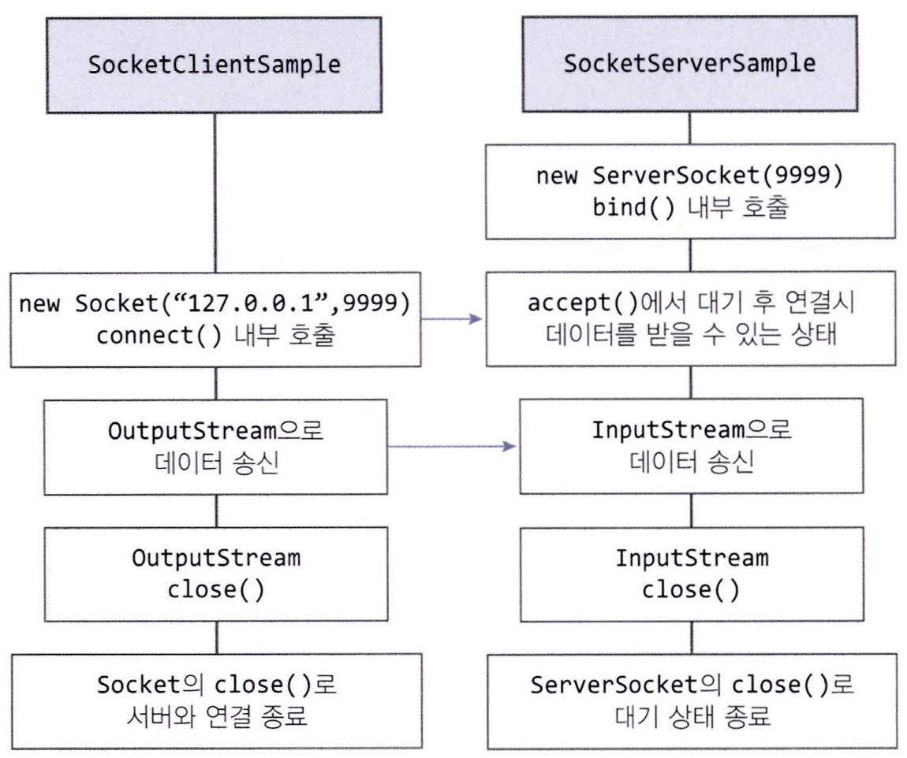

# Socket을 이용한 TCP Connection 예시

```java
// SocketServerSample.java

import java.io.BufferedReader;
import java.io.InputStream;
import java.io.InputStreamReader;
import java.net.ServerSocket;
import java.net.Socket;

public class SocketServerSample {
    public static void main(String[] args) {
        SocketServerSample sample = new SocketServerSample();
        sample.startServer();
    }

    public void startServer() {
        ServerSocket server = null;
        Socket client = null;

        try {
            server = new ServerSocket(9999);
            while (true) {
                System.out.println("Server: Waiting for request...");
                client = server.accept();
                System.out.println("Server: Accepted");

                InputStream stream = client.getInputStream();
                BufferedReader in = new BufferedReader(new InputStreamReader(stream));

                String data = null;
                StringBuilder dataReceived = new StringBuilder();
                while ((data=in.readLine()) != null) {
                    dataReceived.append(data);
                }
                System.out.println("Data received: " + dataReceived);
                in.close();
                stream.close();
                client.close();

                if (dataReceived != null && "EXIT".equals(dataReceived.toString())) {
                    System.out.println("Stop SocketServer");
                    break;
                }
                System.out.println("------------");
            }
        } catch (Exception e) {
            e.printStackTrace();
        } finally {
            if (server != null) {
                try {
                    server.close();
                } catch (Exception e) {
                    e.printStackTrace();
                }
            }
        }
    }
}
```

```java
// SocketClientSample.java

import java.util.Date;
import java.io.BufferedOutputStream;
import java.io.OutputStream;
import java.net.Socket;

public class SocketClientSample {
    public static void main(String[] args) {
        SocketClientSample sample = new SocketClientSample();
        sample.sendSocketSample();
    }

    public void sendSocketSample() {
        for (int loop = 0; loop < 3; loop++) {
            sendSocketData("Sending data at " + new Date());
        }
        sendSocketData("EXIT");
    }

    public void sendSocketData(String data) {
        Socket socket = null;
        try {
            System.out.println("Client: Establishing connection...");
            socket = new Socket("127.0.0.1", 9999);
            System.out.println("Client: Connection Status = " + socket.isConnected());

            Thread.sleep(1000);

            OutputStream stream = socket.getOutputStream();
            BufferedOutputStream out = new BufferedOutputStream(stream);

            byte[] bytes = data.getBytes();
            out.write(bytes);

            System.out.println("Client: Sent data");
            out.close();
            stream.close();
        } catch (Exception e) {
            e.printStackTrace();
        } finally {
            if (socket != null) {
                try {
                    socket.close();
                } catch (Exception e) {
                    e.printStackTrace();
                }
            }
        }
    }
}
```



---

TCP 커넥션이라 서버가 켜져있지 않으면 `ConnectException`이 발생합니다.

```bash
Client: connecting
java.net.ConnectException: Connection refused (Connection refused)
```
