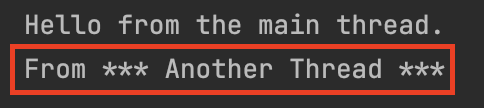
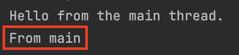

# Java Threads

## 1. Thread 생성 방법

1. Thread 클래스를 상속한 서브클래스를 생성해서 run() 메소드를 오버라이드하는 방법
2. Anonymous Thread 클래스를 생성해서 run() 메소드를 오버라이드하는 방법 (딱 한번만 실행하고 싶은 경우 좋다.)
3. Runnable 인터페이스를 구현하는 방법

### 1. Thread 클래스를 상속한 서브클래스를 생성해서 run() 메소드를 오버라이드하는 방법

```java
// Main.java

public class Main {
    public static void main(String[] args) {
        System.out.println("From main thread");

        Thread anotherThread = new AnotherThread();
        anotherThread.start();
    }
}
```

```java
// AnotherThread.java

public class AnotherThread extends Thread {
    @Override
    public void run() {
        System.out.println("From another thread");
    }
}
```

여기서 같은 `AnotherThread` 인스턴스를 재사용해서 `start()`를 여러번 호출하는것은 불가능합니다.

```java
// Main.java

public class Main {
    public static void main(String[] args) {
        System.out.println("From main thread");

        Thread anotherThread = new AnotherThread();
        anotherThread.start();
        anotherThread.start();
    }
}
```

이렇게 실행시 `IllegalThreadStateException`이 발생합니다.

### 2. Anonymous Thread 클래스를 생성해서 run() 메소드를 오버라이드하는 방법 (딱 한번만 실행하고 싶은 경우 좋다.)

```java
// Main.java

public class Main {
    public static void main(String[] args) {
        System.out.println("From main thread");

        new Thread() {
            public void run() {
                System.out.println("From the anonymous class thread");
            }
        }.start();
    }
}
```

### 3. Runnable 인터페이스를 구현하는 방법

`Runnable` 인터페이스를 구현할 경우 꼭 `Thread` 클래스가 아니더라도 어떤 클래스던 해당 인터페이스를 구현한 다음 `run()` 메소드만 오버라이드해서 사용할 수 있습니다.

그리고 해당 thread에서 실행하고 싶은 코드를 `run()` 메소드에 작성해주면 됩니다.

```java
// MyRunnable.java

public class MyRunnable implements Runnable {
    @Override
    public void run() {
        System.out.println("From MyRunnable");
    }
}
```

위와 같이 Runnable 인터페이스를 구현한 클래스를 생성하고 run() 메소드를 오버라이드 해줍니다.

MyRunnable을 새로운 thread에서 실행하려면 Thread 클래스에 MyRunnable 인스턴스를 넘겨주면 됩니다.

```java
// Main.java

public class Main {
    public static void main(String[] args) {
        System.out.println("From main thread");

        Thread myRunnableThread = new Thread(new MyRunnable());
        myRunnableThread.start();
    }
}
```

Runnable 인터페이스를 구현하는 경우도 Anonymous Thread 클래스를 생성하는 방법을 활용할 수 있습니다.

```java
public class Main {
    public static void main(String[] args) {
        System.out.println("From main thread");

        Thread myRunnableThread = new Thread(new MyRunnable() {
            @Override
            public void run() {
                System.out.println("From the anonymous implementation of run()")
            }
        });

        myRunnableThread.start();
    }
}
```

## Thread 클래스 vs Runnable 인터페이스

Thread 클래스를 활용하는 방법과 Runnable 인터페이스를 활용하는 방법 중 무엇을 사용해야 하는게 좋을까요?

정답은 없지만 보통 Runnable 인터페이스를 구현하는 방식이 더 유연하고 편하기 때문에 더 많이 활용합니다.

Java API에도 Runnable 인스턴스를 넘겨야하는 부분이 많고, Lambda Expression이 추가된 후로 Anonymous Runnable 인스턴스를 활용하는게 많이 편해졌기 때문입니다.

## 생성한 thread 종료 시점?

그렇다면 사용한 쓰레드는 언제 종료될까요?

사용한 thread는 `run()` 메소드가 실행을 마쳤을 때 종료되게 됩니다.

## Thread 사용 시 주의사항 (run() vs start())

여기서 잠깐, Thread를 사용할 때 주의사항이 하나 있습니다.

Thread 클래스의 `run()` 메소드를 직접 호출하는게 아닌 `start()` 메소드를 호출해야한다는 점입니다.

`run()` 메소드는 JVM이 내부적으로 호출하는 메소드이며, `run()` 메소드를 직접 호출할 시 새로 생성한 thread에서 실행하는게 아닌 `run()` 메소드를 호출하는 thread에서 실행하게 되기 때문입니다.

```java
// Main.java

public class Main {
    public static void main(String[] args) {
        System.out.println("From main thread");

        Thread anotherThread = new AnotherThread();
        anotherThread.setName("*** Another Thread ***")
        anotherThread.start();
    }
}
```

```java
// AnotherThread.java

public class AnotherThread extends Thread {
    @Override
    public void run() {
        System.out.println("From " + currentThread().getName());
    }
}
```



`start()`를 호출하면 위와 같이 정상적으로 새로 생성한 쓰레드에서 `run()` 메소드가 실행되는 것을 확인할 수 있습니다.

```java
// Main.java

public class Main {
    public static void main(String[] args) {
        System.out.println("From main thread");

        Thread anotherThread = new AnotherThread();
        anotherThread.setName("*** Another Thread ***")
        // anotherThread.start();
        anotherThread.run();
    }
}
```



하지만 위와 같이 `run()` 메소드를 호출하면 새로 생성한 `anotherThread`에서 `run()` 메소드가 실행되는것이 아닌 `main` 쓰레드에서 실행되게 됩니다.

이런 이유로 쓰레드를 사용할때는 `run()` 메소드를 직접 호출하지 않고 `start()` 메소드를 호출해야합니다.

(TBC...)
