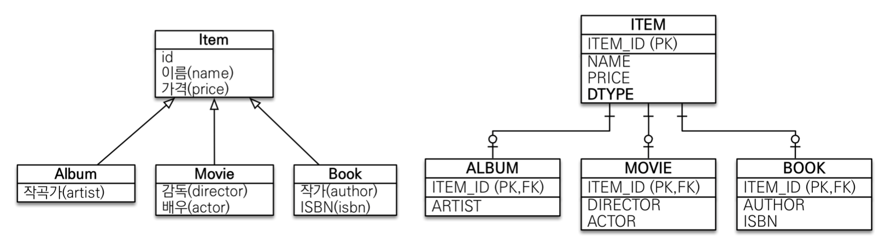
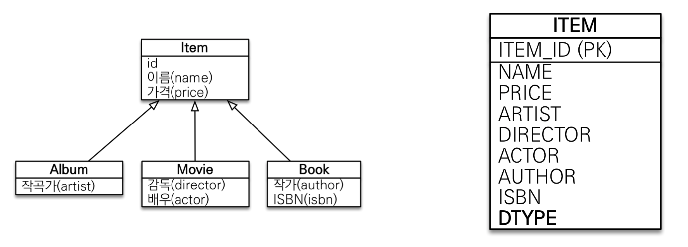
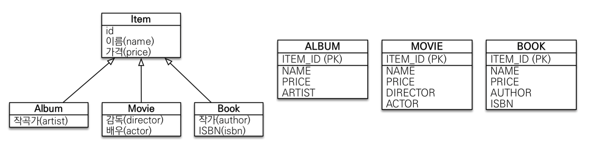

# JPA: 상속관계 매핑 (Inheritance Mapping)

상속관계 매핑이란?

객체의 상속과 구조와 DB의 슈퍼타입 서브타입 관계를 매핑하는 것.

관계형 데이터베이스는 상속 관계가 없지만, 슈퍼타입 서브타입 관계라는 모델링 기법이 객체 상속과 유사함.

## 슈퍼타입 서브타입 논리 모델을 실제 물리 모델로 구현하는 전략 3가지

### 조인 전략 (각각 테이블로 변환)



```java
@Entity
@Inheritance(strategy = InheritanceType.JOINED)
@DiscriminatorColumn(name = "dis_type") // 이름은 안줘도됨.
public abstract class Item {

    @Id @GeneratedValue
    private Long id;

    ...
}
```

새로운 Movie를 insert할 때는 Item을 먼저 insert한 뒤 Movie를 insert 함.  
그리고 여기서 Item의 PK를 Movie가 PK이자 FK로 사용함.

조회할 경우엔 알아서 inner join 해서 가져옴.

Item의 DiscriminatorColumn(DTYPE)은 default로 자식 엔티티 명을 가짐.

만약 이걸 바꿔야 한다면, 각 자식 엔티티에 `@DiscriminatorValue("원하는이름")` 이라는 애노테이션을 주면 됨. (근데 굳이?)

장점

- 테이블 정규화
- 외래 키 참조 무결성 제약조건 활용가능
  - 예를 들어, Order 엔티티 통해서 참조하고 있는 아이템 정보가 필요하면 Item 테이블만 확인하면 됨.
- 저장공간 효율화

단점

- 조회시 조인을 많이 사용, 성능저하
- 조회 쿼리가 복잡함
- 데이터 저장시 INSERT SQL 2번 호출

조인 전략은 객체랑도 잘 맞고, 정규화도 되고, 설계하는 입장에서 깔끔하기 때문에 정석이라고 보면 됨.

### 단일 테이블 전략 (통합 테이블로 변환)



```java
@Entity
@Inheritance(strategy = InheritanceType.SINGLE_TABLE)
@DiscriminatorColumn(name = "dis_type") // 이름은 안줘도됨.
public abstract class Item {

    @Id @GeneratedValue
    private Long id;

    ...
}
```

Item이라는 테이블 하나만 생성되고 자식 클래스들은 따로 생성되지 않음.

단일 테이블 전략은 @DiscriminatorColumn 애노테이션이 없어도 DTYPE 컬럼이 꼭 필요해서 알아서 생김.

조인 전락을 사용하다가 성능이 너무 안나와서 단일 테이블 전략으로 변경한다고 할 시 소스코드가 많이 바뀔 필요가 없이 이렇게 strategy만 바꿔주면 된다는게 큰 장점. (물론 DB 테이블은 생성해야함)

장점

- 조인이 필요 없으므로 일반적으로 조회 성능이 빠름
- 조회 쿼리가 단순함

단점

- (치명적) 자식 엔티티가 매핑한 컬럼은 모두 null 허용
- 단일 테이블에 모든 것을 저장하므로 테이블이 커질 수 있다. 상황에 따라서 조회 성능이 오히려 느려질 수 있다. (임계점을 넘을 경우)

### 구현 클래스마다 테이블 전략 (서브타입 테이블로 변환)



```java
@Entity
@Inheritance(strategy = InheritanceType.TABLE_PER_CLASS)
public abstract class Item {

    @Id @GeneratedValue
    private Long id;

    ...
}
```

Item 테이블이 안생기는 것 확인.

당연히 DiscriminatorColumn은 불필요함.

장점

- 서브 타입을 명확하게 구분해서 처리할 때 효과적
- NOT NULL 제약조건 사용 가능

단점

- 여러 자식 테이블을 함께 조회할 때 성능이 느림 (UNION 사용함)
- 자식 테이블을 통합해서 쿼리하기 어려움.
- 변경이라는 관점에서 볼 때 굉장히 많은 것들을 뜯어고쳐야 함.

쓰면 안되는 전략. 데이터베이스 설계자와 ORM 전문가 둘 다 비추하는 전략임.

위에 다른 전략들 같은 경우 전체 정산 같은거 할 때 Item 테이블만 보면 되는데, 여기는 모든 테이블 다 보면서 price 계산하는거 짜야하고 만약 다른 테이블 추가되면 정산코드 다 고쳐야하는 문제가 있음.

Best Practice는 기본으로 조인 전략을 채택하되, 비즈니스적으로 크게 중요하지 않고 데이터도 많지 않은 단순한 부분 같은 경우 단일 테이블 전략 채택.

항상 trade-off를 고려할 것. (상의 필수)

---

## @MappedSuperclass

공통 매핑 정보가 필요할 때 사용 (예: id, name)

이럴 떄 BaseEntity 같은거 만들어서 id, name 넣어놓고 상속받은 엔티티들 다 함께 사용하고 싶은 경우

```java
@MappedSuperclass
public abstract class BaseEntity {

    private String createdBy;

    @Column(name = "created_at")
    private LocalDateTime createdDate;
    private String lastModifiedBy;

    @Column(name = "updated_at")
    private LocalDateTime lastModifiedDate;
}
```

- 상속관계 매핑이 아님
- 엔티티가 아님 (테이블이 만들어지지 않고 속성만 내려주는 것)
- 부모 클래스를 상속 받는 자식 클래스에 매핑 정보만 제공
- 조회, 검색 불가 (em.find(BaseEntity.class) 불가)
- 직접 생성해서 사용할 일이 없으므로 추상 클래스로 사용 권장
