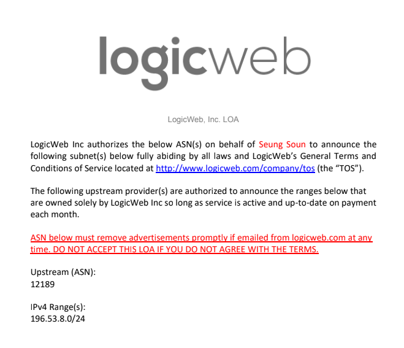

# CIDR - IPv4
이번 포스팅에서는 CIDR에 대해 다뤄보겠습니다.

## Background Story

제가 처음 CIDR에 대해 궁금점을 가지기 시작했던건 학부시절 용돈벌이 목적으로 인기가 많은 운동화들을 다량으로 구매하여 프리미엄을 붙여 되파는 방식으로 나름의 작은 사업을 하고 있을 때 였습니다.

빠른 시간안에 최대한 많은 운동화를 구매하는게 목표였기 때문에 손으로 직접 하나하나 구매하는데는 한계가 있었습니다.

Computer Science를 공부하고 있던 학생으로서 어떻게든 구매 프로세스를 자동화하여 100명의 나 혹은 200명 이상의 나를 만들어 구매를 할 수 있도록 다양한 스크립트도 작성해보려고 노력하고 자동 구매 프로그램을 개발하기 위한 공부도 진행하곤 했었습니다.

그런 과정속에서 저와 같은 생각을 하는 유능한 개발자들은 이미 Sneaker bot 이라고 불리우는 자동 구매 프로그램들을 개발해 판매하거나 사용하고 있었고, 이런 행위를 막기위해 운동화를 판매하는 업체들은 특정 IP에서 짧은 시간안에 많은 요청을 보낼 경우 해당 ip를 ban 하거나 rate limit을 걸어 충분한 시간이 지난 후 다시 요청을 보낼 수 있게끔 하는 방법으로 대응하기 시작했습니다.

저는 이 문제를 해결하기 위해 같은 ip로 몇백번의 요청을 보내는것이 아닌 각 요청마다 다른 ip로 요청을 보내 정말 각 요청이 각각 다른 사람이 요청을 보내는 것처럼 꾸밀 수 있는 방법을 찾았습니다.

그렇게 직접 데이터센터를 찾아 Bare Metal 서버를 한달 단위로 계약한 뒤 LogicWeb 같은 서비스를 이용하여 IP Subnet을 리스하여 다량의 IP를 프록시의 형태로 사용할 수 있게 구축해서 사용했습니다.

위 이미지는 제가 당시 LogicWeb 으로부터 리스한 IP Subnet에 대한 Letter of Agreement(LOA) 입니다.

이미지 하단을 보시면 IPv4 Range라는 곳에 `196.53.8.0/24` 라고 써져있는데 이때 처음 제가 원하는 IP 개수를 다르게 설정할때마다 `/24` 부분의 숫자가 바뀐다는 사실을 알게 되었습니다. (사실 당시 제게는 그렇게 중요한 정보는 아니었습니다..)

하지만 AWS에서 처음 Security Group을 설정할 때 (to be continued..)

## CIDR란?

CIDR란, Classless Inter-Domain Routing의 약자이며 IP주소를 할당하는 방법입니다.
