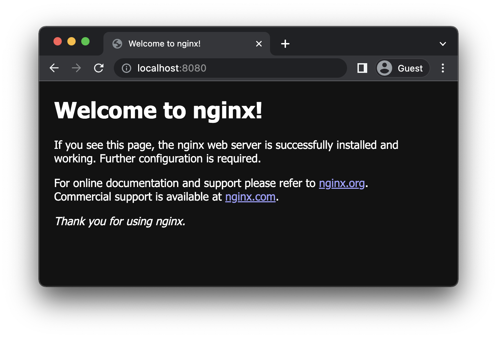
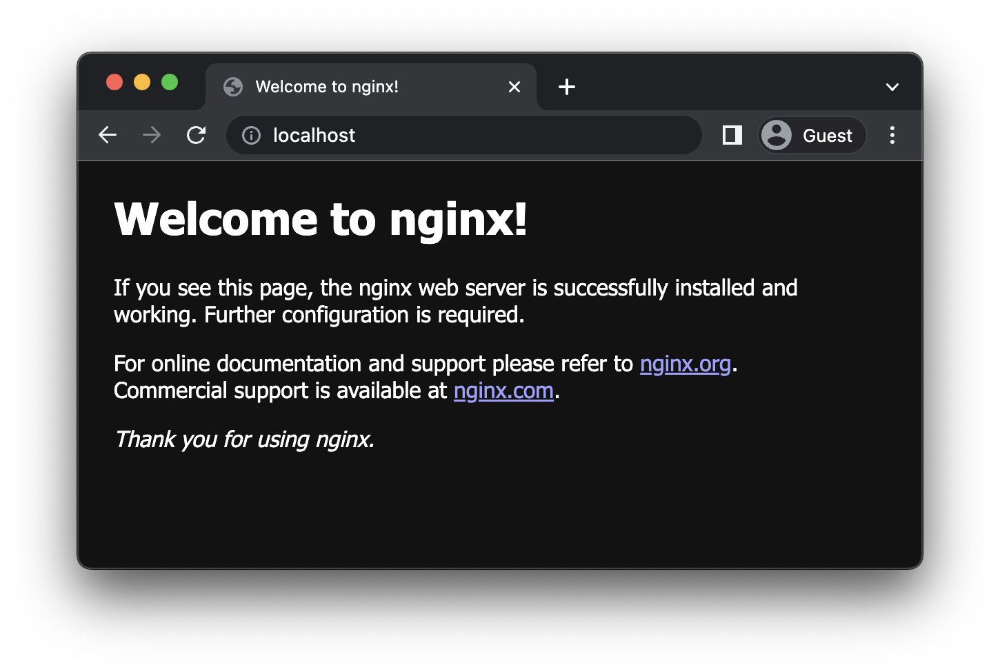
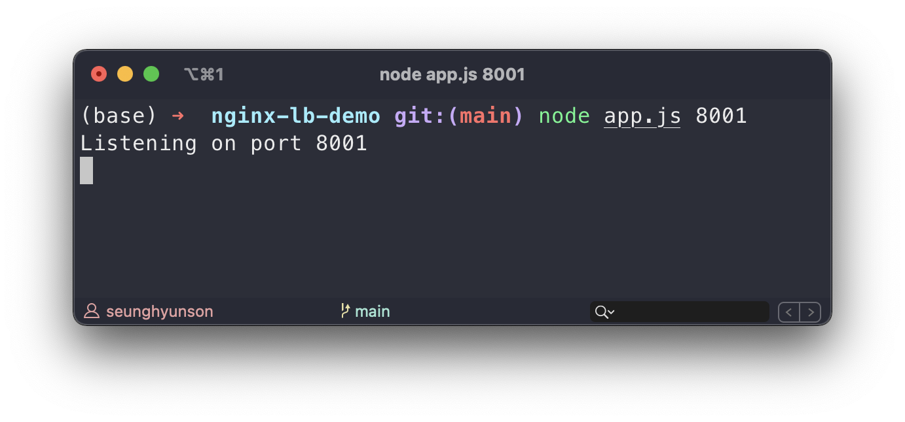
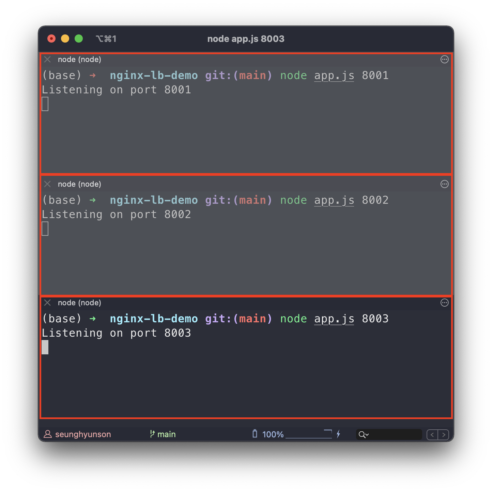
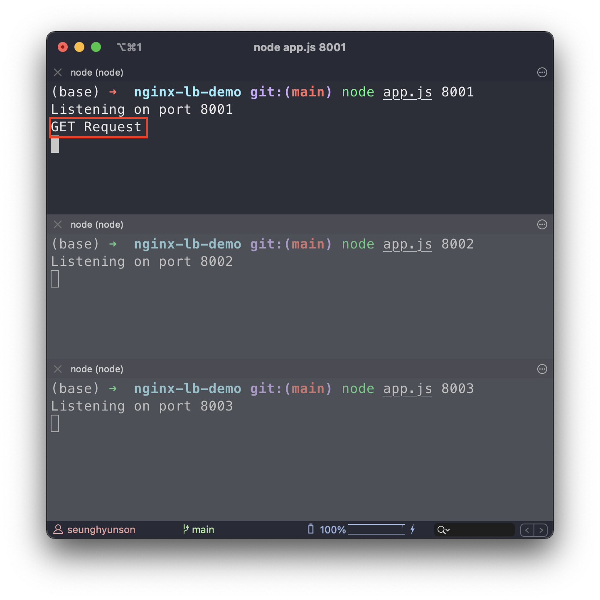
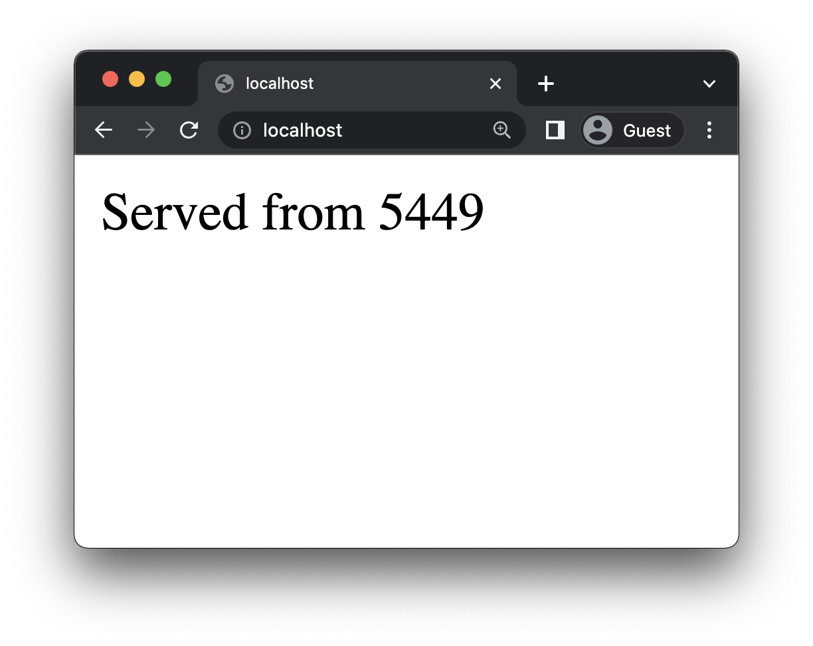
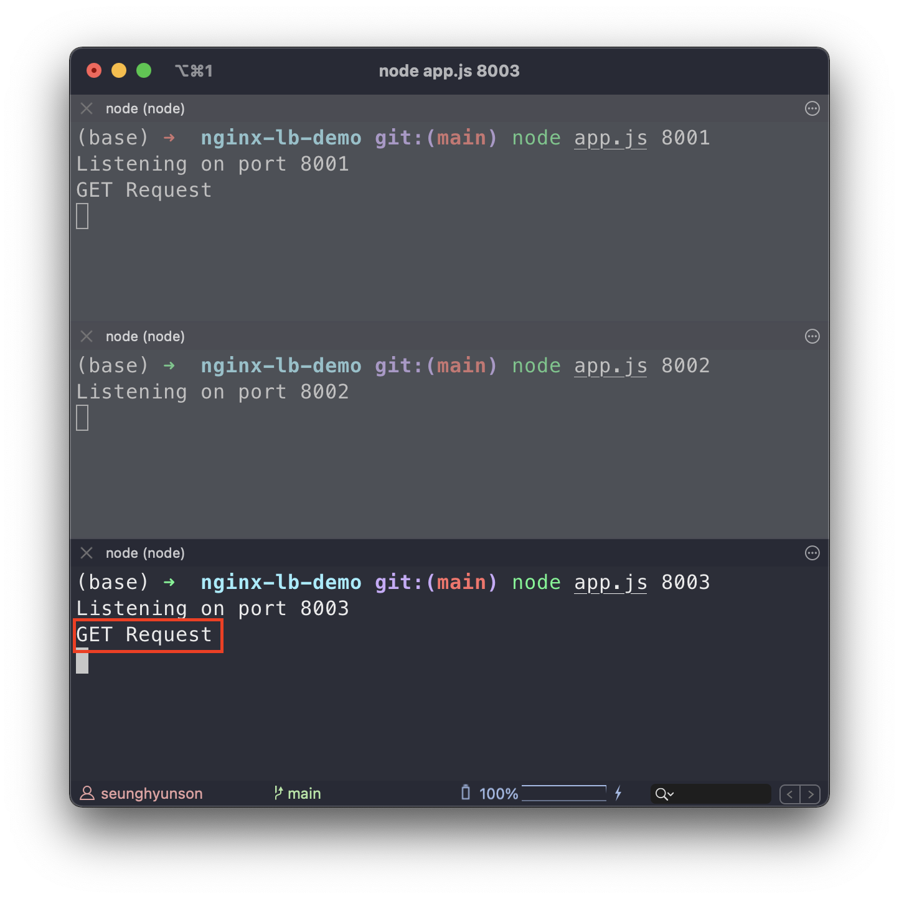
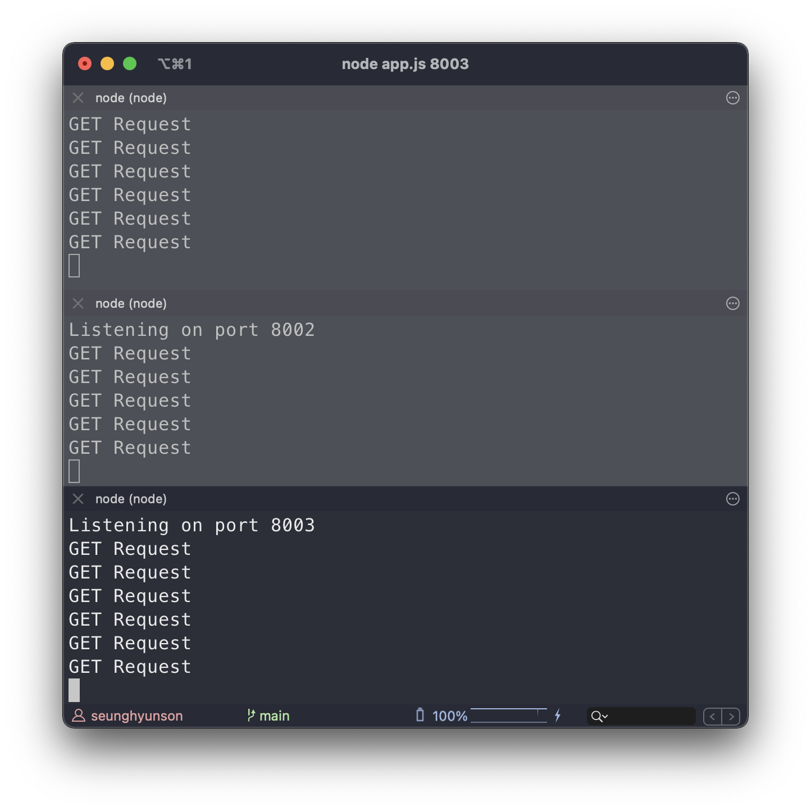

# Nginx 설치 및 Load Balancing 적용하기 (MacOS)

[Tistory 블로그 포스팅 바로가기](https://seunghyunson.tistory.com/21)

# 1. Nginx


(N-ginx가 아닌 engine-X라고 발음합니다)

Nginx는 최신 웹의 증가하는 요구를 지원하기 위해 개발된 **고성능 웹서버**입니다. Nginx는 **적은 자원**의 사용으로 **높은 성능**과 **높은 동시성**을 목표로 만들어졌습니다. 기존에는 Apache를 웹서버로 많이 사용했지만, Apache 서버는 웹과 모바일의 발전으로 점점 늘어나는 트래픽을 감당하기 어려워 크고 작은 문제들이 많이 생겼습니다. 이런 문제를 해결하기 위해 Nginx가 개발되었고 현재는 로드밸런싱, 캐싱, HTTP Server 등의 다양한 용도로 많이 사용되고 있습니다.

# 2. Nginx 설치

## 2-1. Mac (Homebrew)

1. Homebrew를 통해 nginx 설치

```bash
$ brew install nginx
```

2. nginx 서버 실행

```bash
$ nginx
```

만약 permission 관련 에러가 뜬다면 sudo 를 붙여줍니다.

```bash
$ sudo nginx
```

3. [localhost:8080](http://localhost:8080) 으로 접속하여 서버가 정상적으로 실행되고 있는지 확인합니다.



4. 서버 종료

```bash
$ sudo nginx -s stop
```

# 3. Load Balancing 적용하기

Nginx 설치를 마쳤다면 Nginx를 사용하여 로드밸런싱을 적용해보겠습니다.

## 3-1. Nginx 설정 파일 확인

Nginx를 사용하여 로드밸런싱을 적용하려면 Nginx 설정파일을 수정해야합니다. Nginx 설정 파일은 `/usr/local/etc/nginx` 디렉토리에 존재하는 `nginx.conf` 입니다.

```bash
$ vim /usr/local/etc/nginx/nginx.conf
```

## 3-2. Nginx 설정 파일 초기화

1. 실습에 필요한 설정값만 추가하기 위해 `nginx.conf` 파일을 열어 기존에 작성되어있는 모든 내용을 지워준 뒤, 아래 설정만 추가 해줍니다.

```bash
http {
    server {
        listen 80;
    }
}

events { }
```

2. Nginx 설정파일이 업데이트 되었으니 변경된 내용을 적용 해줍니다.

```bash
$ nginx -s reload
```

3. `localhost:80` 으로 접속해서 Nginx 서버가 여전히 제대로 작동하는지 확인합니다.



## 3-3. 서버 준비

지금부터 로드밸런싱이 적용되는 과정을 보기위해 Express 서버 3개를 띄워보도록 하겠습니다.

```js
// app.js

const express = require('express');
const app = express();

const PORT = process.argv[2];

app.get('/', (req, res) => {
  console.log('GET Request');
  res.send(`Served from ${process.pid}`);
});

app.listen(PORT, () => {
  console.log(`Listening on port ${PORT}`);
});
```

Express 프레임워크를 사용하여 서버를 띄우고, 서버에 `/` 에 대한 요청이 들어오면 콘솔에 요청을 받았다는 의미의 `GET Request` 를 로그하고 응답으로 해당 프로세스 ID를 리턴해주는 간단한 서버입니다.

로드밸런서를 적용하고 나면 매 요청이 준비된 3개의 서버에 고르게 전달되어 각 프로세스에 해당하는 프로세스 ID를 반환하게 됩니다.

1. 첫 번째 서버를 8001 포트를 할당하여 실행합니다.

```bash
$ node app.js 8001
```



4. 위처럼 첫번째 서버가 정상적으로 실행되었다면, 터미널 창 두개를 추가로 열어 서버 2개를 각각 포트 8002와 8003을 할당하여 실행해줍니다.



## 3-4. nginx.conf 수정

서버들은 준비되었으니 초기화해두었던 `nginx.conf` 파일 내용을 수정하여 로드밸런싱을 적용해보겠습니다.

1. `upstream` 추가

```bash
http {
    upstream backend {
        server 127.0.0.1:8001;
        server 127.0.0.1:8002;
        server 127.0.0.1:8003;
    }

    server {
        listen 80;
    }
}

events { }
```

첫 번째로 요청을 분산할 대상인 서버들을 그룹지어 `upstream` 블락에 `backend` 라는 이름을 붙여 추가해주었습니다. 이름이 꼭 `backend` 일 필요는 없습니다.

2. `location` 추가

```bash
http {
    upstream backend {
        server 127.0.0.1:8001;
        server 127.0.0.1:8002;
        server 127.0.0.1:8003;
    }

    server {
        listen 80;

        location / {
            proxy_pass http://backend;
        }
    }
}

events { }
```

server 블락에 `location` 을 추가하여 요청을 보낼 path인 `/` 를 지정해두고 `proxy_pass`를 추가해서 `upstream` 으로 지정한 서버들에 http 요청을 전달하는 설정입니다.

3. Nginx 설정파일이 업데이트 되었으니 변경된 내용을 적용 해줍니다.

```bash
$ nginx -s reload
```

## 3-5. 적용완료한 Load Balancer 확인

서버들도 준비되었고 Nginx 세팅도 완료했으니 이제 실제로 요청을 보내 로드 밸런싱이 제대로 적용되는지 확인해볼 차례입니다.

확인하는 방법은 단순합니다.

현재 Nginx 서버가 로컬호스트에 띄워져있고 listen할 포트를 80으로 설정해두었으니, 브라우저에서 `localhost:80` 혹은 그냥 `localhost` (http는 기본 포트가 80이기 때문)에 요청을 보내 확인해보면 됩니다.


처음 localhost에 요청을 보내니 아래와 같이 `5248`이라는 프로세스 ID가 반환되었습니다. `5248`이 아닌 다른 프로세스 ID가 나와도 정상입니다.

그렇다면 3개의 서버 중 어떤 서버가 요청을 처리했는지 서버 로그를 확인해보겠습니다.



위와 같이 첫번째 요청은 8001 포트에 할당된 서버에서 처리한 것을 확인할 수 있습니다.

그렇다면 새로고침을 통해 다시한번 localhost에 요청을 보내보겠습니다.



이번에는 이전 요청에 대한 응답으로 받았던 프로세스 ID인 `5248` 이 아닌 `5449`가 반환된 것을 확인할 수 있습니다. 그렇다면 이전 요청을 처리했던 서버가 아닌 다른 서버에서 두번째 요청을 처리했다는 것을 뜻합니다.

서버 로그를 확인해보겠습니다.



위와 같이 8003 포트에 할당된 서버에서 해당 요청을 처리한 것을 확인할 수 있습니다.

이후 여러번 요청을 반복해보면 요청이 준비된 서버들에 고르게 분포되어 처리되는 것을 확인할 수 있습니다.


