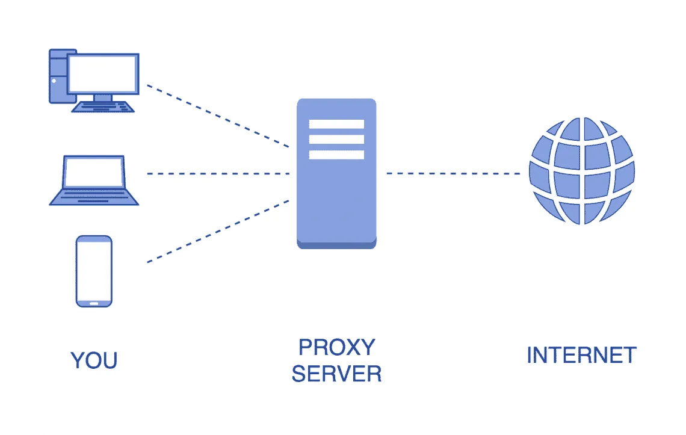
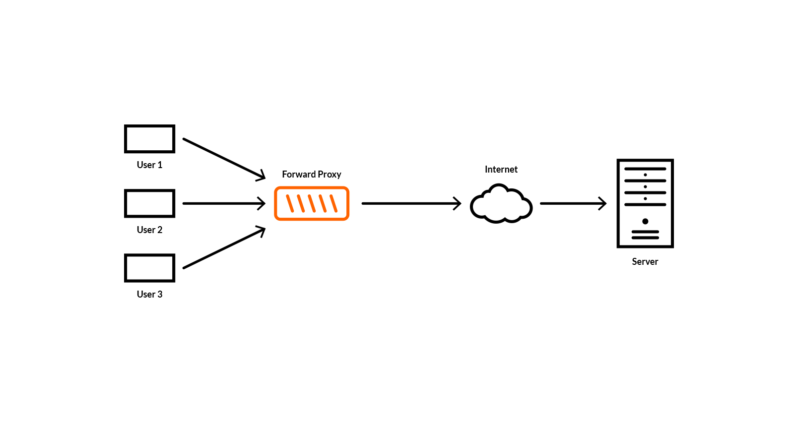
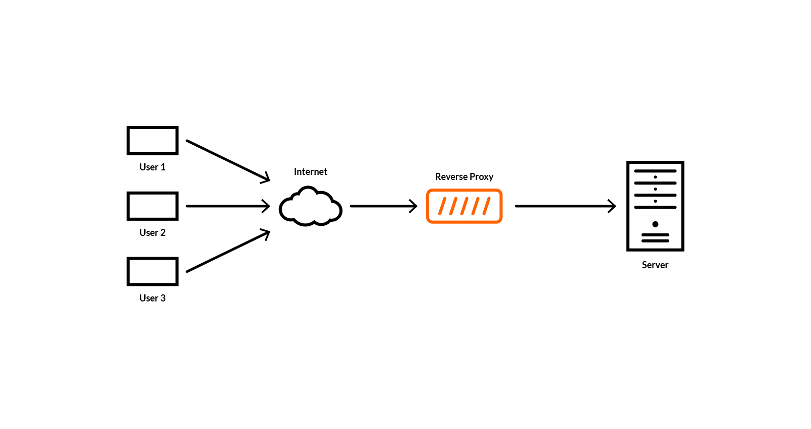
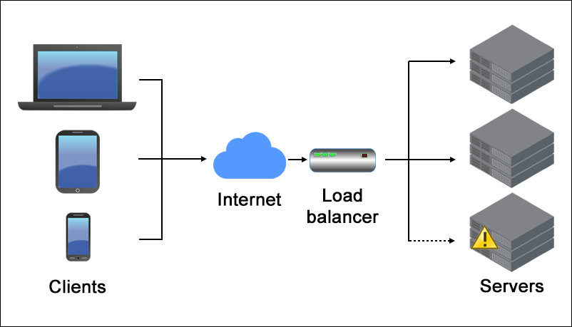

# Proxy란? Load Balancing이란?

[Tistory 블로그 포스팅 바로가기](https://seunghyunson.tistory.com/22)

# 1. Proxy

프록시란 서버와 서버 사이에서 목적에 따라 특정 서버들을 대신해 여러가지 작업을 수행해주는 중개인으로 묘사할 수 있습니다. 프록시 서버는 요청을 가로채서 응답할 수 있으며, 요청만 전달하거나 수정할 수도 있습니다.

우리는 지금까지 프론트엔드와 백엔드로 나누어 개발하면서, 요청의 주체인 프론트엔드 서버 F에서 요청을 받는 백엔드 서버 B에 직접 호출을 했습니다. 따라서 백엔드 서버에서는 해당 요청에 대한 모든 정보를 바로 확인할 수 있습니다. 이 구조에 프록시 서버를 추가하면 어떤 형태가 될까요?

프론트엔드 서버 F와 백엔드 서버 B 사이에 프록시 서버 역할을 하는 P라는 서버를 추가함으로써, 프론트엔드 서버 F는 더이상 백엔드 서버 B가 아닌 프록시 서버 P로 요청을 보내게되고, 프록시 서버 P는 해당 요청을 받아 필요한 작업을 한 뒤 백엔드 서버 B에 해당 요청을 넘겨주게 되는 것이죠.

그렇다면 프록시 서버가 하는 일에는 어떤 작업들이 있을까요? 우리가 말하는 컨텍스트에서는 Forward Proxy와 Reverse Proxy라는 두 가지의 프록시가 있습니다. 프록시 서버가 어떤 역할을 하는지에 따라 Forward 프록시인지 Reverse 프록시인지 구분할 수 있습니다.

## 1-1. Forward Proxy

Forward 프록시가 무엇인지 알아보기전에 우리가 한번쯤은 사용해봤을 서비스인 VPN에 대해 잠시 이야기하고 넘어가겠습니다.

VPN의 역할은 무엇이며 사람들이 VPN을 왜 사용하나요? 회사에서 사내 내부 서버에 접근할 때 보안상의 이유로 특정 IP만 허용되어 VPN을 통해 접속하기 위한 용도로 사용할 수도 있고, 한국 IP로는 접속이 불가능한 쇼핑몰을 접속 가능한 미국 IP로 접속하기 위해서도 사용할 수 있습니다. 이 외에도 많은 use case들이 존재하겠지만, 요청 서버에 대한 정보를 마스킹(masking)하는 것이 VPN의 주된 용도라고 할 수 있습니다.

Forward Proxy의 다른 use case로는 캐싱을 예로 들 수 있습니다. 클라이언트에서 같은 요청을 여러번 보낼 때 매번 서버에서 같은 요청에 대한 응답처리를 반복할 필요없이 Forward Proxy 서버에서 캐싱해두고 같은 요청에 대한 응답을 대신 즉각즉각 보내주게 되는 것입니다. 이렇게 되면 불필요한 통신이 줄어들고 그만큼 리소스 낭비를 줄일 수 있으며 전체적인 성능 개선 효과를 경험할 수 있습니다.

이처럼 요청을 보내는 서버(유저)를 대신하여 특정 작업들을 처리해주는 프록시를 Forward Proxy라고 합니다.

## 1-2. Reverse Proxy

Reverse 프록시는 프라이빗 네트워크의 서버에 대한 액세스를 제어합니다. 데이터 암호화 및 암호 해독, 인증 작업, 정보 캐싱 및 로드 밸런서 역할을 수행할 수 있습니다.

기본적으로 Reverse 프록시는 웹 서버 또는 서버 그룹에 대한 Gateway 입니다. Reverse 프록시는 클라이언트가 접근하고자 하는 오리진 서버의 실제 위치를 마스킹(masking)하여 클라이언트가 아닌 백엔드 서버에 대한 익명성을 제공합니다.

Reverse 프록시는 서버가 하나만 있는 경우에도 유용합니다. Reverse 프록시를 통해서만 네트워크에 액세스할 수 있게하여 악의적인 공격을 차단하는 등 웹사이트에 보안과 유연성을 추가할 수 있습니다.

Reverse 프록시는 수백만 명의 방문자가 있는 서비스에 로드밸런서로 활용될 수 있습니다. 특정서버가 동시에 많은 요청을 처리하게 되면서 생기는 문제를 방지하기 위해 로드밸런서가 트래픽을 준비된 서버그룹에 골고루 분산시켜주는 것이죠.

# 2. Load Balancing

우리의 application 서버에 대한 요청이 많을 때는 어떤 문제가 발생할 수 있을까요?

서버는 작업을 처리할 때 필요한 사용할 수 있는 자원이 정해져 있습니다. 한 사람이 갑자기 어느날은 두명이 되어 동시에 일을 두 배로 할 수 없듯이, 서버가 일을 할 때에도 처리할 수 있는 요청에 대한 한계가 존재한다는 뜻입니다. 하지만 우리는 항상 더 많은 사람들이 우리 서비스를 이용하기를 원합니다. 하루 평균 100명 정도가 사용하던 서비스가 마케팅 전략을 통해 갑자기 하루에 1만명의 유저가 우리 서비스에 접속한다고 가정해본다면, 100명이 사용하던 인프라를 그대로 유지하면서 원활한 서비스를 제공하는 것은 어려울 수 있습니다. (물론 기존 인프라를 확장성을 고려해 설계했다면 가능할 수도 있지만 여기서는 그렇지 않다고 가정합니다.)

이런 상황에서 택할 수 있는 방법은 크게 두 가지가 있습니다. 바로 Scale-up 방식으로의 확장과 Scale-out 방식으로의 확장입니다.

Scale-up 방식은 서버의 성능을 높여 기존보다 더 많은 일을 할 수 있게 해주는 방법입니다. Scale-out 방식은 동일하거나 비슷한 성능의 서버를 추가하여 여러대의 서버를 운용하는 방식으로의 확장을 뜻합니다. 보통 서버를 확장할 때는 Scale-out 방식을 선호하는데, 하드웨어 성능을 높이는 비용보다 값싼 서버를 한대 더 추가하는 방법이 보통 더 적은 비용이 들고, 여러 대의 서버를 운용하면서 서비스를 중단없이 운영할 수 있다는 장점이 있기 때문입니다.

그렇다면 Scale-out 방식을 채택해서 서버를 늘리는 방법으로 확장을 했을 때, 여러대의 서버가 골고루 요청을 받아 처리할 수 있게 해줄 수 있는 방법에는 무엇이 있을까요?

## 2-1. Load Balancer

로드 밸런서(Load Balancer)란, 여러 대의 서버에게 균등하게 요청을 분산시켜주는 역할을 합니다. 이 로드 밸런서는 Reverse Proxy의 역할을 합니다.

여러대의 서버들이 있는데 모든 요청이 특정 서버에만 집중된다면 확장하기 전과 다를게 없는 시스템입니다. 그렇기 때문에 로드 밸런서를 활용하여 우리가 운용중인 서버들에게 요청을 분산시켜주는 작업이 필요합니다.

유저의 접속과 사용을 통해 발생하는 트래픽들(http request)들을 모두 1차적으로 로드 밸런서가 처리합니다. 로드 밸런서가 먼저 요청들을 처리한 뒤 서비스를 운영하고 있는 서버들로 분배하게 됩니다.

로드 밸런서를 사용하면 요청을 고르게 분배해줘서 많은 요청을 동시에 처리할 수 있게 해주는 장점 외에도 Fault Tolerant System (결함 감내 시스템) 효과까지 경험할 수 있습니다.

예를 들어, 운영되고 있는 서버 3개중 1개가 어떠한 결함이나 에러로 운영 중단이 된다면 로드 밸런서가 자동으로 정상적으로 작동하는 나머지 2개의 서버에만 요청을 분배할 수 있습니다. 그리고 실제 요청을 보내는 유저는 서버들 중 하나가 운영 중단이 된 사실을 인지하지 못하고 사용하는 서비스를 정상적으로 이용할 수 있습니다. 개발자들이 운영 중단 되었던 서버를 고쳐 정상적으로 작동하기 시작한다면 로드 밸런서가 다시 해당 서버를 포함한 모든 서버들에 요청을 분배합니다.

이 모든 과정동안 유저는 문제가 있었다는 사실을 전혀 인지하지 못하게 되는 것입니다.

이런 로드 밸런서의 장점을 통해 유저 입장에서는 down time이 없는 서비스 운영 및 배포가 가능합니다.
