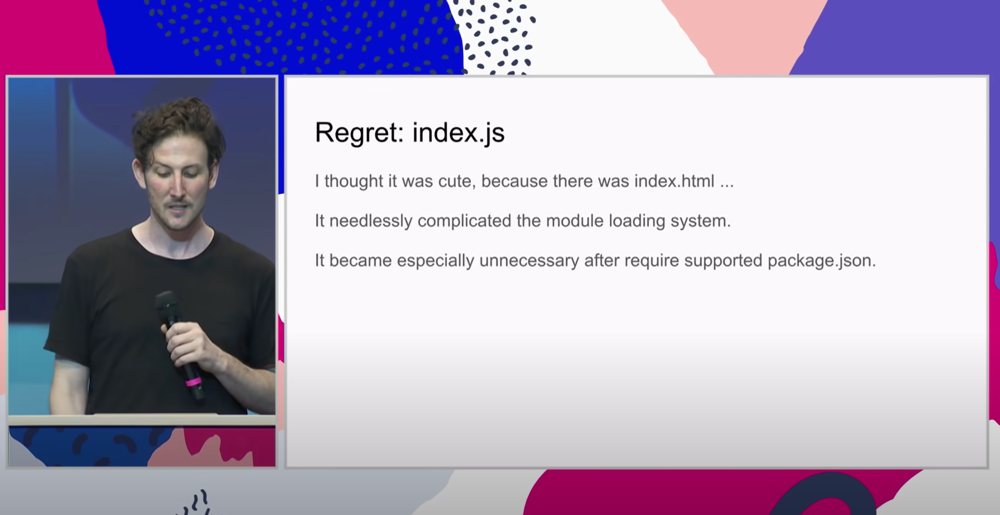
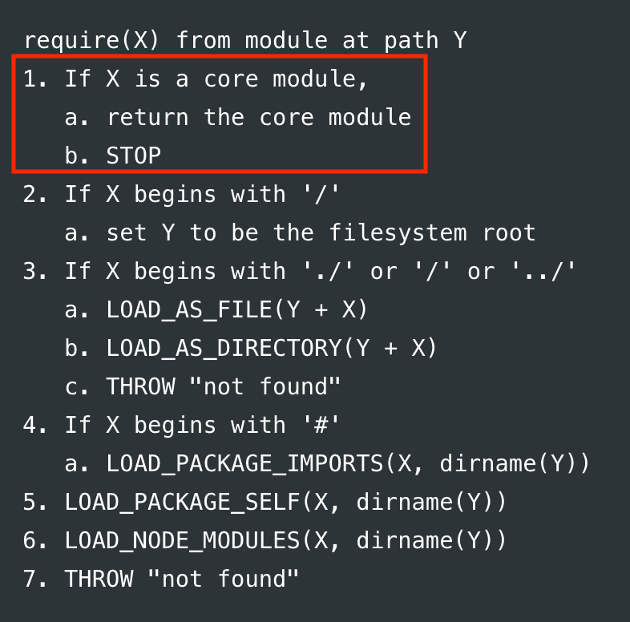
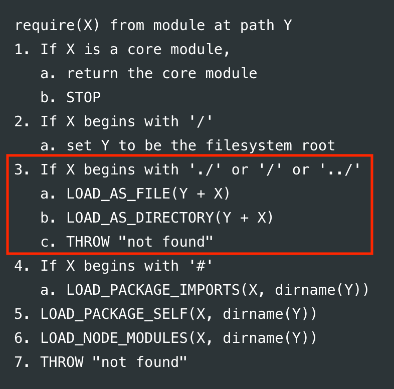
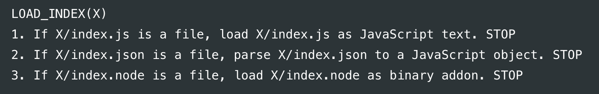

# index.js를 사용한 모듈 import 사용 관련

[10 Things I Regret About Node.js - Ryan Dahl - JSConf EU
](https://www.youtube.com/watch?v=M3BM9TB-8yA)

JSConf EU에서 Node.js의 창시자인 Ryan Dahl이 Node.js를 만들때 후회되는 10가지에 대한 발표를 했는데 그 중 index.js를 사용한 module import에 관해 짧게 언급한 부분이 있다.

[The high-level algorithm in pseudocode of what require() does](https://nodejs.org/dist/latest-v16.x/docs/api/modules.html)

built-in modules

custom modules

adds another special case to already fairly long logic

