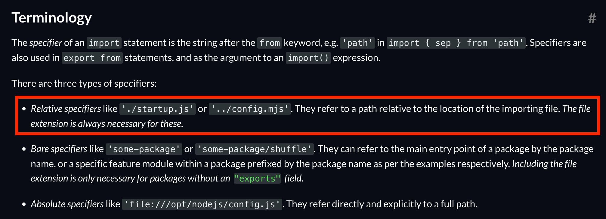

# Node.js에서 ECMAScript 모듈 사용하기

```js
// FROM
const { send } = require('./request');
const { read } = require('./response');

// TO
import { send } from './request';
import { read } from './response';
```

```js
// FROM
module.exports = { read };

// TO
export { read };
```


`.js` 확장자를 `.mjs` 로 변경

```
// FROM
https.js
request.js
response.js

// TO
https.mjs
request.mjs
response.mjs
```

[ECMAScript modules -> Terminology](https://nodejs.org/dist/latest-v16.x/docs/api/esm.html#terminology)



```js
// FROM
import { send } from './request';
import { read } from './response';

// TO
import { send } from './request.mjs';
import { read } from './response.mjs';
```
